# Aula 01

Sumário

- [Aula 01](#aula-01)
  - [O que é a Internet?](#o-que-é-a-internet)
    - [Conceitos básicos e terminologia](#conceitos-básicos-e-terminologia)
    - [Autoridades da Internet](#autoridades-da-internet)
  - [História das Redes de Computadores e da Internet](#história-das-redes-de-computadores-e-da-internet)
    - [1961 - 1972: Desenvolvimento da Comutação de Pacotes](#1961---1972-desenvolvimento-da-comutação-de-pacotes)
    - [1972 - 1980: Redes proprietárias e interligação de redes](#1972---1980-redes-proprietárias-e-interligação-de-redes)
    - [1980 - 1990: Proliferação de redes](#1980---1990-proliferação-de-redes)
    - [Década de 1990: A explosão da Internet](#década-de-1990-a-explosão-da-internet)
    - [Século XXI](#século-xxi)
  - [Tecnologia de Redes Locais a Globais](#tecnologia-de-redes-locais-a-globais)
    - [Nanoredes](#nanoredes)
    - [*Near-field communication* - NFC](#near-field-communication---nfc)
    - [*Body Area Network* - BAN](#body-area-network---ban)
    - [*Personal Area Network* - PAN](#personal-area-network---pan)
    - [*Local Area Network* - LAN](#local-area-network---lan)
      - [Tipos de LAN](#tipos-de-lan)
    - [*Campus Area Network* - CAN](#campus-area-network---can)
    - [*Metropolitan Area Network* - MAN](#metropolitan-area-network---man)
      - [IXes ou IXPs - *Internet exchange points*](#ixes-ou-ixps---internet-exchange-points)
    - [*Wide Area Network* - WAN](#wide-area-network---wan)
    - [Redes interligadas](#redes-interligadas)
  - [O Modelo de referência TCP/IP](#o-modelo-de-referência-tcpip)
    - [Camada Física](#camada-física)
    - [Camada de Enlace](#camada-de-enlace)
    - [Camada de Rede](#camada-de-rede)
    - [Camada de Transporte](#camada-de-transporte)
    - [Camada de Aplicação](#camada-de-aplicação)
    - [Comunicação entre dois hosts através da Interet](#comunicação-entre-dois-hosts-através-da-interet)
  - [Como a Web funciona](#como-a-web-funciona)
    - [DNS](#dns)
    - [HTTP](#http)
    - [URL](#url)
  - [Programação para a Web I](#programação-para-a-web-i)

## O que é a Internet?

Antes de entender o que é a Internet, é interessante entender o que é uma **rede de computadores**, a qual consiste em um grupo de cmoputadores, ou outros dispositivos, os quais estão conectados uns aos outros. A partir disso, podemos conceituar a Internet como uma rede de bilhões de dispositivos, os quais estão espalhados por todo o mundo. Esses dispositivos podem ser servidores, PCs, videogames, celulares, tablets, relógios, veı́culos, eletrodomésticos, etc.

De forma superficial a Internet funciona ao conectar diferentes dispositivos através do uso de protocolos padronizados. O núcleo da Internet consiste em uma rede global de **roteadores**, os quais são responsáveis por direcionar o tráfego de dados entre diferentes dispositivos e sistemas. Para serem enviados pela rede, os dados são "quebrados" em pacotes pequenos unidades chamadas de **pacote**. Ao receber um pacote um roteador examina seus metadados e então o encaminha para o próximo roteador no caminho, e isso ocorre até que os dados cheguem ao destino.

O conteúdo a seguir aprofunda vários desses conceitos, para permitir que possamos entender melhor, e de forma básica, as redes de computadores, inclusive a Internet, e como tudo funciona.

### Conceitos básicos e terminologia

- **Pacote**: uma pequena unidade de dados, a qual é transmitida pela internet.
- **Comutador** (**roteador**/**switch**): um dispositivo que direciona os pacotes de dados entre diferentes redes.
- **Endereço IP**: um identificador único assinalado a cada dispositivo em uma rede, usado para rotear dados para o destino correto.
- **Gateway**: o dispositivo que faz a conexão entre duas ou mais redes e oferece a conversão necessária, tanto em termos de hardware quanto de software.
- **Hospedeiro**/**Host**: dispositivo conectado a uma rede.
- **ISPs**: *Internet Service Providers* - Provedores de Serviços de Internet.
- **PDU**: *Protocol Data Unit* - Unidade de Dados do Protocolo. Basicamente o nome dado à unidade de dados manipulada por um protocolo.
- **Protocolos**: programas que definem como a informação é trocada entre os dispositivos, e garantem que os dados são transmitidos de forma confiável e segura.

### Autoridades da Internet

O funcionamento correto da Internet depende de todos os envolvidos operarem obedecendo **padrões internacionais**, os quais são criados por algumas **autoridades**:

- **ISO** (*International Organization for Standardization*)
- **IEEE** (*Institute of Electrical and Eletronics Engineers*)
  - O *Instituto de Engenheiros Elétricos e Eletrônicos* é a maior organização profissional do mundo. Possui grupos de trabalho que desenvolvem padrões nas áreas de engenharia elétrica e informática.
- **IETF** (*Internet Engineering Task Force*)
  - A *Força Tarefa de Engenharia da Internet* é estruturada em grupos que tratam questões relacionadas à Internet.
  - Uma nova ideia deve ser apresentada formalmente em uma **RFC** (*Request For Comments* - Requisição de Comentários). Após validada, a ideia pode ganhar o status de padrão.
- **IEN** (*Internet Experiment Notes*): [lista dos primeiros documentos da Internet](https://www.potaroo.net/ietf/html/ienindex.html).

Além dos protocolos, o funcionamento correto da Internet depende de todos os envolvidos operarem obedecendo **padrões internacionais**, os quais são criados por algumas **autoridades**:

- **ICANN** (*Internet Corporation for Assigned Names and Numbers*)
- **IANA** (*Internet Assigned Numbers Authority*)

Relação entre ICANN, IETF e IANA:

- ICANN supervisiona o gerenciamento de nomes de domı́nio (DNS), endereços IP e parâmetros de protocolos.
- IETF foca em desenvolver padrões técnicos e protocolos para a Internet.
- IANA, sob a ICANN, é a responsável de fato pela coordenação e atribuição de endereços de IP, gerenciamento da zona raiz do DNS e atribuição dos parâmetros de protocolos.

## História das Redes de Computadores e da Internet

### 1961 - 1972: Desenvolvimento da Comutação de Pacotes

Antes de 1960 as redes de comunicação consistiam basicamente em telégrafo e telefone, e sua respectiva comutação de circuito. Porém, a quantidade de computadores estava crescendo, e em locais distantes uns dos outros. Naturalmente surgiu o interesse pela comutação de pacotes.

Ao redor do mundo, 3 grupos de pesquisa começam a inventar a comutação de pacotes (sem nenhum conhecer o outro):

- Primeiro trabalho: Tese [Leonard Kleinrock](https://en.wikipedia.org/wiki/Leonard_Kleinrock), aluno de graduação do MIT, em 1961.
- Em 1964, [Paul Baran](https://en.wikipedia.org/wiki/Paul_Baran), *Rand Institute*, começou a investigar a utilização de comutação de pacotes na transmissão segura de voz pelas redes militares.
- Ao mesmo tempo, [Donald Davies](https://en.wikipedia.org/wiki/Donald_Davies) e Roger Scantlebury desenvolviam suas ideias no *National Physical Laboratory* (NPL), na Inglaterra.

Na década de 60, [J. C. R. Licklider](https://en.wikipedia.org/wiki/J._C._R._Licklider) e [Larry Roberts](https://en.wikipedia.org/wiki/Larry_Roberts_(computer_scientist)), ambos colegas de Kleinrock, lideraram o programa de Ciência da Computação na **ARPA** (*Advanced Research Projects Agency* - Agência de Projetos de Pesquisa Avançada), órgão do Departamento de Defesa dos Estados Unidos.

Em 1967, em uma reunião da Associação para Maquinaria da Computação ([ACM](https://www.acm.org/) - *Association for Computing Machinery*), a ARPA apresentou suas ideias para a **Rede da Agência de Projetos de Pesquisa Avançados** ([ARPANET](https://en.wikipedia.org/wiki/ARPANET) - *ARPA NETwork*). A ideia era que cada computador (não necessariamente do mesmo fabricante) seria ligado a um computador especializado, chamado de **Processador de Mensagens de Interface** (IMP - *Interface Message Processor*). Os IMPs seriam ligados uns aos outros.

Em 1 de Maio de 1969, foi instalado o primeiro roteador de pacotes na UCLA (Universidade da Califórnia em Los Angeles) sob a supervisão de Kleinrock. Pouco tempo depois foram instalados três roteadores de pacotes adicionais no *Stanford Research Institute* (SRI), na Universidade da Califórnia em Santa Bárbara e na Universidade de Utah.

<figure style="text-align: center;">
  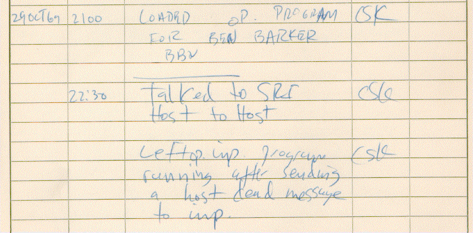
  <figcaption>Registro da primeira mensagem enviada através da ARPANET (fonte: <a href="https://www.lk.cs.ucla.edu/internet_first_words.html">UCLA</a>)</figcaption>
</figure>

<figure style="text-align: center;">
  
  <figcaption>ARPANET em 1972</figcaption>
</figure>

### 1972 - 1980: Redes proprietárias e interligação de redes

Além da ARPANET (que era uma rede fechada) outras redes foram surgindo:

- **ALOHA**net (no Havaí), utilizando microondas.
- Redes de pacote por satélite ([RFC 829](https://www.rfc-editor.org/info/rfc829)), e por rádio, da DARPA.
- [Telenet](https://en.wikipedia.org/wiki/Telenet), rede comercial de comutação de pacotes da [BBN](https://en.wikipedia.org/wiki/RTX_BBN_Technologies).
- [CYCLADES](https://en.wikipedia.org/wiki/CYCLADES), na França.
- SNA da IBM.

  <figure style="max-width: 100px;">
    
    <figurecaption>Vint Cerf</figurecaption>
  </figure>
  <figure style="max-width: 100px;">
    
    <figurecaption>Robert Kahn</figurecaption>
  </figure>
  
<a href="https://en.wikipedia.org/wiki/Vint_Cerf">Vint Cerf</a> e <a href="https://en.wikipedia.org/wiki/Robert_Kahn_(computer_scientist)">Robert Kahn</a> sob o patrocı́nio da DARPA (<i>Defense Advanced Research Projects Agency</i> - Agência de de Projetos de Pesquisa Avançada de Defesa), foram pioneiros na interconexão de redes, ou redes de redes. O termo cunhado naquele tempo: <i>internetting</i>. Eles tiveram a ideia de um dispositivo chamado <b><i>gateway</i></b> para atuar como o hardware intermediário na transferência de dados de uma rede para outra.

Os princı́pios de arquitetura da *internetting* foram incorporadas ao TCP (*Transmission Control Protocol*). [RFC 761](https://datatracker.ietf.org/doc/html/rfc761), primeiro RFC do TCP.

### 1980 - 1990: Proliferação de redes

Ao fim da década de 70, cerca de 200 máquinas estavam conectadas à ARPANET. Ao fim da década de 80 a rede alcançou a marca de 100 mil! Muito esforço foi feito para interligar universidades, e em 01 Janeiro de 1983 o TCP/IP foi oficialmente adotado como o novo padrão de protocolo das máquinas na rede ARPANET. O **DNS** (*Domain Name System*) foi desenvolvido nesse perı́odo também.

Na França a Rede Minitel teve bastante sucesso e incentivo governamental.

### Década de 1990: A explosão da Internet

A ARPANET deixou de existir, mas tivemos o surgimento da ***World Wide Web*** (WWW), criada no CERN (*European Center for Nuclear Physics*) pelo Físico e Cientista da Computação [Tim Berners-Lee](https://pt.wikipedia.org/wiki/Tim_Berners-Lee) entre 1989 e 1991. O WWW, de forma resumida, consiste em um sistema de documentos interligados e executados na Internet. Esses documentos podem ser imagens, vídeos, sons, hipertextos, etc. A partir disso, passamos a ter os **Navegadores**, programas que permitem o acesso e envio desses documentos.

<figure style="text-align: center;">
  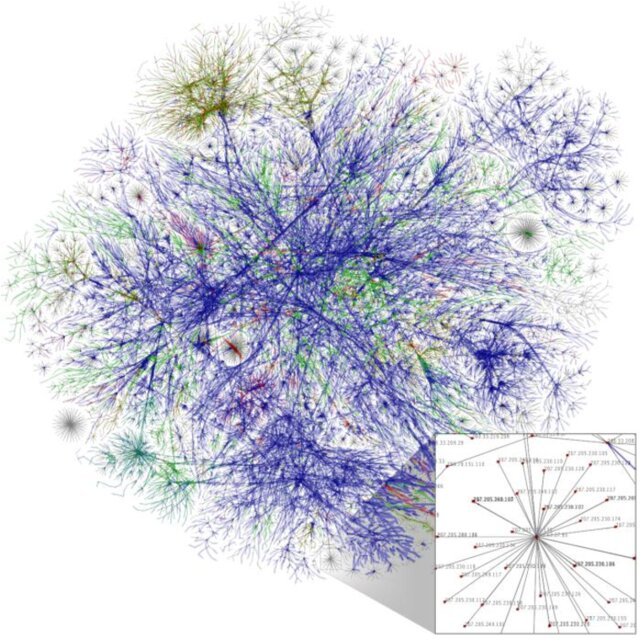
  <figcaption>A Web</figcaption>
</figure>

A partir de 1996: guerra entre os navegadores Netscape e Internet Explorer ([TecMundo: Guerra dos Navegadores](https://www.youtube.com/watch?v=3yTDZTKwj-o)). Além disso, milhares de novas empresas foram surgindo, propondo os mais diversos serviços pela Web. Os principais: correio eletrônico (e-mail), serviço de mensagem instantânea e compartilhamento *peer-to-peer* (**P2P**).

Em 2002 estourou a [Bolha da Internet](https://pt.wikipedia.org/wiki/Bolha_da_Internet).

Vídeos do TecMundo sobre a história da Internet: 

- [Parte 1](https://www.youtube.com/watch?v=pKxWPo73pX0). 
- [Parte 2](https://www.youtube.com/watch?v=k_inQhpKprg).

### Século XXI

Estamos sendo testemunhas vivas de todas as evoluções e revoluções. Qual(is) foi(ram) a(s) mais impactante(s)?

## Tecnologia de Redes Locais a Globais

As redes podem variar de pequenas e pessoais a grandes e globais, e são denominadas de acordo com sua abrangência geográfica e escala: **Nanoredes**, **NFC**, **BAN**, **PAN**, **LAN**, **CAN**, **MAN**, **WAN**.

### Nanoredes

Consiste em um conjunto de nanomáquinas capazes de se comunicar. Aplicações possı́veis: biologia, meio-ambiente, tecnologia militar e industrial e bens de consumo. 

Prática recomendada do IEEE para *framework* de comunicação em nanoescala e molecular: [1906.1-2015](https://ieeexplore.ieee.org/document/7378262).

<figure style="text-align: center;">
  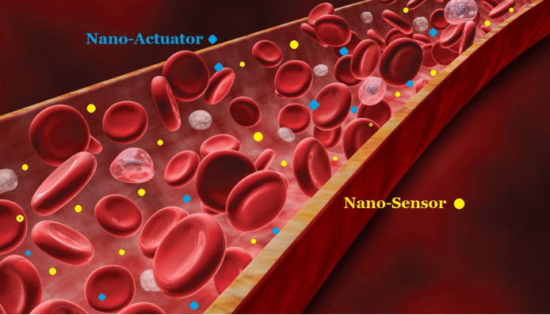
  <figcaption>Nanomáquinas em rede para aplicação de medicamento</figcaption>
</figure>

### *Near-field communication* - NFC

Consiste em um conjunto de tecnologias de comunicação sem fio em curta distância: 10 cm ou menos. Tem suas raı́zes na tecnologia [RFID](https://en.wikipedia.org/wiki/Radio-frequency_identification).

Aplicações:

- Pagamento por aproximação, cartão fı́sico ou virtual.
- Recarregamento de celular sem fio.
- Automatização de outros tipos de conexão (ex.: ativar, emparelhar e desativar o Bluetooth).
- Permite dispositivos eletrônicos serem utilizados como documentos de identidade.
- Permite dispositivos eletrônicos ter configurações alteradas. Por exemplo, todas as pessoas que entram em uma sala de cinema têm seus celulares configurados no modo silencioso/vibratório automaticamente.

### *Body Area Network* - BAN

Rede formada por dispositivos computacionais vestı́veis. Geralmente são sensores sem fio, e pode ser referida também como **WBAN** (*Wireless BAN*), **BSN** (*Body Sensor Network*) ou **MBAN** (*Medical BAN*). Exemplos:

- Implante subcutâneo.
- Comprimido/pı́lula.
- Smartwatches, pulseiras, etc.
- Dispositivos que podem ser carregados: na mão, bolso, sacola, etc.

[IEEE 802.15](https://grouper.ieee.org/groups/802/15/) - *Working Grupo for Wireless Specialty Networks*.

### *Personal Area Network* - PAN

  <figure style="width:150px;">
    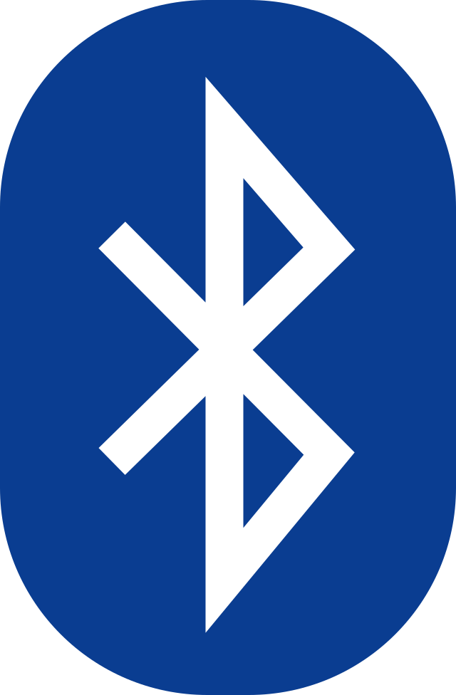
  </figure>
  
Rede entre dispositivos computacionais dentro do alcance de uma pessoa. Por exemplo, todos os seus dispositivos em um quarto/sala: celular, fones, notebook, relógio, teclado, mouse, etc. A principal rede sem fio de curta é o <b>Bluetooth</b>.

### *Local Area Network* - LAN

É uma rede particular que opera dentro e próximo de um único prédio: casa, escritório, fábrica, etc. As antigas e saudosas ***LAN Houses*** têm esse nome justamente por causa da rede entre seus computadores.

Quase sempre, cada computador se comunica com um dispositivo chamado **ponto de acesso** (AP - *Access Point*), **roteador sem fio** ou **estação-base**.

O padrão para LANs sem fio é o IEEE 802.11. [Artigo na Wikipedia](https://en.wikipedia.org/wiki/IEEE_802.11). [Working Group da IEEE](https://www.ieee802.org/11/).

<figure style="text-align: center;">
  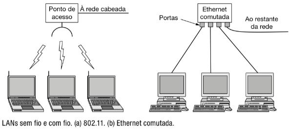
</figure>

<figure style="text-align: center;">
  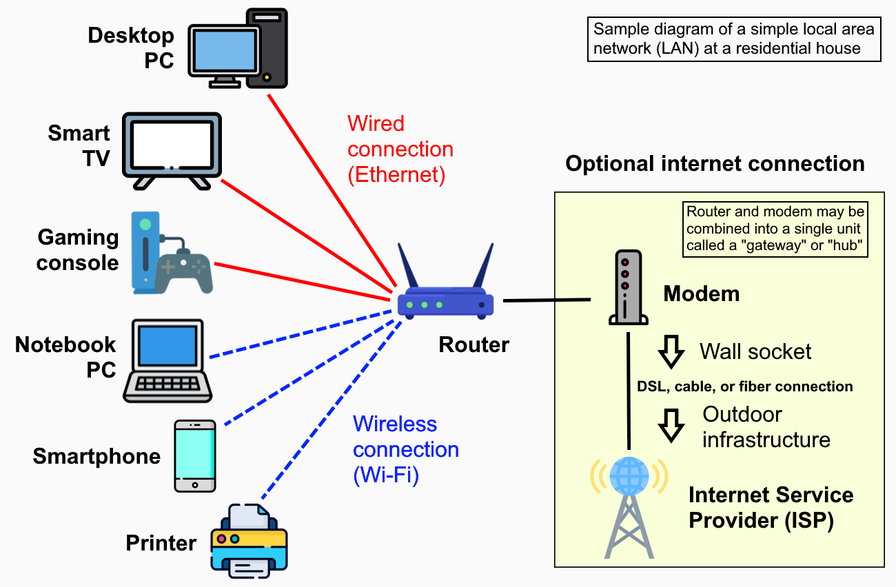
</figure>

<figure style="text-align: center;">
  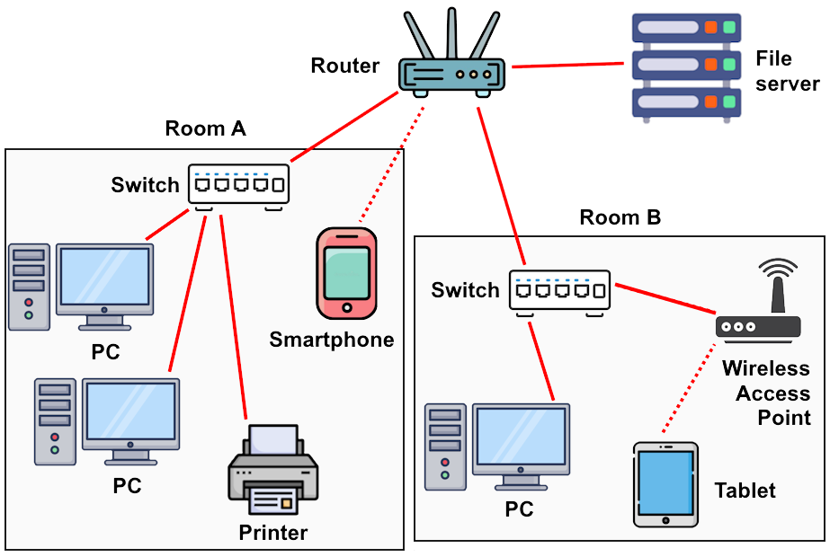
</figure>

#### Tipos de LAN

**HAN** (*Home Area Network*), consiste em uma rede doméstica, ou seja, a conectividade de todos os dispositivos em uma residência.

Em um ambiente corporativo, pode ser interessante separar uma LAN em subredes, ou seja, uma LAN para cada setor. Então, terı́amos várias LANs virtuais (**VLANs** - *Virtual LANs*).

Em uma LAN onde os dispositivos se comunicam apenas sem fio pode ser referida como **WLAN** (*Wireless LAN*).

  <figure>
    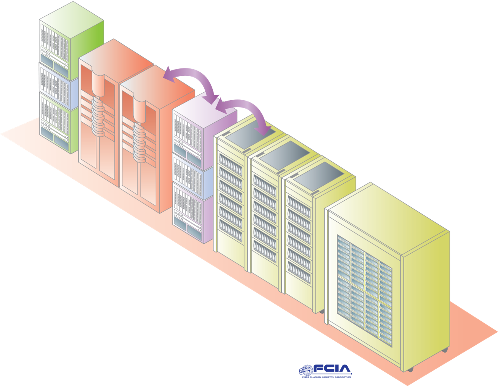
  </figure>
  
Nos centros de processamento de dados há vários computadores dedicados ao armazenamento de informações. A rede local entre os servidores para acessar os dados armazenados é chamada de <b>SAN</b> (<i>Storage Area Network</i>).

### *Campus Area Network* - CAN

Pode ser também *Corporate Area Network*. Consiste em um conjunto de LANs que estão próximas fisicamente. Exemplo da UFPI em Teresina (CT, CCHL, CCS, CCN, CCE, CCA):

<figure style="text-align: center;">
  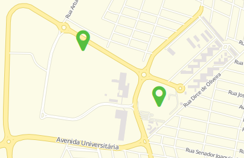
</figure>

### *Metropolitan Area Network* - MAN

É a interconexão de várias LANs presentes em uma região metropolitana.

CANs e MANs podem ser consideradas “**backbones** (espinhas dorsais) locais” de redes de computadores, uma vez que consistem em infraestrutura considerável, permitindo a conexão de milhares a milhões de dispositivos.

<figure style="text-align: center;">
  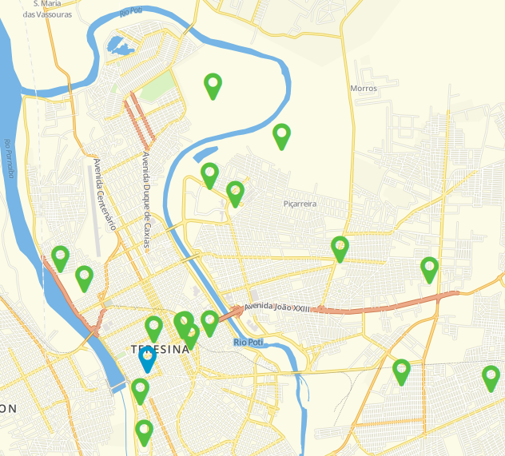
  <figcaption><a href="https://viaipe.rnp.br/?&estado=PI&periodo=1d&aglomerado=0#@-5.066321981043081,-42.80170440673828,13z">MAN</a> da <a href="https://www.rnp.br/">RNP</a> (Rede Nacional de Ensino e Pesquisa) em Teresina: <a href="https://www.redepoti.rnp.br/">Rede Poti</a>.</figcaption>
</figure>

<figure style="text-align: center;">
  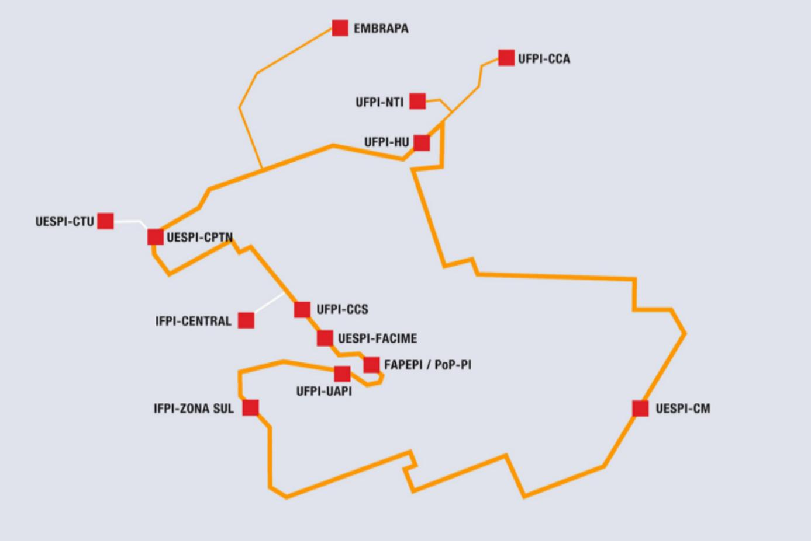
  <figcaption>Outro mapa da Rede Poti.</figcaption>
</figure>

<figure style="text-align: center;">
  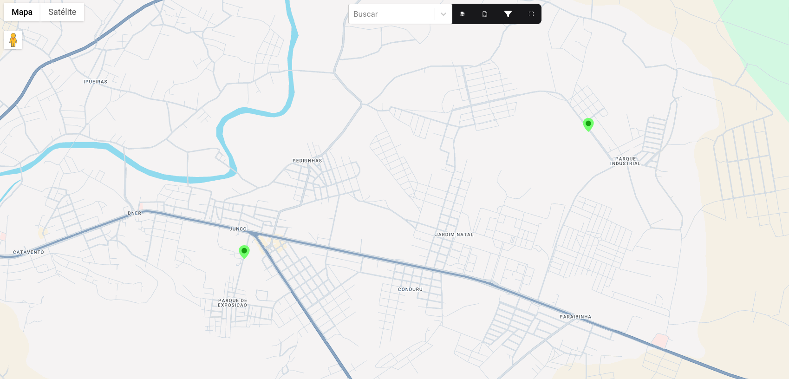
  <figcaption>MAN da RNP em Picos.</figcaption>
</figure>

#### IXes ou IXPs - *Internet exchange points*

Em Português: **Ponto de Troca de Tráfego** (PTT.

São os locais fı́sicos onde **Sistemas Autônomos** (SAs), ou seja, as redes de ISPs, provedoras de conteúdo, instituições acadêmicas, etc., podem se conectar umas às outras.

No Brasil, temos o [CGI.br](https://cgi.br/) (**Comitê Gestor da Internet**), uma agência governamental, que mantém o sistema de IX chamado [IX.br](https://ix.br/), operando a partir da organização sem fins lucrativos [NIC.br](https://nic.br/) (**Núcleo de Informação e Coordenação do Ponto**). Os *datacenters* onde os equipamentos do IX.br são instalados e operados pelo NIC.br são chamados de **PIX** (Ponto de Interconexão).

- [Mapa de SAs e PTTs](https://mapadeas.ceptro.br/).
- [Lista de todos os IX do mundo](https://en.wikipedia.org/wiki/List_of_Internet_exchange_points_by_size).

Atualmente existem [39 IX](https://ix.br/localidades/atuais) no Brasil. Dados de 02/03/2026:

- Média de tráfego diário total: [49,02 Tbps](https://ix.br/agregado/), sendo **São Paulo**, **Fortaleza** e **Rio de Janeiro** os três maiores. São Paulo costuma ser o maior do mundo, tanto em tráfego quanto em número de participantes.
- [IX de São Paulo](https://ix.br/trafego/agregado/sp):
  - Média de tráfego: 19,27 Tbps
  - Pico de tráfego: 30,51 Tbps
  - Participantes: 2647
- [IX de Fortaleza](https://ix.br/trafego/agregado/ce):
  - Média de tráfego: 4,4 Tbps
  - Pico de tráfego: 6,8 Tbps
  - Participantes: 911
- [IX do Rio de Janeiro](https://ix.br/trafego/agregado/rj) - *outlier* (houve algum problema na medição)
  - Média de tráfego: 20,72 Tbps
  - Pico de tráfego: 6,33 Pbps
  - Participantes: 755
- [IX de Teresina](https://ix.br/trafego/agregado/the)
  - Média de tráfego: 13,64 Gbps
  - Pico de tráfego: 30,88 Gbps
  - Participantes: 59

### *Wide Area Network* - WAN

Abrange uma grande área geográfica, de Estados a Continentes. Pode atender a uma organização privada ou pode ser uma oferta de serviço comercial.

<figure style="text-align: center;">
  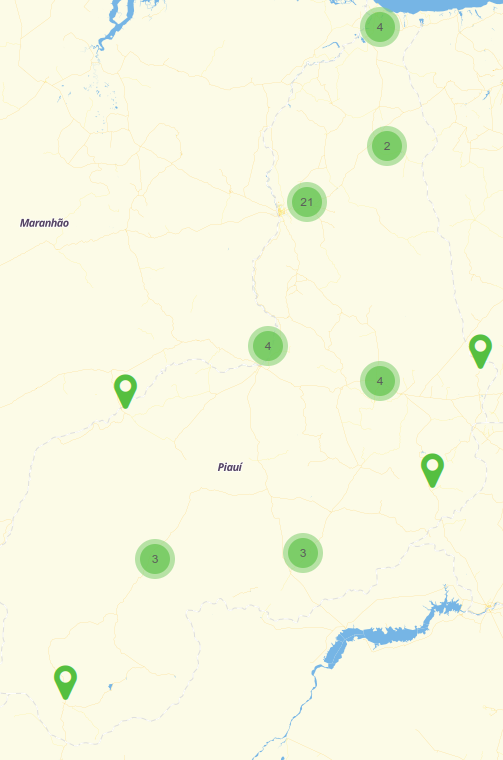
  <figcaption><a href="https://viaipe.rnp.br/?&estado=PI&periodo=1d#@-6.282538526926375,-41.231689453125,7z">WAN</a> da RNP no Piauí.</figcaption>
</figure>

<figure style="text-align: center;">
  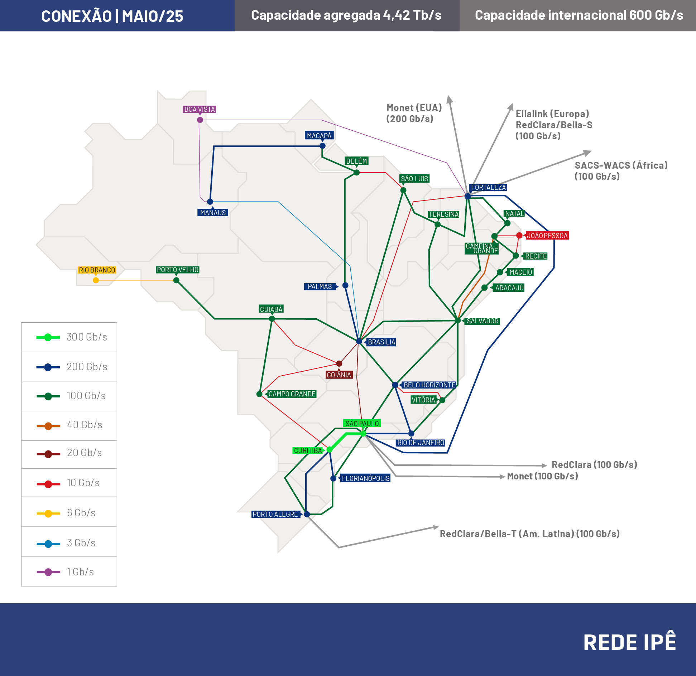
  <figcaption><a href="https://www.rnp.br/sistema-rnp/infraestrutura-para-pesquisa/evolucao-da-rede-ipe/">WAN</a> da RNP no Brasil (<a href="https://redeipe.rnp.br/home">Rede Ipê</a>).</figcaption>
</figure>

### Redes interligadas

Uma rede é formada pela combinação de uma sub-rede e seus hosts. Redes diferentes possuem hardwares e softwares diferentes, muitas vezes incompatíveis. Uma rede interligada consiste na interconexão de um conjunto de redes distintas e operadas independentemente. Pode ter qualquer tamanho: duas ou mais LANs/MANs/WANs, etc.

<figure style="text-align: center;">
  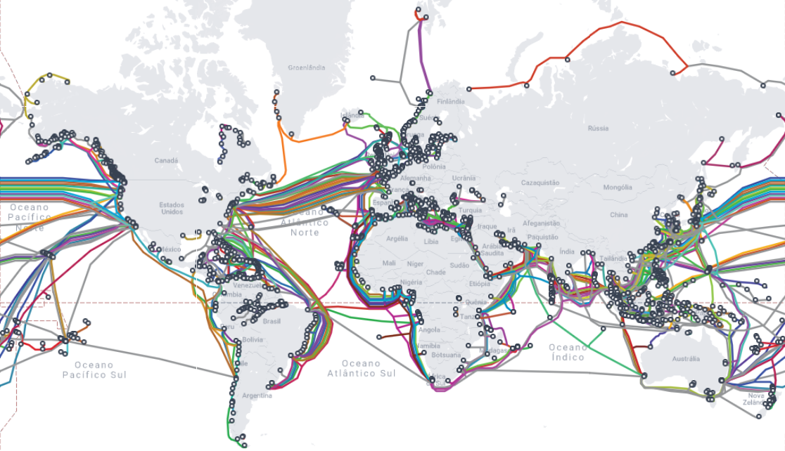
  <figcaption>Internet: a expressão máxima das redes interligadas (fonte: <a href="https://www.submarinecablemap.com/">submarinecablemap</a>)</figcaption>
</figure>

## O Modelo de referência TCP/IP

<figure style="text-align: center;">
  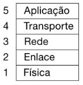
  <figcaption>Camadas do TCP/IP</figcaption>
</figure>

### Camada Física

Não é "parte oficial" do modelo, porém é presente no mundo real. É onde são definidas as interfaces elétrica, de sincronização e outras, pelas quais os bits são enviados como sinais pelos canais (cabos e ondas eletromagnéticas que se propagam pelo ar).

É aqui que temos também a **modulação digital** (conversão de sinais analógicos em digitais, e vice-versa) e **multiplexação** (transmissão de vários sinais no mesmo meio ao mesmo tempo, sem que interfiram uns nos outros).

### Camada de Enlace

É responsável por mover pacotes entre dois hosts de um mesmo enlace. A transmissão e recepção de pacotes pode ser controlada através de um *driver* da placa de rede, um firmware ou chipsets especializados.

Os pacotes recebidos passam pelo processo de **enquadramento**, e os quadros são transmitidos para a camada fı́sica.

O TCP/IP inclui especificações sobre a tradução de métodos de endereçamento usados pelo IP (*Internet Protocol*) para endereços de camada de rede, como o MAC (*Media Access Control*).

<figure style="text-align: center;">
  
</figure>

### Camada de Rede

É a camada responsável pelo envio de datagramas (PDU da camada de rede) de uma rede para outra rede (roteamento) através dos endereços IP.

Os datagramas (ou pacotes) de uma mesma mensagem podem trafegar independentemente (comutação de pacotes). Caso seja necessário, as camadas superiores reorganizam os pacotes.

<figure style="text-align: center;">
  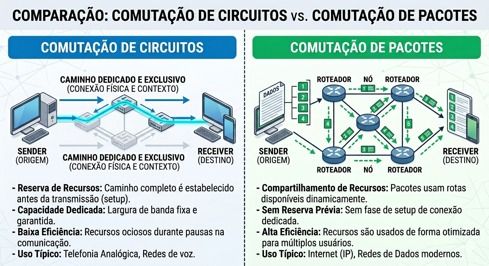
  <figcaption>Diferença entre Comutação de Circuitos e Comutação de Pacotes.</figcaption>
</figure>

Dois protocolos principais: **IP** (v4 e v6) e **ICMP** (*Internet Control Message Protocol*), um protocolo de suporte para mensagens de erro ou operacionais.

### Camada de Transporte

Estabelece canais de comunicação fim-a-fim, utilizados para a troca de dados entre aplicações.

Principais protocolos: **TCP** (*Transmission Control Protocol*), **UDP** (*User Datagram Protocol*) e mais recentemente **QUIC**, que é basicamente HTTP/3 sobre UDP.

### Camada de Aplicação

É a camada que contém todos os protocolos de nı́vel mais alto, no sentido de ser mais próximo do usuário. Exemplos de protocolos: HTTP, DNS, FTP, SMTP, etc.

<figure style="text-align: center;">
  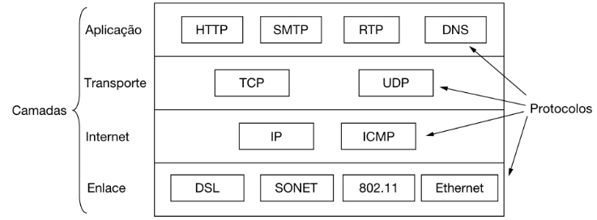
  <figcaption>Alguns dos principais protocolos do TCP/IP</figcaption>
</figure>

<figure style="text-align: center;">
  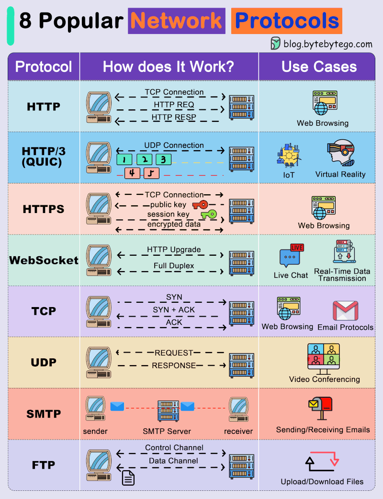
</figure>

### Comunicação entre dois hosts através da Interet

<figure style="text-align: center;">
  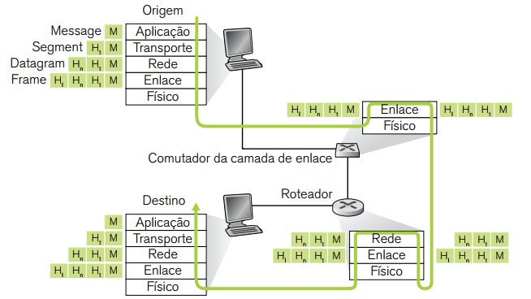
</figure>

## Como a Web funciona

De forma geral, a Web funciona em cima de um fluxo de comunicação chamado **cliente-servidor**.

O **cliente** é um programa na máquina que faz requisições, normalmente, é o navegador que você esteja usando. O **servidor** costuma ser uma máquina que vai estar utilizando um programa de servidor, além de ter dados armazenados.

De forma resumida a comunicação ocorre da seguinte forma:

1. Ao abrir o navegador você digita uma `URL`.
2. O navegador faz um `DNS Lookup`, e envia uma requisição `HTTP` para o servidor.
3. O servidor recebe e interpreta a requisição, e devolve o `HTML`.
4. O navegador recebe o `HTML` e renderiza para você.

A seguir, uma passagem breve sobre `DNS`, `HTTP` e `URL`.

### DNS

O *Domain Name System* é especificado no [RFC 1034](https://www.rfc-editor.org/info/rfc1034) e [RFC 1035](https://www.rfc-editor.org/info/rfc1035), que juntos formam o [STD 13](https://www.rfc-editor.org/info/std13). É um protocolo da Camada de Aplicação que funciona como um banco de dados distribuídos que armazena os endereços `IP` associados a `URLs`.

<figure style="text-align: center;">
  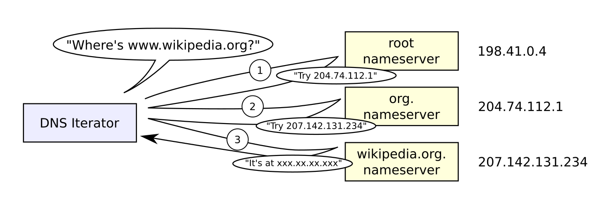
</figure>

### HTTP

O *Hypertext Transfer Protocol* é definido nos RFCs [1945](https://www.rfc-editor.org/rfc/rfc1945.html) e [2616](https://www.rfc-editor.org/rfc/rfc2616.html). As duas últimas atualizações estão nos RFCs [9110](https://www.rfc-editor.org/info/rfc9110) e [9112](https://www.rfc-editor.org/info/rfc9112).

O protocolo é executado em dois programas: um cliente e um servidor. A troca de mensagens entre os dois programas é feita através de mensagens HTTP (*Request* e *Response*).

<figure style="text-align: center;">
  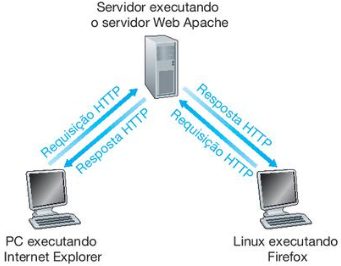
</figure>

Uma de suas características mais marcantes são os `Códigos de Status` das respostas. A seguir, alguns:

- 200 : OK
- 400 : Bad Request
- 404 : Not Found
- 502 : Bad Gateway
- 503 : Service Unavailable

### URL

O *Uniform Resource Locator* consiste no endereço de rede no qual se encontra algum recurso da Web. Suas definições podem ser encontradas nos RFCs [1738](https://datatracker.ietf.org/doc/html/rfc1738), [3986](https://datatracker.ietf.org/doc/html/rfc3986), [4248](https://datatracker.ietf.org/doc/html/rfc4248) e [4266](https://datatracker.ietf.org/doc/html/rfc4266).

Possui a seguinte estrutura:

protocolo://domínio:porta/caminho/recurso?query_string#fragmento

- O protocolo pode ser `HTTP`, `HTTPS`, etc.
- O domínio é o endereço do servidor (o trabalho do `DNS` é informar qual IP está vinculado ao domínio).
- A porta indica a interface da aplicação (protocolo ou programa) a receber a requisião/resposta. O HTTP, por exemplo, opera na porta 80.
- O **caminho** especifica o local onde o recurso está na máquina.
- A query_string é um conjunto de um ou mais pares "pergunta-resposta" ou "parâmetro-argumento".
- O fragmento é uma parte ou posição específica dentro do recurso.

Dois exemplos reais:

- https://www.youtube.com/watch?v=pKxWPo73pX0
- https://developer.mozilla.org/pt-BR/docs/Web/HTML#t%C3%B3picos_avan%C3%A7ados

## Programação para a Web I

Agora que tivemos uma densa revisão sobre a Internet, é hora de vermos maiores detalhes sobre a disicplina.

Nosso foco será sobre o desenvolvimento *frontend*, ou seja, a parte dos aplicativos/sistemas web mais próximos do usuário. Por isso veremos as seguintes tecnologias: HTML, CSS e JavaScript.

Em seguida nos aprofundaremos no *frontend* ao estudarmos os *frameworks* mais utilizados na atualidade e, depois, outros conceitos e tecnologias importantes envolvendo segurança, APIs e autenticação.