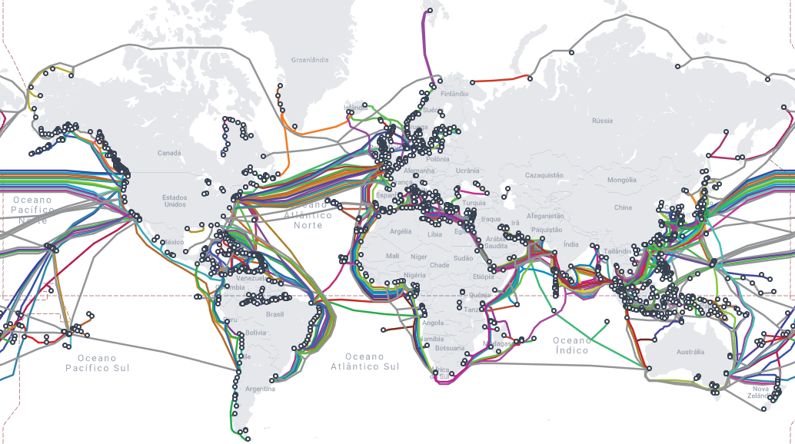

# Aula 01

Sumário

- [Aula 01](#aula-01)
  - [Breve história da Internet e da Web](#breve-história-da-internet-e-da-web)
    - [Diferença entre Internet e Web](#diferença-entre-internet-e-web)
  - [Como a Web funciona](#como-a-web-funciona)
    - [DNS](#dns)
    - [HTTP](#http)
    - [URL](#url)
  - [HTML](#html)
    - [Estrutura de um documento HTML](#estrutura-de-um-documento-html)
      - [`<!DOCTYPE html>`](#doctype-html)
      - [Atributos](#atributos)
      - [Codificação de caracteres](#codificação-de-caracteres)
      - [Tags básicas principais](#tags-básicas-principais)
        - [Elementos básicos](#elementos-básicos)
        - [Metadados](#metadados)
        - [Raiz de seccionamento](#raiz-de-seccionamento)
        - [Separação de conteúdo](#separação-de-conteúdo)
        - [Conteúdo textual](#conteúdo-textual)
        - [Semânticas textuais inline](#semânticas-textuais-inline)
        - [Imagem e multimídia](#imagem-e-multimídia)
        - [Conteúdo tabulado](#conteúdo-tabulado)
      - [Atributos](#atributos-1)
  - [Exercícios](#exercícios)


## Breve história da Internet e da Web

Antes de 1960 as redes de comunicação consistiam basicamente em **telégrafo** e **telefone**. Porém, a quantidade de computadores estava crescendo, e em locais distantes uns dos outros. Naturalmente surgiu por interligar essas máquinas.

Ao fim da década de 50, em resposta ao lançamento do [Sputnik 1](https://en.wikipedia.org/wiki/Sputnik_1) os EUA criaram a **ARPA** (*Advanced Research Projects Agency*), órgão do Departamento de Defesa. Na década de 60 foi iniciado o projeto **ARPANET** (*Advanced Research Projects Agency Network*) para a comunicação entre os computadores.

A seguir, a primeira mensagem enviada:


ARPANET em 1972:


A ARPANET era uma rede fechada, mas à medida em que o tempo ia passando, outras redes foram surgindo, tanto nos EUA quanto em outros países. O desafio agora era: como interligar essas redes?

Durante o restante da década de 70 e toda a década de 80, protocolos de rede, como o TCP e o IP, foram sendo melhorados enquanto outros foram surgindo, ao mesmo tempo em que acontecia a evolução própria dos computadores e da infraestrutura (a "rede" em si).

Na década de 90, no CERN (*European Center for Nuclear Physics*) o Físico e Cientista da Computação [Tim Berners-Lee](https://pt.wikipedia.org/wiki/Tim_Berners-Lee) apresentou o **World Wide Web** (WWW), basicamente, a "Internet" como a gente conhece hoje.

O WWW, de forma resumida, consiste em um sistema de documentos interligados e executados na Internet. Esses documentos podem ser imagens, vídeos, sons, hipertextos, etc. A partir disso, passamos a ter os **Navegadores**, programas que permitem o acesso e envio desses documentos.

Vídeos do TecMundo sobre a história da Internet: 

- [Parte 1](https://www.youtube.com/watch?v=pKxWPo73pX0). 
- [Parte 2](https://www.youtube.com/watch?v=k_inQhpKprg).
- [Guerra dos Navegadores](https://www.youtube.com/watch?v=3yTDZTKwj-o).

### Diferença entre Internet e Web

A Internet é uma **rede de redes**, ou seja, a interligação de praticamente todas as redes de computadores do mundo. Já a Web consiste nos serviços prestados e consumidos na rede.

Em sua expressão "máxima" a Internet pode ser vista como nessa imagem a seguir:



Já a Web é melhor entendida como na seguinte imagem:


## Como a Web funciona

De forma geral, a Web funciona em cima de um fluxo de comunicação chamado **cliente-servidor**.

O **cliente** é um programa na máquina que faz requisições, normalmente, é o navegador que você esteja usando. O **servidor** costuma ser uma máquina que vai estar utilizando um programa de servidor, além de ter dados armazenados.

De forma resumida a comunicação ocorre da seguinte forma:

1. Ao abrir o navegador você digita uma `URL`.
2. O navegador faz um `DNS Lookup`, e envia uma requisição `HTTP` para o servidor.
3. O servidor recebe e interpreta a requisição, e devolve o `HTML`.
4. O navegador recebe o `HTML` e renderiza para você.

A seguir, uma passagem breve sobre `DNS`, `HTTP` e `URL`.

### DNS

O *Domain Name System* é especificado no [RFC 1034](https://www.rfc-editor.org/info/rfc1034) e [RFC 1035](https://www.rfc-editor.org/info/rfc1035), que juntos formam o [STD 13](https://www.rfc-editor.org/info/std13). É um protocolo da Camada de Aplicação que funciona como um banco de dados distribuídos que armazena os endereços `IP` associados a `URLs`.


### HTTP

O *Hypertext Transfer Protocol* é definido nos RFCs [1945](https://www.rfc-editor.org/rfc/rfc1945.html) e [2616](https://www.rfc-editor.org/rfc/rfc2616.html). As duas últimas atualizações estão nos RFCs [9110](https://www.rfc-editor.org/info/rfc9110) e [9112](https://www.rfc-editor.org/info/rfc9112).

O protocolo é executado em dois programas: um cliente e um servidor. A troca de mensagens entre os dois programas é feita através de mensagens HTTP (*Request* e *Response*).


Uma de suas características mais marcantes são os `Códigos de Status` das respostas. A seguir, alguns:

- 200 : OK
- 400 : Bad Request
- 404 : Not Found
- 502 : Bad Gateway
- 503 : Service Unavailable

### URL

O *Uniform Resource Locator* consiste no endereço de rede no qual se encontra algum recurso da Web. Suas definições podem ser encontradas nos RFCs [1738](https://datatracker.ietf.org/doc/html/rfc1738), [3986](https://datatracker.ietf.org/doc/html/rfc3986), [4248](https://datatracker.ietf.org/doc/html/rfc4248) e [4266](https://datatracker.ietf.org/doc/html/rfc4266).

Possui a seguinte estrutura:

<span style="color:red;">protocolo</span>://<span style="color:blue;">domínio</span>:<span style="color:#DF01D7;">porta</span>/caminho/<span style="color:#8000FF;">recurso</span>?<span style="color:#FF8000;">query_string</span>#<span style="color:#088A85;">fragmento</span>

- O <span style="color:red;">protocolo</span> pode ser `HTTP`, `HTTPS`, etc.
- O <span style="color:blue;">domínio</span> é o endereço do servidor (o trabalho do `DNS` é informar qual IP está vinculado ao domínio).
- A <span style="color:#DF01D7;">porta</span> indica a interface da aplicação (protocolo ou programa) a receber a requisião/resposta. O HTTP, por exemplo, opera na porta 80.
- O **caminho** especifica o local onde o <span style="color:#8000FF;">recurso</span> está na máquina.
- A <span style="color:#FF8000;">query_string</span> é um conjunto de um ou mais pares "pergunta-resposta" ou "parâmetro-argumento".
- O <span style="color:#088A85;">fragmento</span> é uma parte ou posição específica dentro do recurso.

Dois exemplos reais:

- <span style="color:red;">https</span>://<span style="color:blue;">www.youtube.com</span>/<span style="color:#8000FF;">watch</span>?<span style="color:#FF8000;">v=pKxWPo73pX0</span>
- <span style="color:red;">https</span>://<span style="color:blue;">developer.mozilla.org</span>/pt-BR/docs/Web/<span style="color:#8000FF;">HTML</span>#<span style="color:#088A85;">t%C3%B3picos_avan%C3%A7ados</span>

## HTML

Excelente site para tutorial e referência (HTML, CSS e JavaScript): [MDN](https://developer.mozilla.org/pt-BR/). [Página de tutoriais do HTML](https://developer.mozilla.org/pt-BR/docs/Web/HTML).

O [*HyperText Markup Language*](https://html.spec.whatwg.org/), é uma **linguagem de marcação** utilizada na construção de páginas na Web. 

É a linguagem *essencial* da web. Isso significa que existem outras linguagens e elementos que são utilizados na construção das páginas web. O [W3C](https://www.w3.org/) (*World Wide Web Consortium*) é a principal organização de padronização da web. Consiste em um consórcio de (atualmente) 460 membros, desde empresas a órgãos governamentais e independentes. Alguns padrões da W3C: 

- CSS;
- SVG;
- PNG;
- XML;
- DOM;
- OWL.

Uma **linguagem de marcação** é um sistema de codificação de texto que consiste em um conjunto de símbolos inseridos em um documento de texto para controlar sua estrutura, formatação, ou o relacionamento entre suas partes.

Em outras palavras é um conjunto de regras que 'governa' qual informação marcada pode ser incluída em um documento e como ela será combinada com o conteúdo do documento, de forma a facilitar o uso por humanos e máquinas.

As marcações do HTML são conhecidas como **tags**.

### Estrutura de um documento HTML

```html
<!DOCTYPE html>
<html lang="pt-br">
    <head>
        <meta charset="UTF-8">
        <title>Título</title>
    </head>
    <body>
        <h1>Cabeçalho</h1>
        <p>Este é um exemplo <a href=“exemplo.html”>simples</a>.</p>
        <!– isto é um comentário –>
    </body>
</html>
```

Ou seja, o documento consiste em uma **árvore** de elementos e texto. Cada elemento é denotado por uma tag de abertura e sua tag correspondente de fechamento.

#### `<!DOCTYPE html>`

Não é um elemento HTML, mas uma instrução para que o navegador saiba a versão da linguagem de marcação que está sendo utilizada.

O HTML5 requer um elemento `<DOCTYPE>` para garantir que a página seja renderizada pelo navegador de maneira correta.

#### Atributos

Elementos podem ter atributos, os quais controlam como eles irão funcionar. Consistem em pares `nome=valor` dentro da tag de abertura. O valor pode ser escrito sem aspas caso não tenha espaço vazio, ou os caracteres `<`, `>`, `‘`, `’`, `“`, `”` e `=`.

Se tiver, o valor terá de ser escrito entre aspas duplas, `nome=“valor”` ou aspas simples também, `nome=‘valor’`.

No exemplo tivemos o elemento de hiperlink `<a>` com seu atributo *href*.

#### Codificação de caracteres

Quando um browser vai renderizar uma página HTML, ele uitliza a condificação de caracteres definida explicitamente na página, ou a codificação padrão do idioma do navegador do usuário.

O UTF-8 é uma codificação desejável para se deixar explícita na página HTML. Para isso, basta utilizar o elemento `<meta>` e seu atributo *charset*.

#### Tags básicas principais

Para uma lista completa de tags (elementos HTML) clique [aqui](https://developer.mozilla.org/pt-BR/docs/Web/HTML/Reference/Elements).

##### Elementos básicos

- `<html>`: ou *root element*, representa a raiz de um documento HTML. Todos os outros elementos devem ser descendentes desse elemento.

##### Metadados

- `<head>`: providencia informações gerais (metadados) sobre o documento, incluindo seu título e links para scripts e folhas de estilos.
- `<meta>`: define qualquer informação de metadados que não podem ser definidos por outros elementos HTML.
- `<style>`: contém informações de estilo para um documento ou uma parte do documento.
- `<title>`: define o título do documento, mostrado na barra de título de um navegador ou na aba da página.

##### Raiz de seccionamento

- `<body>`: representa o conteúdo de um documento HTML.

##### Separação de conteúdo

- `<h1>` - `<h6>`: representam seis níveis de título de seção, onde `<h1>` é o mais alto e `<h6>` o mais baixo.

##### Conteúdo textual

- `<div>`: é um container genérico para conteúdo de fluxo, que de certa forma não representa nada. Ele pode ser utilizado para agrupar elementos para fins de estilos (usando **class** ou **id**), ou porque eles compartilham valores de atributos, como **lang**. Ele deve ser utilizado somente quando não tiver outro elemento de semântica
- `<figure>`: representa conteúdo autocontido, potencialmente com uma legenda opcional, que é especificada usando o `<figcaption>` elemento. A figura, sua legenda e seu conteúdo são referenciados como uma única unidade.
- `<ol>`: representa uma lista de itens ordenados, geralmente a partir de números.
- `<p>`: representa um parágrafo. Em mídias visuais, parágrafos são representados como blocos indentados de texto com a primeira letra avançada e separados por linhas em branco. Já em HTML, parágrafos são usados para agrupar conteúdos relacionados de qualquer tipo, como imagens e campos de um formulário.
- `<ul>`: representa uma lista de itens sem ordem rígida, isto é, uma coleção de itens que não trazem uma ordenação numérica e as suas posições, nessa lista, são irrelevantes.

##### Semânticas textuais inline

- `<a>`: ou elemento âncora, cria uma hiperligação nas páginas web, arquivos, endereços de emails, ligações na mesma página ou endereços na URL.
- `<b>`, `<em>` e `<strong>`: destaca um texto em **negrito**. Tarefa: pesquisar a diferença entre eles.
- `<i>`: destaca um texto em *itálico*.
- `<br>`: produz uma quebra de linha em um texto.
- `<code>`: apresenta seu conteúdo estilizado de maneira a indicar que o texto é um pequeno fragmento de código. Por padrão, o conteúdo é exibido utilizando uma fonte monoespaçada.
- `<span>`: um conteiner genérico em linha para conteúdo fraseado , que não representa nada por natureza. Deve ser usado somente quando nenhum outro elemento semântico for apropriado.
- `<u>`: deixa um texto sublinhado.

##### Imagem e multimídia

- ``: representa a inserção de imagem no documento, sendo implementado também pelo HTML5 para uma melhor experiência com os elementos `<figure>` e `<figcaption>`.
- `<video>`: é utilizado para incorporar conteúdo de vídeo em um documento HTML.

##### Conteúdo tabulado

- `<table>`: representa dados em duas dimensões ou mais.

#### Atributos

[Lista de atributos globais](https://developer.mozilla.org/pt-BR/docs/Web/HTML/Reference/Global_attributes), ou seja, que podem ser usados em todos os elementos.

[Lista de atributos e seus respectivos elementos](https://developer.mozilla.org/pt-BR/docs/Web/HTML/Reference/Attributes).

## Exercícios

1. Crie um arquivo chamado index.html contendo a estrutura mínima de um documento HTML:
   - A declaração `<!DOCTYPE html>.`
   - As tags `<html>`, `<head>` e `<body>`.
   - No `<head>`, coloque um `<title>` com o texto: Minha Primeira Página Web.
   - No `<body>`, escreva um parágrafo com seu nome e curso.

2. Na mesma página, adicione:
   - Um título principal `<h1>` com o nome da disciplina: Programação para a Web 1.
   - Dois subtítulos `<h2>` com os textos: Introdução à Web e Fundamentos de HTML.
   - Um subtítulo `<h3>` chamado Primeiros Testes.

3. Adicione dois parágrafos `<p>` no corpo da página:
    - O primeiro com um resumo da disciplina.
    - O segundo com uma curiosidade pessoal (ex.: “Meu primeiro contato com a Internet foi…”).

4. Adicione três links à sua página usando a tag `<a>`:
    - Um link para o site da UFPI.
    - Um link para o [MDN Web Docs](https://developer.mozilla.org/pt-BR/).
    - Um link para o [W3Schools](https://www.w3schools.com/) configurado para abrir em uma nova aba (`target="_blank"`).

5. Adicione uma imagem usando ``:
   - Escolha uma imagem da Internet ou local.
   - Inclua os atributos `src`, `alt` e `title`.
   - Ajuste a largura da imagem (`width="200px"` por exemplo).

6. Crie:
    - Um `<div>` com fundo colorido (usando atributo `style`).
    - Dentro do `<div>`, adicione um `<p>` com texto qualquer.
    - Adicione também um `<span>` dentro do parágrafo, destacando uma palavra em outra cor.
    - Compare a diferença entre elementos de **bloco** (`div`, `p`) e **inline** (`span`).

7. Atribua:
   - `id="principal"` ao `<h1>` da página.
   - `class="subtitulo"` aos `<h2>`.
   - Passe o mouse sobre os títulos e veja o atributo `title` exibido como dica.

8. Monte uma página HTML que contenha:
   - Um título `<h1>` com seu nome.
   - Um parágrafo com uma breve biografia.
   - Um link para um vídeo ou artigo que você goste.
   - Uma imagem que represente um hobby ou interesse pessoal.
   - Um uso de `<span>` para destacar uma palavra importante.

9. Crie uma mini “página de apresentação pessoal” contendo:
    - Um título com seu nome e curso.
    - Uma foto (pode ser avatar ou ícone).
    - Uma lista de três hobbies ou interesses.
    - Um link para um site que você visita frequentemente.
    - Pelo menos um uso de `id` e um de `class` nos elementos.