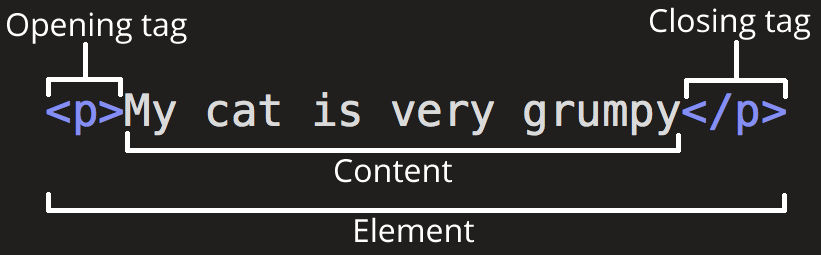

# Aula 02

Sumário

- [Aula 02](#aula-02)
  - [O que é HTML](#o-que-é-html)
    - [Elemento HTML](#elemento-html)
      - [Elementos vazios](#elementos-vazios)
      - [Atributos](#atributos)
    - [Estrutura de um documento HTML](#estrutura-de-um-documento-html)
  - [Listas](#listas)
    - [Listas ordenadas](#listas-ordenadas)
    - [Listas não ordenadas](#listas-não-ordenadas)
    - [Aninhando listas](#aninhando-listas)
    - [Listas de descrição/definição](#listas-de-descriçãodefinição)
  - [Multimídia](#multimídia)
  - [Exercícios](#exercícios)
    - [Introdução](#introdução)
    - [Listas](#listas-1)
    - [Áudio e Vídeo](#áudio-e-vídeo)

## O que é HTML

Excelente site para tutorial e referência (HTML, CSS e JavaScript): [MDN](https://developer.mozilla.org/pt-BR/). [Página de tutoriais do HTML](https://developer.mozilla.org/pt-BR/docs/Web/HTML).

O [*HyperText Markup Language*](https://html.spec.whatwg.org/), é uma **linguagem de marcação** utilizada na construção de páginas na Web. 

É a linguagem *essencial* da web. Isso significa que existem outras linguagens e elementos que são utilizados na construção das páginas web. O [W3C](https://www.w3.org/) (*World Wide Web Consortium*) é a principal organização de padronização da web. Consiste em um consórcio de (atualmente) 460 membros, desde empresas a órgãos governamentais e independentes. Alguns padrões da W3C: 

- CSS;
- SVG;
- PNG;
- XML;
- DOM;
- OWL.

Uma **linguagem de marcação** é um sistema de codificação de texto que consiste em um conjunto de símbolos inseridos em um documento de texto para controlar sua estrutura, formatação, ou o relacionamento entre suas partes. Em outras palavras é um conjunto de regras que 'governa' qual informação marcada pode ser incluída em um documento e como ela será combinada com o conteúdo do documento, de forma a facilitar o uso por humanos e máquinas. No HTML esse controle é feito com o uso de **elementos**.

### Elemento HTML

<figure style="text-align: center;">
  
  <figcaption>Anatomia de um elemento HTML</figcaption>
</figure>

As partes principais do elemento são:

- **Tag de abertura**: Consiste no nome do elemento (neste caso: `p`), envolvido entre parênteses angulares de abertura e fechamento. Isso indica onde o elemento começa, ou inicia a produzir efeito — neste caso, onde o parágrafo se inicia.
- **Tag de fechamento**: É o mesmo que a tag de abertura, exceto que este inclui uma barra diagonal antes do nome do elemento. Indica onde o elemento termina — neste caso, onde fica o fim do parágrafo. Falhar em incluir o fechamento de uma tag é um erro comum para iniciantes e pode levar a resultados estranhos.
- **O conteúdo**: Este é o conteúdo do elemento, que neste caso é somente texto.
- O **elemento**: A tag de abertura, mais a tag de fechamento, mais o conteúdo, é igual ao elemento.

Os elementos podem ser **aninhados**:

<div style="display:flex;gap:20px;">
  <pre><code>
&lt;p&gt;O Prof. Evandro é o &lt;strong&gt;melhor&lt;/strong&gt; professor de SI da UFPI.&lt;/p&gt;
  </code></pre>
  <p>O Prof. Evandro é o <strong>melhor</strong> professor de SI da UFPI.</p>
</div>

E são classificados em várias categorias: [lista de categorias de elementos](https://html.spec.whatwg.org/multipage/indices.html#element-content-categories).

Para uma lista completa de tags (elementos HTML) clique [aqui](https://developer.mozilla.org/pt-BR/docs/Web/HTML/Reference/Elements).

#### Elementos vazios

Nem todos os elementos seguem o padrão de possuírem tag de abertura, conteúdo e tag de fechamento. Alguns elementos consistem apenas em uma única tag, que é geralmente usada para inserir/incorporar algo no documento no lugar em que ele é incluído. Dois exemplos: `` e `<br>`.

#### Atributos

<figure style="text-align: center;">
  
</figure>

Elementos podem ter atributos, os quais controlam como eles irão funcionar. Consistem em pares `nome=valor` dentro da tag de abertura. O valor pode ser escrito sem aspas caso não tenha espaço vazio, ou os caracteres `<`, `>`, `‘`, `’`, `“`, `”` e `=`. Se tiver, o valor terá de ser escrito entre aspas duplas, `nome=“valor”` ou aspas simples também, `nome=‘valor’`.

No exemplo tivemos o elemento de hiperlink `<a>` com seu atributo *href*.

Um atributo deve conter:

- Um espaço entre ele e o nome do elemento (ou o atributo anterior, caso o elemento já contenha um ou mais atributos.)
- O nome do atributo, seguido por um sinal de igual.
- Um valor de atributo, com aspas de abertura e fechamento em volta dele.

[Lista de atributos globais](https://developer.mozilla.org/pt-BR/docs/Web/HTML/Reference/Global_attributes), ou seja, que podem ser usados em todos os elementos.

[Lista de atributos e seus respectivos elementos](https://developer.mozilla.org/pt-BR/docs/Web/HTML/Reference/Attributes).

### Estrutura de um documento HTML

TODO: ver sobre a URL de um arquivo local; adicionar todos os elementos básicos do html (footer, aside, etc.) no exemplo de estrutura.

A seguir o exemplo simples de um documento HTML completo:

```html
<!DOCTYPE html>
<html lang="pt-br">
    <head>
        <meta charset="UTF-8">
        <title>Título</title>
    </head>
    <body>
        <h1>Cabeçalho</h1>
        <p>Este é um exemplo <a href=“exemplo.html”>simples</a>.</p>
        <!– isto é um comentário –>
    </body>
</html>
```

Percebe-se que o documento consiste em uma **árvore de elementos e texto**. No código temos:

1. `<!DOCTYPE html>`: não é um elemento HTML, mas uma instrução para que o navegador saiba a versão da linguagem de marcação que está sendo utilizada. O HTML5 requer um elemento `<DOCTYPE>` para garantir que a página seja renderizada pelo navegador de maneira correta.
2. `<html></html>`: envolve o conteúdo da página inteira e é conhecido como o **elemento raiz** (*root element*) da página HTML, ou seja, todos os outros elementos devem ser descendentes desse elemento.
   1. No exemplo estamos configurando o atributo `lang` para `pt-br`. Com isso estamos indicando que a língua principal da página é `pt-br`.
3. `<head></head>`: atua como um container para todo o conteúdo da página HTML que não é visível para os visitantes do site. É onde são declarados os metadados sobre o documento, incluindo seu título e links para scripts e folhas de estilos.
4. `<meta charset="UTF-8">`: define o tipo da codificação dos caracteres que o seu documento deve usar, neste caso, para o tipo UTF-8.
5. `<title></title>`:  define o título de sua página, que aparecerá na guia do navegador na qual a página está carregada e é usado para descrevê-la quando for salva nos favoritos.
6. `<body></body>`: contém todo o conteúdo a ser mostrado aos usuários quando eles visitarem sua página, como texto, imagens, vídeos, jogos, faixas de áudio reproduzíveis, ou qualquer outra coisa.
7. `<h1></h1>`: tag de cabeçalho. Ao todo são 6 cabeçalhos: h1 - h6.
8. `<p></p>`: tag de parágrafo.
9. `<a></a>`: tag de link.
10. `<!– ... ->`: comentário, ou seja, texto que não será renderizado pelo navegador.

## Listas

Existem três tipos principais de listas:

- **Ordenadas**: seus elementos são ordenados de acordo com algum tipo de numeração.
- **Não ordenadas**: não há qualquer tipo de ordenação.
- **Lista de descrição/definição**: serve para organizar um conjunto de itens e suas descrições/definições associadas.

### Listas ordenadas

A tag para listas ordenadas é [`<ol>`](https://developer.mozilla.org/pt-BR/docs/Web/HTML/Reference/Elements/ol) de *ordered list*. Seus elementos devem estar entre tags `<li>` (*list item*).

Atributos: `reversed`, `start` e `type`.

Exemplo:

<div style="display:flex;gap:20px;">
  <pre><code>
&lt;ol start="5", type="A"&gt;
  &lt;li>Primeiro item&lt;/li&gt;
  &lt;li>Segundo item&lt;/li&gt;
  &lt;li>Terceiro item&lt;/li&gt;
&lt;/ol&gt;
  </code></pre>
  <div>
    <ol start="5", type="A">
      <li>Primeiro item</li>
      <li>Segundo item</li>
      <li>Terceiro item</li>
    </ol>
  </div>
</div>

### Listas não ordenadas

A tag para listas não-ordenadas é [`<ul>`](https://developer.mozilla.org/pt-BR/docs/Web/HTML/Reference/Elements/ul) de *unordered list*. Seus elementos devem estar entre tags `<li>` (*list item*).

Exemplo:

<div style="display:flex;gap:20px;">
  <pre><code>
&lt;ul>
  &lt;li>Pera&lt;/li&gt;
  &lt;li>Uva&lt;/li&gt;
  &lt;li>Maçã&lt;/li&gt;
  &lt;li>Salada Mista&lt;/li&gt;
&lt;/ul&gt;
  </code></pre>
  <div>
    <ul>
      <li>Pera</li>
      <li>Uva</li>
      <li>Maçã</li>
      <li>Salada Mista</li>
    </ul>
  </div>
</div>

### Aninhando listas

Ambas as listas podem ser aninhadas e misturadas, ou seja, `<ol>` dentro de `<ul>` e vice-versa.

Exemplo:

<div style="display:flex;gap:20px;">
  <pre><code>
&lt;ol start="5", type="A"&gt;
  &lt;li> Primeiro item&lt;/li&gt;
  &lt;li&gt;
    Segundo item
    &lt;!-- Veja que a tag de fechamento &lt;/li&gt; não é colocada aqui! --&gt;
    &lt;ol&gt;
      &lt;li&gt;segundo item primeiro subitem&lt;/li&gt;
      &lt;li&gt;segundo item segundo subitem&lt;/li&gt;
      &lt;li&gt;segundo item terceiro subitem
        &lt;ul&gt;
          &lt;li&gt; Elemento não ordenado dentro da lista ordenada&lt;/li&gt;
        &lt;/ul&gt;
      &lt;/li&gt;
    &lt;/ol&gt;
  &lt;/li&gt;
  &lt;!-- Aqui está a tag de fechamento &lt;/li&gt; --&gt;
  &lt;li>terceiro item&lt;/li&gt;
&lt;/ol&gt;
  </code></pre>
  <div>
    <ol start="5", type="A">
      <li> Primeiro item</li>
      <li>
        Segundo item
        <!-- Veja que a tag de fechamento </li> não é colocada aqui! -->
        <ol>
          <li>segundo item primeiro subitem</li>
          <li>segundo item segundo subitem</li>
          <li>segundo item terceiro subitem
            <ul>
              <li> Elemento não ordenado dentro da lista ordenada</li>  
            </ul>
          </li>
        </ol>
      </li>
      <!-- Aqui está a tag de fechamento </li> -->
      <li>terceiro item</li>
    </ol>
  </div>
</div>

### Listas de descrição/definição

A tag para listas de desrição/definição é [`<dl>`](https://developer.mozilla.org/pt-BR/docs/Web/HTML/Reference/Elements/dl) de *definition list*. Possui duas "subtags" `<dt>` (*description term*) e `<dd>` (*description definition*).

Exemplo:

<div style="display:flex;">
  <pre><code>
&lt;dl&gt;
  &lt;dt&gt;Solilóquio&lt;/dt&gt;
  &lt;dd&gt;
    Recurso dramático ou literário que consiste em verbalizar, na primeira pessoa, aquilo que se passa na consciência de um personagem para a audiência ou plateia, mas não para os demais personagens.
  &lt;/dd&gt;
  &lt;dt&gt;Monólogo&lt;/dt&gt;
  &lt;dd&gt;
    Forma de discurso teatral ou literário em que um único indivíduo expressa seus pensamentos, sentimentos e reflexões, falando sozinho ou dirigindo-se ao público
  &lt;/dd&gt;
&lt;/dl&gt;
  </code></pre>
  <div>
    <dl>
      <dt>Solilóquio</dt>
      <dd>
        Recurso dramático ou literário que consiste em verbalizar, na primeira pessoa, aquilo que se passa na consciência de um personagem para a audiência ou plateia, mas não para os demais personagens.
      </dd>
      <dt>Monólogo</dt>
      <dd>
        Forma de discurso teatral ou literário em que um único indivíduo expressa seus pensamentos, sentimentos e reflexões, falando sozinho ou dirigindo-se ao público
      </dd>
    </dl>
  </div>
</div>

## Multimídia

Para imagens as duas principais tags são: 

- [``](https://developer.mozilla.org/pt-BR/docs/Web/HTML/Reference/Elements/img): representa a inserção de imagem no documento.
  - **Principais atributos**: 
    - `alt`: define um texto alternativo que descreve a imagem.
    - `height`: a altura da imagem em pixels ou porcentagem.
    - `src` (**obrigatório**): o caminho para o arquivo de imagem.
    - `width`: a largura da imagem em pixels ou porcentagem.
- [`<figure>`](https://developer.mozilla.org/pt-BR/docs/Web/HTML/Reference/Elements/figure): representa conteúdo autocontido, potencialmente com uma legenda opcional, que é especificada usando o elemento `<figcaption>`. A figura, sua legenda e seu conteúdo são referenciados como uma única unidade.
  - Só possui os atributos globais.

Para a inserção de vídeo temos a tag

- [`<video>`](https://developer.mozilla.org/pt-BR/docs/Web/HTML/Reference/Elements/video): incorpora um reprodutor de mídia que suporta a reprodução de vídeo no documento.
  - **Atributos principais**:
    - `autoplay`: booleano, se especificado, o vídeo vai ser executado assim que possível sem precisar de carregar todo o arquivo.
    - `controls`: se estiver presente, o navegador oferecerá controles para permitir o usuário controlar a reprodução do vídeo, incluindo volume, navegação (seek), e pausa/continuação da reprodução.
    - `height`: a altura da da área de exibição em pixels.
    - `loop`: booleano, se especificado, ao chegar no fim do vídeo, ele voltará automaticamente para o começo.
    - `muted`: booleano, se especificado, o áudio vai começar mudo.
    - `poster`: para definir a *thumbnail* do vídeo.
    - `src`: a URL do vídeo a ser incorporado. É opcional, e ao invés dela é possível usar o elemento `<source>` dentro do bloco do vídeo para especificar o vídeo a ser incorporado .
    - `width`: a largura da da área de exibição em pixels.

Para adicionar vídeos do YouTube, por exemplo, é necessário utilizar a tag [`<iframe>`](https://developer.mozilla.org/pt-BR/docs/Web/HTML/Reference/Elements/iframe).

Para a inserção de áudio temos a tag

- [`<audio>`](https://developer.mozilla.org/pt-BR/docs/Web/HTML/Reference/Elements/audio)

## Exercícios

### Introdução

1. Crie um arquivo chamado index.html contendo a estrutura mínima de um documento HTML:
   - A declaração `<!DOCTYPE html>.`
   - As tags `<html>`, `<head>` e `<body>`.
   - No `<head>`, coloque um `<title>` com o texto: Minha Primeira Página Web.
   - No `<body>`, escreva um parágrafo com seu nome e curso.

2. Na mesma página, adicione:
   - Um título principal `<h1>` com o nome da disciplina: Programação para a Web 1.
   - Dois subtítulos `<h2>` com os textos: Introdução à Web e Fundamentos de HTML.
   - Um subtítulo `<h3>` chamado Primeiros Testes.

3. Adicione dois parágrafos `<p>` no corpo da página:
    - O primeiro com um resumo da disciplina.
    - O segundo com uma curiosidade pessoal (ex.: “Meu primeiro contato com a Internet foi…”).

4. Adicione três links à sua página usando a tag `<a>`:
    - Um link para o site da UFPI.
    - Um link para o [MDN Web Docs](https://developer.mozilla.org/pt-BR/).
    - Um link para o [W3Schools](https://www.w3schools.com/) configurado para abrir em uma nova aba (`target="_blank"`).

5. Adicione uma imagem usando ``:
   - Escolha uma imagem da Internet ou local.
   - Inclua os atributos `src`, `alt` e `title`.
   - Ajuste a largura da imagem (`width="200px"` por exemplo).

6. Crie:
    - Um `<div>` com fundo colorido (usando atributo `style`).
    - Dentro do `<div>`, adicione um `<p>` com texto qualquer.
    - Adicione também um `<span>` dentro do parágrafo, destacando uma palavra em outra cor.
    - Compare a diferença entre elementos de **bloco** (`div`, `p`) e **inline** (`span`).

7. Atribua:
   - `id="principal"` ao `<h1>` da página.
   - `class="subtitulo"` aos `<h2>`.
   - Passe o mouse sobre os títulos e veja o atributo `title` exibido como dica.

8. Monte uma página HTML que contenha:
   - Um título `<h1>` com seu nome.
   - Um parágrafo com uma breve biografia.
   - Um link para um vídeo ou artigo que você goste.
   - Uma imagem que represente um hobby ou interesse pessoal.
   - Um uso de `<span>` para destacar uma palavra importante.

9. Crie uma mini “página de apresentação pessoal” contendo:
    - Um título com seu nome e curso.
    - Uma foto (pode ser avatar ou ícone).
    - Uma lista de três hobbies ou interesses.
    - Um link para um site que você visita frequentemente.
    - Pelo menos um uso de `id` e um de `class` nos elementos.

### Listas

1. Crie uma lista não ordenada com os nomes de três linguagens de programação.
2. Crie uma lista ordenada com os passos para preparar um café.
3. Crie uma lista de compras usando `<ul>`.
4. Crie uma lista numerada com os meses do ano.
5. Crie uma lista de filmes favoritos e use sublistas para organizar por gênero (ação, drama, comédia).
6. Crie uma lista ordenada com tipos de protocolos da Internet (HTTP, HTTPS, FTP, SMTP).
7. Crie uma lista de tópicos de um curso, onde cada item da lista contém também uma breve descrição em parágrafo.
8. Crie uma lista não ordenada de três países, cada um contendo uma sublista com duas cidades.
9. Crie uma lista ordenada onde cada item contém também um link externo.
10. Crie uma lista de definições usando `<dl>`, `<dt>`, `<dd>` explicando termos como “HTML”, “CSS” e “JavaScript”.
11. Monte uma lista aninhada de músicas organizadas por cantores.
12. Crie uma lista ordenada de navegadores web e destaque o navegador favorito com a tag `<mark>`.

### Áudio e Vídeo

1. Crie um player de áudio simples que mostre os controles padrão do navegador. Use um arquivo `.mp3`.
2. Insira um vídeo com 480×270 pixels e controles padrão.
3. Crie um áudio que comece a tocar automaticamente ao carregar a página.
4. Coloque um vídeo curto (ex.: 5–10 segundos) que repita automaticamente para sempre.
5. Insira um arquivo de áudio que toque automaticamente e em loop, mas sem exibir controles.
6. Adicione um vídeo que mostre uma imagem estática (poster) antes de começar a reprodução.
7. Crie um player de áudio que forneça dois formatos diferentes (ex.: MP3 e OGG) usando duas tags `<source>`.
8. Insira um vídeo que inicie sem som (muted) e com autoplay + loop (ótimo para vídeos de fundo).
9. Crie um vídeo que:
   1.  Forneça 2–3 formatos (mp4, webm, ogv)
   2.  Tenha largura 100% e altura automática (responsivo)
   3.  Inclua uma mensagem de fallback clara
   4.  Use poster e controles
10. Crie um player de áudio com as seguintes características combinadas: autoplay, loop, muted (inicia sem som), preload="auto", controls. Explique qual atributo está conflitando com outro, e por quê.
11. Crie um player de vídeo que inclua legendas usando a tag `<track>`. Requisitos:
    1.  Use kind="subtitles"
    2.  srclang="pt-BR"
    3.  label="Português (Brasil)"
    4.  Arquivo .vtt simples com pelo menos 3 legendas
    5.  Coloque o atributo default para ativar as legendas automaticamente

    Exemplo mínimo de arquivo `legenda.vtt`:
    ```vtt
    WEBVTT

    00:00:01.000 --> 00:00:04.000
    Primeira frase de legenda

    00:00:05.000 --> 00:00:08.000
    Segunda legenda bem legal
    ```
12. (**DESAFIO**) Crie uma página com:
    1.  Um único elemento `<video>` ou `<audio>`.
    2.  Três botões abaixo dele (música 1, música 2, vídeo curto).
    3.  Ao clicar em cada botão, o `src` do media element muda e o player inicia automaticamente.