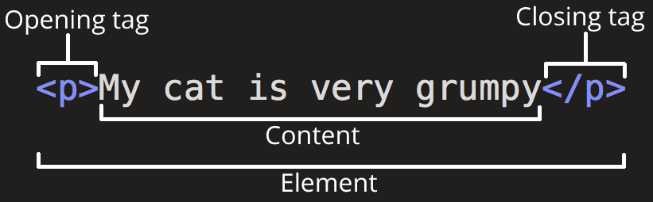
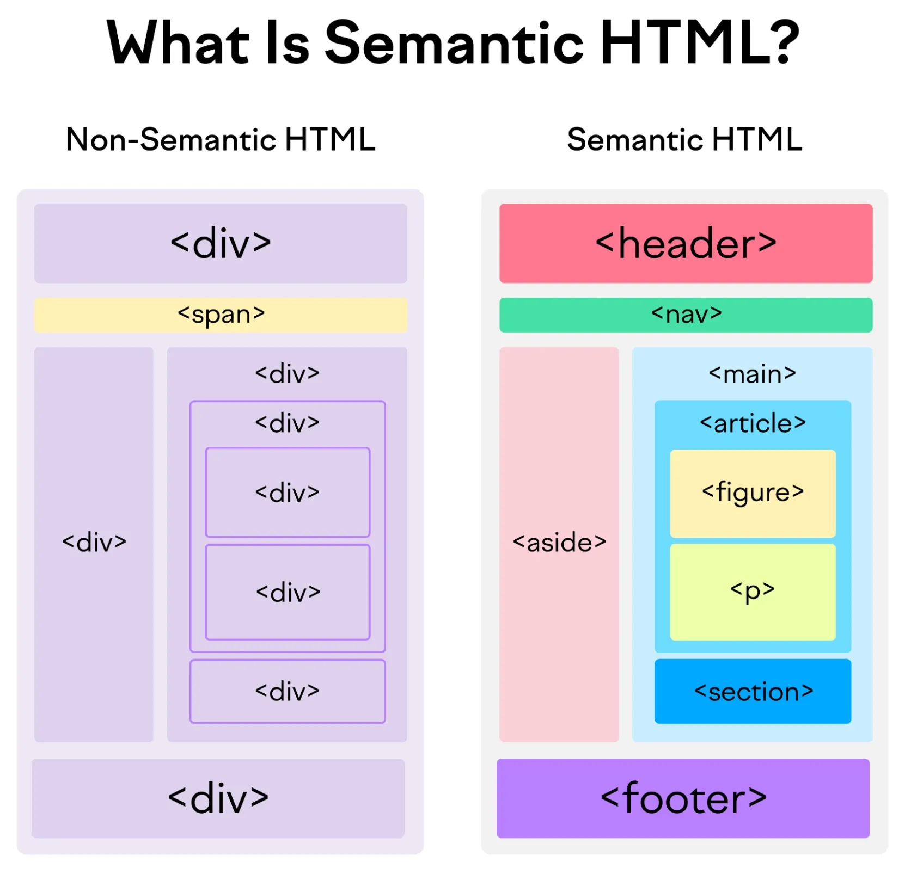

# Aula 02

Sumário

- [Aula 02](#aula-02)
  - [O que é HTML](#o-que-é-html)
    - [Elemento HTML](#elemento-html)
      - [Elementos vazios](#elementos-vazios)
      - [Atributos](#atributos)
    - [Estrutura de um documento HTML](#estrutura-de-um-documento-html)
    - [Estrutura semântica e não semântica](#estrutura-semântica-e-não-semântica)
    - [Hierarquia](#hierarquia)
  - [Exercícios](#exercícios)
    - [Fácil](#fácil)
    - [Médio](#médio)
    - [Difícil](#difícil)

## O que é HTML

Excelente site para tutorial e referência (HTML, CSS e JavaScript): [MDN](https://developer.mozilla.org/pt-BR/). [Página de tutoriais do HTML](https://developer.mozilla.org/pt-BR/docs/Web/HTML).

O [*HyperText Markup Language*](https://html.spec.whatwg.org/), é uma **linguagem de marcação** utilizada na construção de páginas na Web. 

É a linguagem *essencial* da web. Isso significa que existem outras linguagens e elementos que são utilizados na construção das páginas web. O [W3C](https://www.w3.org/) (*World Wide Web Consortium*) é a principal organização de padronização da web. Consiste em um consórcio de (atualmente) 460 membros, desde empresas a órgãos governamentais e independentes. Alguns padrões da W3C: 

- CSS;
- SVG;
- PNG;
- XML;
- DOM;
- OWL.

Uma **linguagem de marcação** é um sistema de codificação de texto que consiste em um conjunto de símbolos inseridos em um documento de texto para controlar sua estrutura, formatação, ou o relacionamento entre suas partes. Em outras palavras é um conjunto de regras que 'governa' qual informação marcada pode ser incluída em um documento e como ela será combinada com o conteúdo do documento, de forma a facilitar o uso por humanos e máquinas. No HTML esse controle é feito com o uso de **elementos**.

### Elemento HTML

<figure style="text-align: center;">
  
  <figcaption>Anatomia de um elemento HTML</figcaption>
</figure>

As partes principais do elemento são:

- **Tag de abertura**: Consiste no nome do elemento (neste caso: `p`), envolvido entre parênteses angulares de abertura e fechamento. Isso indica onde o elemento começa, ou inicia a produzir efeito — neste caso, onde o parágrafo se inicia.
- **Tag de fechamento**: É o mesmo que a tag de abertura, exceto que este inclui uma barra diagonal antes do nome do elemento. Indica onde o elemento termina — neste caso, onde fica o fim do parágrafo. Falhar em incluir o fechamento de uma tag é um erro comum para iniciantes e pode levar a resultados estranhos.
- **O conteúdo**: Este é o conteúdo do elemento, que neste caso é somente texto.
- O **elemento**: A tag de abertura, mais a tag de fechamento, mais o conteúdo, é igual ao elemento.

Os elementos podem ser **aninhados**:

<div style="display:flex;gap:20px;">
  <pre><code>
&lt;p&gt;O Prof. Evandro é o &lt;strong&gt;melhor&lt;/strong&gt; professor de SI da UFPI.&lt;/p&gt;
  </code></pre>
  <p>O Prof. Evandro é o <strong>melhor</strong> professor de SI da UFPI.</p>
</div>

E são classificados em várias categorias: [lista de categorias de elementos](https://html.spec.whatwg.org/multipage/indices.html#element-content-categories).

Para uma lista completa de tags (elementos HTML) clique [aqui](https://developer.mozilla.org/pt-BR/docs/Web/HTML/Reference/Elements).

#### Elementos vazios

Nem todos os elementos seguem o padrão de possuírem tag de abertura, conteúdo e tag de fechamento. Alguns elementos consistem apenas em uma única tag, que é geralmente usada para inserir/incorporar algo no documento no lugar em que ele é incluído. Dois exemplos: `` e `<br>`.

#### Atributos

<figure style="text-align: center;">
  
</figure>

Elementos podem ter atributos, os quais controlam como eles irão funcionar. Consistem em pares `nome=valor` dentro da tag de abertura. O valor pode ser escrito sem aspas caso não tenha espaço vazio, ou os caracteres `<`, `>`, `‘`, `’`, `“`, `”` e `=`. Se tiver, o valor terá de ser escrito entre aspas duplas, `nome=“valor”` ou aspas simples também, `nome=‘valor’`.

No exemplo tivemos o elemento de hiperlink `<a>` com seu atributo *href*.

Um atributo deve conter:

- Um espaço entre ele e o nome do elemento (ou o atributo anterior, caso o elemento já contenha um ou mais atributos.)
- O nome do atributo, seguido por um sinal de igual.
- Um valor de atributo, com aspas de abertura e fechamento em volta dele.

[Lista de atributos globais](https://developer.mozilla.org/pt-BR/docs/Web/HTML/Reference/Global_attributes), ou seja, que podem ser usados em todos os elementos.

[Lista de atributos e seus respectivos elementos](https://developer.mozilla.org/pt-BR/docs/Web/HTML/Reference/Attributes).

### Estrutura de um documento HTML

A seguir o exemplo simples de um documento HTML completo:

```html
<!DOCTYPE html>
<html lang="pt-br">
    <head>
        <meta charset="UTF-8">
        <title>Título</title>
    </head>
    <body>
        <h1>Cabeçalho</h1>
        <p>Este é um exemplo <a href=“exemplo.html”>simples</a>.</p>
        <!– isto é um comentário –>
    </body>
</html>
```

Percebe-se que o documento consiste em uma **árvore de elementos e texto**. No código temos:

1. `<!DOCTYPE html>`: não é um elemento HTML, mas uma instrução para que o navegador saiba a versão da linguagem de marcação que está sendo utilizada. O HTML5 requer um elemento `<DOCTYPE>` para garantir que a página seja renderizada pelo navegador de maneira correta.
2. `<html></html>`: envolve o conteúdo da página inteira e é conhecido como o **elemento raiz** (*root element*) da página HTML, ou seja, todos os outros elementos devem ser descendentes desse elemento.
   1. No exemplo estamos configurando o atributo `lang` para `pt-br`. Com isso estamos indicando que a língua principal da página é `pt-br`.
3. `<head></head>`: atua como um container para todo o conteúdo da página HTML que não é visível para os visitantes do site. É onde são declarados os metadados sobre o documento, incluindo seu título e links para scripts e folhas de estilos.
4. `<meta charset="UTF-8">`: define o tipo da codificação dos caracteres que o seu documento deve usar, neste caso, para o tipo UTF-8.
5. `<title></title>`:  define o título de sua página, que aparecerá na guia do navegador na qual a página está carregada e é usado para descrevê-la quando for salva nos favoritos.
6. `<body></body>`: contém todo o conteúdo a ser mostrado aos usuários quando eles visitarem sua página, como texto, imagens, vídeos, jogos, faixas de áudio reproduzíveis, ou qualquer outra coisa.
7. `<h1></h1>`: tag de cabeçalho. Ao todo são 6 cabeçalhos: h1 - h6.
8. `<p></p>`: tag de parágrafo.
9. `<a></a>`: tag de link.
10. `<!– ... ->`: comentário, ou seja, texto que não será renderizado pelo navegador.

### Estrutura semântica e não semântica

A partir da estrutura básica que já vimos, uma página HTML (ou parte dela) pode também ser organizada de forma semântica e não semântica:

<figure style="text-align: center;">
  
  <figcaption>Fonte: <a href="https://medium.com/@Bharat2044/what-are-semantics-in-html-e5b55c61f354">Bharat</a></figcaption>
</figure>

[Exemplo](exemplo-semantic.html):

```html
<!DOCTYPE html>
<html lang="en">
<head>
    <meta charset="UTF-8">
    <meta name="viewport" content="width=device-width, initial-scale=1.0">
    <title>Deep Dive into HTML Semantics</title>
</head>
<body>
    <header>
        <h1>Web Development Blog</h1>
        <nav>
            <ul>
                <li><a href="#home">Home</a></li>
                <li><a href="#about">About</a></li>
                <li><a href="#contact">Contact</a></li>
            </ul>
        </nav>
    </header>
    <main>
        <section>
            <h2>Introduction</h2>
            <p>Welcome to our exploration of HTML semantic elements...</p>
        </section>
        <article>
            <h2>Unraveling HTML Semantics</h2>
            <p>Today, we embark on a journey into the depths of HTML semantics...</p>
        </article>
    </main>
    <footer>
        <p>&copy; 2024 Web Development Blog. All rights reserved.</p>
    </footer>
</body>
</html>
```

### Hierarquia

A partir das estruturas que vimos, podemos identificar também hierarquias (DOM Tree):

```
<!DOCTYPE html>
<html> (Root)
├── <head> (Metadata)
│   ├── <title>
│   └── <meta>
└── <body> (Visible Content)
    ├── <header>
    ├── <main>
    │   └── <section>
    │       └── <p>
    └── <footer>
```

Como se trata de uma árvore, os elementos (enquanto nós na árvore) podem ser classificados de acordo com os termos:

- **Pai** (*parent*).
- **Filho** (*child*).
- **Irmão** (*sibling*).
- **Descendente** (*descendant*).

## Exercícios

### Fácil

1. Em HTML, qual é a principal função de uma `tag`?<br>
    A)Armazenar informações em um banco de dados.<br>
    B) Definir a estrutura e/ou o significado de uma parte do documento.<br>
    C) Executar código JavaScript automaticamente.<br>
    D) Definir exclusivamente a aparência visual da página.<br>
    E) Criar arquivos no computador do usuário.<br>

2. Crie um documento HTML mínimo contendo:<br>
   - a declaração `DOCTYPE`;
   - o elemento `<html>`;
   - um `<head>`;
   - um `<body>`;
   - o título da página como "Minha primeira página".

    Não é necessário adicionar nenhum conteúdo ao `<body>`.

3. Crie um documento HTML contendo três títulos:<br>
    - Sistemas de Informação como título de nível 1;
    - Programação para a Web como título de nível 2;
    - HTML como título de nível 3.

4. Escreva o código HTML que apresente o seguinte texto em um parágrafo:<br>
   > HTML é uma linguagem utilizada para estruturar documentos destinados à Web.

5. Considere o código:<br>
   ```html
   <a href="https://www.exemplo.com">Exemplo</a>
   ```
   
   Qual é a função do atributo `href`?<br>
    A) Define o texto que será exibido pelo link.<br>
    B) Define a cor do link.<br>
    C) Define o endereço para o qual o link aponta.<br>
    D) Define o tamanho da fonte do link.<br>
    E) Define o título da página.<br>

6. Crie um documento HTML contendo um link com o texto "Portal da Universidade" que aponte para:

    > https://www.ufpi.br

7. Escreva um elemento HTML para exibir a imagem `logo.png`.

    O elemento deve possuir:<br>
    - `src` apontando para `logo.png`;
    - `alt` contendo o texto "Logotipo da universidade".

8. Crie uma lista não ordenada contendo os seguintes itens:<br>
    - HTML
    - CSS
    - JavaScript
    - Python

9. Qual dos elementos abaixo deve conter o conteúdo que será apresentado na área principal da página?<br>
    A) `<head>`<br>
    B) `<title>`<br>
    C) `<meta>`<br>
    D) `<body>`<br>
    E) `<html>`<br>

10. Crie um trecho HTML contendo:<br>
    - um título de nível 1 com o texto "Sobre o curso";
    - um parágrafo com o texto "Este curso apresenta os fundamentos do desenvolvimento Web."

11. Crie um link com o texto "Pesquisar" apontando para `https://www.google.com`. O link deve possuir também um atributo title com o valor: `Abrir página de pesquisa`.

12. Escreva HTML para apresentar as seguintes três informações, cada uma em uma linha:<br>
    ```
    Nome: Maria
    Curso: Sistemas de Informação
    Semestre: 2º
    ```

    Utilize um único elemento `<p>` e elementos apropriados para realizar as quebras de linha.

13. Qual alternativa apresenta corretamente os elementos utilizados para títulos em HTML, do maior nível hierárquico para o menor?<br>
    A) `<title>`, `<subtitle>`, `<subsubtitle>`<br>
    B) `<h1>`, `<h2>`, `<h3>`<br>
    C) `<header>`, `<section>`, `<article>`<br>
    D) `<heading1>`, `<heading2>`, `<heading3>`<br>
    E) `<head>`, `<body>`, `<footer>`<br>

14. Crie um documento HTML completo que apresente:<br>
    - título da página: "Página Inicial";
    - título `<h1>`: "Bem-vindo!";
    - parágrafo: "Esta é minha primeira página HTML."

15. Qual é a finalidade principal do elemento `<title>`?<br>
    A) Criar o título principal visível no corpo da página.<br>
    B) Definir o título associado ao documento, normalmente exibido na aba ou janela do navegador.<br>
    C) Definir o título de uma imagem.<br>
    D) Criar um cabeçalho dentro do `<body>`.<br>
    E) Exibir uma mensagem ao usuário.<br>

### Médio

16.  Crie uma página HTML completa para representar um pequeno perfil pessoal. A página deve conter:<br>
    - título do documento: "Meu perfil";
    - `<h1>` com seu nome;
    - um parágrafo apresentando brevemente você;
    - um subtítulo `<h2>` chamado "Meus interesses";
    - uma lista não ordenada com pelo menos três interesses.


17. Crie uma página contendo três links:
    1.  Google, apontando para https://www.google.com;
    2.  MDN, apontando para https://developer.mozilla.org;
    3.  W3C, apontando para https://www.w3.org.

    Todos os links devem possuir um atributo title que explique o destino do link.

18. Considere:<br>
    ```html
    
    ```

    Qual é a finalidade mais importante do atributo alt?<br>
    A) Definir o endereço da imagem.<br>
    B) Alterar automaticamente o tamanho da imagem.<br>
    C) Fornecer um texto alternativo para a imagem.<br>
    D) Definir a extensão do arquivo.<br>
    E) Criar uma legenda visual obrigatoriamente abaixo da imagem.<br>

19. Crie uma página HTML para representar uma disciplina universitária chamada Estatística. A página deve conter:<br>
    - um `<h1>` com o nome da disciplina;
    - um parágrafo descrevendo a disciplina;
    - um `<h2>` chamado "Conteúdo";
    - uma lista contendo pelo menos quatro conteúdos;
    - um `<h2>` chamado "Material";
    - um link para um material fictício chamado material.html.


20. Crie uma página contendo:<br>
    - uma imagem chamada universidade.jpg;
    - texto alternativo adequado para a imagem;
    - um título `<h1>` chamado "Nossa Universidade";
    - um parágrafo descrevendo a universidade;
    - um link chamado "Saiba mais", apontando para sobre.html.

    Organize os elementos em uma ordem coerente.

21. Crie uma estrutura HTML para uma pequena página com um menu contendo os seguintes links:<br>
    ```
    Início
    Cursos
    Professores
    Contato
    ```

    Os links devem apontar, respectivamente, para:<br>
    ```
    index.html
    cursos.html
    professores.html
    contato.html
    ```

22. O código abaixo apresenta problemas de estrutura e fechamento de elementos:<br>
    ```html
    <html>
      <head>
        <title>Minha página
      </head>

      <body>
        <h1>Bem-vindo
        <p>Este é meu site.
    </html>
    ```

    Reescreva o código corrigindo os problemas para produzir um documento HTML estruturalmente adequado.

23. Crie uma página que contenha:<br>
    - uma imagem com src e alt;
    - um link com href e title;
    - um elemento `<p>` com um atributo id de valor descricao;
    - um título `<h1>` com o texto "Página de teste".

24. Considere a estrutura:<br>
    ```html
    <html>
        <head>
            ...
        </head>
        <body>
            ...
        </body>
    </html>
    ```

    Qual alternativa descreve corretamente a diferença entre `<head>` e `<body>`?<br>
    A) `<head>` contém todo o conteúdo visível e `<body>` contém apenas metadados.<br>
    B) `<head>` contém informações e recursos relacionados ao documento; `<body>` contém o conteúdo da página.<br>
    C) Ambos possuem exatamente a mesma função.<br>
    D) `<head>` deve estar dentro de `<body>`.<br>
    E) `<body>` deve estar fora de `<html>`.<br>

25.  Crie uma página HTML representando uma notícia. Ela deve conter:<br>
    - título do documento: "Notícias da Universidade";
    - título principal com a manchete;
    - um parágrafo introdutório;
    - subtítulo "Detalhes";
    - pelo menos dois parágrafos;
    - uma imagem relacionada à notícia, utilizando src e alt;
    - um link chamado "Leia mais".

### Difícil

26. Crie um documento HTML utilizando, além de `<html>`, `<head>` e `<body>`, os seguintes elementos:<br>
    - `<header>`;
    - `<nav>`;
    - `<main>`;
    - `<section>`;
    - `<footer>`.

    A página deve representar um pequeno site de uma universidade e conter:<br>
    - um cabeçalho com o nome da universidade;
    - uma área de navegação com três links;
    - uma seção principal com título e texto;
    - um rodapé com o texto "© 2026 Universidade".

27. Crie uma página HTML representando um produto de uma loja virtual. A página deve conter:<br>
    - título do documento;
    - cabeçalho;
    - nome do produto como `<h1>`;
    - imagem do produto com alt;
    - descrição;
    - preço;
    - uma lista com pelo menos três características do produto;
    - um link chamado "Comprar";
    - rodapé.

    Procure organizar os elementos de maneira semanticamente coerente.

28. Crie uma página HTML para representar um curso de Desenvolvimento Web. A página deverá possuir:<br>
    - um `<header>` com o nome do curso;
    - um `<nav>` com links para Início, Conteúdo e Contato;
    - um `<main>`;
    - pelo menos três `<section>` dentro do `<main>`;
    - cada seção deve possuir um título;
    - uma seção deve conter uma lista;
    - outra deve conter uma imagem;
    - outra deve conter um link;
    - um `<footer>`.

    Utilize corretamente os níveis de título (h1, h2, etc.).

29. O código abaixo foi produzido por um estudante, mas contém diversos problemas:<br>
    ```html
    <!DOCTYPE html>
    <html>
    <head>
        <title>Curso Web
    <body>
        <header>
            <h1>Desenvolvimento Web</h2>
        </header>


        <main>
            <p>Aprenda HTML e CSS.
            
            <a>Material do curso</a>
        </main>


        <footer>
            <p>Universidade 2026
    </html>
    ```

    Reescreva o documento corrigindo os problemas encontrados. Além de corrigir as tags abertas/fechadas incorretamente, faça as alterações necessárias para que:<br>
    - a imagem tenha texto alternativo;
    - o link tenha um destino;
    - os elementos estruturais estejam corretamente organizados.

30.  Crie uma página HTML completa para um portfólio acadêmico de um estudante de Sistemas de Informação. A página deve conter, no mínimo:<br>
    - estrutura completa de um documento HTML;
    - `<title>` apropriado;
    - `<header>`;
    - `<nav>` com pelo menos três links;
    - `<main>`;
    - uma seção de apresentação;
    - uma seção de habilidades contendo uma lista;
    - uma seção de projetos contendo pelo menos dois projetos;
    - uma imagem com src e alt;
    - links para informações ou projetos;
    - `<footer>`.

    Além de funcionar no navegador, o código deve apresentar boa organização hierárquica dos elementos e uso coerente das tags HTML.