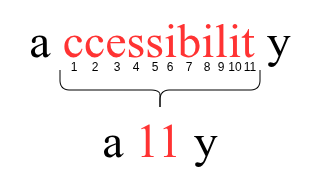

# Aula 03

**Sumário**

- [Aula 03](#aula-03)
  - [Acessibilidade](#acessibilidade)
    - [O papel do HTML Semântico](#o-papel-do-html-semântico)
      - [Princípios-chave](#princípios-chave)
  - [Trabalho de sala de aula](#trabalho-de-sala-de-aula)

---

## Acessibilidade

A **accessibilidade**  no desenvolvimento web significa permitir o máximo possível de pessosa de utilizarem os sites, incluindo todas aquelas com algum grau de limitação física ou cognitiva. Por exemplo, pessoas com:

- Problemas de visão: cegas, baixa visão, ou daltônicas; 
- Problemas de audição: surdas, com baixa audição, ou perda de audição; 
- Dificuldade de locomoção: amputadas, com paralisia, distúrbio genético ou neurológico; 
- Doenças mentais: depressão, esquizofrenia; 
- Dificuldades de aprendizagem: dislexia, TDAH; 
- etc.

Na Internet, em Inglês, a acessibilidade é comumente referida como `a11y`, um "numerônimo" para a palavra *accessibility*.

<figure style="text-align:center">
  
  <figcaption>Explicação visual do numerônimo <code>a11y</code> (inspiração: <a href="https://www.continualengine.com/blog/what-is-a11y/">Continual Engine</a>)</figcaption>
</figure>

A construção de sites acessíveis acaba se tornando vantajoso em diversos aspectos:

- **HTML semântico**, que aumenta a acessibilidade, também melhora o SEO (*Search Engine Optimization*) do seu site.
- O seu site e empresa passam a ser vistos de maneira mais positiva.
- Não somente as pessoas com limitação, mas também outros grupos de pessoas se beneficiam: 
  - Usuários de dispositivos móveis (celular, tablet, etc.);
  - Pessoas com Internet lenta;
  - Pessoas que, por alguma razão, precisam desabilitar o áudio ou a tela enquanto continuam consumindo seu conteúdo;
  - etc.
- Seu site estará cumprindo leis (caso existam).

### O papel do HTML Semântico

<!-- Fonte: https://usability.yale.edu/digital-accessibility/accessibility-resources/accessibility-articles/html -->
O HTML semântico fornece estrutura, significado e suporte nativo para leitores de tela, sem a necessidade de trabalho extra para a criação de tecnologias assistivas.

#### Princípios-chave

- **Use elementos que correspondem ao propósito do conteúdo**
  - Por exemplo:
    - `<button>` para ações.
    - `<a href="">` para hiperlinks.
    - `<input>` e `<label>` nos formulários.
    - `<nav>`, `<main>`, `<header>`, `<footer>`, etc., para o layout.
  - Evite `
` ou `` para criar recursos interativos
    - `
Enviar
` [NÃO]
    - `<button onclick="submitForm()">Enviar</button>` [SIM]
- **Use estrutura de cabeçalho apropriado**
  - Os cabeçalhos definem a hierarquia do conteúdo de uma página.
  - Melhores práticas:
    - Apenas um `<h1>` por página;
    - Utilize cabeçalhos aninhados (`<h2>`, `<h3>`, etc.) para a estrutura;
    - Não pule níveis de cabeçalho (por exemplo, `<h2>` -> `<h4>`).

**CONTINUAR DE:** https://usability.yale.edu/digital-accessibility/accessibility-resources/accessibility-articles/html

Como o `a11y` é um termo "genérico", na Internet é possível encontrar diversos guias, *melhores práticas*, ferramentas, etc., em uma infinidade de sites. Talvez, o melhor lugar de encontrar informações e guias "oficiais" seja no site do [**WAI**](https://www.w3.org/WAI/) (*Web Accessibility Initiative*), de início principalmente nas abas [*Accessibility Fundamentals*](https://www.w3.org/WAI/fundamentals/), [*Design & Develop*](https://www.w3.org/WAI/design-develop/) e [*Standards/Guidelines*](https://www.w3.org/WAI/standards-guidelines/).

## Trabalho de sala de aula

A turma deverá se dividir em 2 grupos:

- **Grupo 1:** Pesquisar e apresentar sobre WCAG 2.
- **Grupo 2:** Pesquisar e apresentar sobre ARIA.