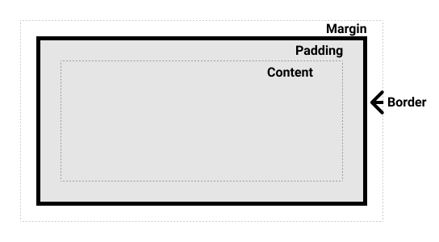

# Aula 04

Sumário

- [Aula 04](#aula-04)
  - [CSS](#css)
  - [Sintaxe básica](#sintaxe-básica)
    - [Aplicando o CSS](#aplicando-o-css)
  - [Seletores](#seletores)
    - [Seletor de tipo (ou Seletor de Elemento/Tag)](#seletor-de-tipo-ou-seletor-de-elementotag)
    - [Seletor de classe](#seletor-de-classe)
    - [Seletor de id](#seletor-de-id)
    - [Seletor universal](#seletor-universal)
    - [Lista de Seletores (ou Grupo de Seletores)](#lista-de-seletores-ou-grupo-de-seletores)
    - [Seletores de atributo](#seletores-de-atributo)
      - [Seletores de presença e valor](#seletores-de-presença-e-valor)
      - [Seletores de substring](#seletores-de-substring)
    - [Pseudo-classes](#pseudo-classes)
    - [Pseudo-elementos](#pseudo-elementos)
  - [Combinadores](#combinadores)
    - [Combinador Descendente](#combinador-descendente)
    - [Combinador Filho Direto (Child combinator)](#combinador-filho-direto-child-combinator)
    - [Combinador Irmão Adjacente (Adjacent sibling / Next-sibling)](#combinador-irmão-adjacente-adjacent-sibling--next-sibling)
    - [Combinador Irmão Geral (General sibling / Subsequent-sibling)](#combinador-irmão-geral-general-sibling--subsequent-sibling)
  - [Box Model](#box-model)
    - [Como o tamanho total é calculado](#como-o-tamanho-total-é-calculado)

## CSS

O **CSS** (*Cascading Style Sheets*, ou Folhas de Estilo em Cascata, numa tradução livre) é uma linguagem usada para descrever a apresentação de um documento escrito em HTML ou XML. Uma `folha de estilo` consiste em um conjunto de regras que especificam a apresentação de um documento. Portanto, o CSS descreve como elementos devem ser renderizados na tela ou em outras mídias.

É uma das principais linguagens da web e suas [especificações](https://www.w3.org/Style/CSS) são padronizadas pelo W3C. As especificações não são versionadas, porém, o W3C compila um panorama (*snapshot*) do **último estado estável das especificações** e também do progresso de **módulos individuais**. O *snapshot* de 2026 pode ser acessado com [este link](https://www.w3.org/TR/css-2026/). As últimas especificações são o CSS Nível 2 Revisão 1 (título em Inglês: *Cascading Style Sheets Level 2 Revision 1 (CSS 2.1) Specification*), ou [CSS 2.1](https://www.w3.org/TR/CSS2/).

O CSS pode ser usado em várias situações relacionadas à aparência de uma página, por exemplo:

- Estilização de texto, incluindo modificação da cor e tamanho de títulos e links.
- Criação de layouts, como layouts de grade (*grid layout*) ou de múltiplas colunas.
- Aplicação de efeitos especiais, como animação.


## Sintaxe básica

O CSS é uma linguagem baseada em regras, as quais são definidas ao se especificar grupos de estilos que devem ser aplicados a um elemento particular ou um grupo de elementos da página. Exemplo:

```css
h1{
    color: red;
    font-size: 2.5em;
}
```

- A regra acima inicia com um `seletor`, ou seja, uma seleção de qual elemento será estilizado. No exemplo o cabeçalho de primeiro nível foi selecionado. Logo após o `seletor` são abertas as *chaves*, delimitando o bloco da regra em questão.
- Dentro do bloco podemos ter uma ou mais declarações, as quais possuem a forma de um par `propriedade: valor;`. No exemplo, foram declaradas duas prorpridades, `color` e `font-size`. A cor escolhida foi vermelho (`red`), e o tamanho escolhido foi `2.5em`. Esse `em` é um valor proporcional relativo ao elemento pai do elemento atual.

### Aplicando o CSS

Existem três formas de se aplicar o CSS a um elemento:

1. **Estilo *inline***: quando utilizamos o atributo `style` de um elemento. [Exemplo](./exemplos/exemplo_estilo-1.html).
2. **Estilo interno**: quando definimos o CSS em uma tag `<style>` dentro da tag `<head>`. [Exemplo](./exemplos/exemplo_estilo-2.html).
3. **Estilo externo**: quando o CSS é definido em um arquivo próprio de extensão `.css` e importado dentro da tag `<head>`. [Exemplo](./exemplos/exemplo_estilo-3.html).

## Seletores

### Seletor de tipo (ou Seletor de Elemento/Tag)

Seleciona todos os elementos HTML de acordo com o nome da tag. É o seletor mais básico e direto. Ele afeta todos os elementos daquele tipo na página.

**Sintaxe**: 

`nome-da-tag { propriedade: valor; }`

**Exemplos**:

```css
p { color: navy; }                  /* todos os parágrafos */
h1 { font-size: 2.5rem; }           /* todos os títulos h1 */
div { background-color: #f0f0f0; }  /* todos os divs */
a { text-decoration: none; }        /* todos os links */
```

### Seletor de classe

Seleciona elementos que possuem um atributo `class`. Uma mesma classe pode ser usada em vários elementos diferentes. É o seletor mais flexível e mais utilizado em projetos reais.

**Sintaxe**:

`.nome-da-classe { propriedade: valor; }`

**Exemplos**:

```css
.destaque { font-weight: bold; color: red; }
.botao { padding: 12px 24px; background: #007bff; color: white; }
.card { border: 1px solid #ddd; border-radius: 8px; }
```

É possível definir uma `classe` para elementos específicos:

```css
span.highlight { background-color: yellow; }
h1.highlight { background-color: pink; }
```

E também múltiplas `classes` para um mesmo elemento:

```css
.notebox {
   border: 4px solid #666666;
   padding: 0.5em;
   margin: 0.5em;
}

.notebox.warning {
   border-color: orange;
   font-weight: bold;
}

.notebox.danger {
   border-color: red;
   font-weight: bold;
}
```

### Seletor de id

Seleciona um único elemento da página através do atributo `id`. Tem a maior especificidade entre os seletores básicos.

**Sintaxe**:

`#nome-do-id { propriedade: valor; }`

**Exemplos**:

```css
#cabecalho { background: #333; color: white; padding: 20px; }
#menu-principal { position: sticky; top: 0; }
#rodape { text-align: center; font-size: 0.9rem; }
```

### Seletor universal

Seleciona todos os elementos da página (incluindo `<html>`, `<body>`, etc.). Muito usado para resets globais ou para aplicar uma propriedade a tudo.

**Sintaxe**:

`* { propriedade: valor; }`

**Exemplos**:

```css
* { margin: 0; padding: 0; box-sizing: border-box; }   /* reset clássico */
* { font-family: 'Arial', sans-serif; }                /* fonte padrão para tudo */
```

### Lista de Seletores (ou Grupo de Seletores)

Permite aplicar as mesmas regras de estilo a vários seletores diferentes de uma só vez. Separa os seletores por vírgula. Economiza código e facilita a manutenção.

**Sintaxe**:

`seletor1, seletor2, seletor3 { propriedade: valor; }`

**Exemplo**:

```css
h1, h2, h3, h4 { color: #2c3e50; font-family: 'Georgia', serif; }
p, li, span { line-height: 1.6; }
button, .botao, input[type="submit"] { cursor: pointer; }
```

**[Exemplo com todos os seletores básicos](./exemplos/seletores_basicos.html)**.

### Seletores de atributo

#### Seletores de presença e valor

Esses seletores permitem a seleção de um elemento baseado na presença de um atributo, ou em várias correspondências diferentes com o valor do atributo.

| **Seletor** | **Exemplo** | **Descrição** |
|---|---|---|
| `[attr]` | `a[title]` | Seleciona elementos que possuam o elemento `attr`. |
| `[attr=valor]` | `a[href="https://exemplo.com"]` | Seleciona elementos com um atributo `attr` cujo valor seja exatamente `valor`. |
| `[attr~=valor]` | `p[class~="especial"]` | Seleciona elementos com um atributo `attr` cujo valor seja exatamente `valor` ou contenha `valor` em sua lista de valores. |
| `[attr\|=valor]` | `div[lang\|="pt"]` | Seleciona elementos com um atributo `attr` cujo valor seja exatamente `valor` ou comece com `valor` imediatamente seguido por um hífen. |

**[Exemplo de seletores de presença e valor](./exemplos/seletor_atributo.html)**.

#### Seletores de substring

Esses seletores permitem uma correspondência mais avançada de substrings dentro do valor do seu atributo. Por exemplo, se você tivesse classes de `box-warning` e `box-error` e quisesse combinar tudo que começou com a string "box-", você poderia usar `[class^="box-"]` para selecionar os dois (ou `[class|="box"]` como descrito abaixo).

| **Seletor** | **Exemplo** | **Descrição** |
|---|---|---|
| `[attr^=value]` | `li[class^="box-"]` | Corresponde a elementos com um atributo `attr` cujo valor começa com `valor`. |
| `[attr$=value]` | `li[class$="-box"]` | Corresponde a elementos com um atributo `attr` cujo valor termina com `valor`. |
| `[attr*=value]` | `li[class*="box"]` | Corresponde a elementos com um atributo `attr` cujo valor contém o `valor` em qualquer lugar dentro da string. |

**[Exemplo de seletores de substring](./exemplos/seletor_substring.html)**.

### Pseudo-classes

As pseudo-classes são palavras-chave que definem um **estado especial de um elemento**. Elas não existem no HTML, mas são ativadas pelo navegador conforme a interação do usuário ou pela posição/condição do elemento na estrutura.

Elas sempre começam com dois pontos (`:`) e são colocadas depois do seletor normal. As pseudo-classes mais comuns:

| Pseudo-classe | Quando é ativada? | Uso comum |
|---|---|---|
| `:hover` | Mouse passa por cima | "Efeitos de botão, link, card" |
| `:active` | Elemento está sendo clicado (pressionado) | Feedback de clique |
| `:focus` | Elemento recebe foco (teclado ou clique) | "Formulários, acessibilidade" |
| `:visited` | Link já foi visitado | Links visitados |
| `:link` | Link ainda não foi visitado | Links não visitados |
| `:first-child` | Primeiro filho do pai | "Listas, tabelas" |
| `:last-child` | Último filho do pai | "Listas, tabelas" |
| `:nth-child(n)` | Elemento na posição específica | "Zebra stripes, galerias" |
| `:checked` | Checkbox/radio está marcado | Formulários |
| `:disabled` | Elemento está desabilitado | Inputs bloqueados |
| `:not()` | Negação (exclui algo) | `:not(:hover)` |

**Exemplos**:

```css
a:hover { color: red; }
button:active { transform: scale(0.95); }
input:focus { outline: 3px solid blue; }
li:nth-child(2n) { background: #f0f0f0; }
```

### Pseudo-elementos

Pseudo-elementos permitem criar conteúdo fictício ou estilizar partes específicas de um elemento sem precisar adicionar tags extras no HTML.

Eles representam uma “parte virtual” do elemento e sempre começam com dois dois-pontos (`::`). Os pseudo-elementos mais comuns:

| Pseudo-elemento | O que faz? | Uso comum |
|---|---|---|
| `::before` |Insere conteúdo antes do elemento | "Ícones, setas, contadores" |
| `::after` | Insere conteúdo depois do elemento | "Ícones, marca d’água, aspas" |
| `::first-letter` |Estiliza a primeira letra | "Drop caps, capitulares" |
| `::first-line` | Estiliza a primeira linha do texto | Destaque inicial de parágrafo |
| `::selection` | Estiliza o texto selecionado pelo usuário | Highlight personalizado |
| `::marker` | Estiliza o marcador de listas (`<ul>` e `<ol>`) | Bolinhas ou números customizados |

**Exemplos**:

```css
.card::before { content: "⭐"; }
blockquote::after { content: "”"; font-size: 4rem; }
p::first-letter { font-size: 3rem; float: left; }
::selection { background: gold; color: black; }
```

**[Exemplo completo de pseudo-classes e pseudo-elementos](./exemplos/pseudo-classes_pseudo-elementos.html)**.

## Combinadores

### Combinador Descendente

Seleciona elementos que são **descendentes** (filhos, netos, bisnetos etc.) de outro elemento, **independentemente do nível de aninhamento**. É o combinador mais amplo e mais usado.

Símbolo: ` ` (um ou mais espaços).

**Exemplos**:

```css
article p          { color: #444; }              /* todo <p> que esteja dentro de <article> (qualquer nível) */
nav a              { text-decoration: none; }    /* todo link dentro de nav */
.card .preco       { font-weight: bold; }        /* classe .preco dentro de .card */
```

### Combinador Filho Direto (Child combinator)

Seleciona apenas elementos que são **filhos diretos** (nível imediatamente abaixo) do elemento anterior. Ignora netos e níveis mais profundos.

Símbolo: `>`

**Exemplos**:

```css
ul > li            { list-style: square; }       /* apenas filhos diretos de ul */
article > h2       { margin-top: 0; }            /* h2 que é filho direto de article */
.menu > .item      { padding: 10px; }            /* apenas itens diretos do menu */
```

### Combinador Irmão Adjacente (Adjacent sibling / Next-sibling)

Seleciona um elemento que é irmão imediato (vem logo em seguida) do elemento anterior, e **ambos devem ter o mesmo pai**.

Símbolo: `+`

**Exemplos**:

```css
h2 + p             { margin-top: 0; }               /* primeiro parágrafo após h2 (muito usado em textos) */
dt + dd            { margin-bottom: 1.2em; }        /* definição após termo em <dl> */
li.active + li     { border-top: 1px solid gray; }  /* primeiro item de lista após um item de lista da classe active */
```

### Combinador Irmão Geral (General sibling / Subsequent-sibling)

Seleciona todos os irmãos que aparecem depois (em qualquer posição posterior) do elemento anterior, desde que tenham o mesmo pai. Mais amplo que o `+`.

Símbolo: `~`

**Exemplos**:

```css
h2 ~ p             { color: #555; line-height: 1.7; }           /* todos <p> após h2 */
img ~ figcaption   { font-style: italic; font-size: 0.9em; }    /* todos os <figcaption> após img */
dt ~ dd            { margin-left: 2em; }                        /*todos os <dd> após dt */
```

**[Exemplo geral de combinadores](./exemplos/combinadores.html)**.

## [Box Model](https://developer.mozilla.org/en-US/docs/Web/CSS/CSS_box_model/Introduction_to_the_CSS_box_model)

Todo elemento HTML é tratado como uma caixa retangular pelo navegador. O Box Model define como essa caixa é calculada e como suas partes interagem entre si.

<figure style="text-align:center;">
    
</figure>

As quatro camadas principais (de dentro para fora):

1. Content (conteúdo)
    - Área onde fica o texto, imagem, vídeo etc.
    - Controlada diretamente pelas propriedades `width` e `height`.

2. Padding (preenchimento interno)
    - Espaço entre o conteúdo e a borda.
    - Afeta o fundo do elemento (background).
    - Propriedades: `padding-top`, `padding-right`, `padding-bottom`, `padding-left` ou, de forma mais direta (shorthand), `padding: 10px 20px 15px 5px;`

3. Border (borda)
    - Linha ao redor do padding + content.
    - Pode ter espessura, estilo e cor.
    - Propriedades: `border-width`, `border-style`, `border-color` ou, de forma mais direta (shorthand), `border: 4px solid #333;`

4. Margin (margem externa)
    - Espaço fora da borda.
    - Não tem cor/fundo (é transparente).
    - Causa colapso de margens verticais entre elementos block adjacentes.
    - Propriedades: `margin: 20px;` (todos os lados) ou `margin: 10px 30px;`

### Como o tamanho total é calculado

Existem dois modelos de cálculo controlados pela propriedade `box-sizing`:

| Valor | O que inclui em `width` e `height`? | Fórmula do tamanho total final,Comportamento típico |
|---|---|---|
| `content-box` | Apenas o content | Total = width + padding-esq/dir + border-esq/dir + margin-esq/dir,Padrão histórico (padrão do CSS) – causa surpresas frequentes |
| `border-box` | content + padding + border (margin fica fora) | "Total = width (fixo) – padding e border são ""subtraídos"" do espaço interno",Muito mais previsível e usado na prática |

Exemplo prático comparativo:

```css
.caixa {
  width: 300px;
  height: 200px;
  padding: 20px;
  border: 10px solid black;
  margin: 30px;
}
```

- **content-box** (padrão): Tamanho total na tela = 360px largura × 260px altura (300 + 20+20 + 10+10)
- **border-box**: Tamanho total na tela = 300px largura × 200px altura (exatamente o que você declarou)

Por isso, a grande maioria dos projetos modernos usa:

```css
* {
  box-sizing: border-box;
}
```

**[Exemplo completo de box model](./exemplos/boxmodel.html)**.