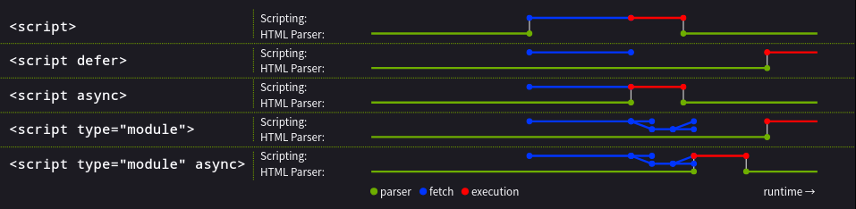

# Aula 05

Fontes:

- Principal: [The Modern JavaScript Tutorial](https://javascript.info/)
- Secundárias
  - [Roadmap](https://roadmap.sh/javascript).
  - [MDN](https://developer.mozilla.org/pt-BR/docs/Web/JavaScript).
  - [Eloquent JavaScript](https://eloquentjavascript.net/).

Sumário

- [Aula 05](#aula-05)
  - [O que é JavaScript?](#o-que-é-javascript)
  - [O que o JavaScript pode fazer no navegador](#o-que-o-javascript-pode-fazer-no-navegador)
  - [O que o JavaScript não pode fazer no navegador](#o-que-o-javascript-não-pode-fazer-no-navegador)
  - [O que faz o JavaScript único](#o-que-faz-o-javascript-único)
  - [Linguagens "sobre" o JavaScript](#linguagens-sobre-o-javascript)
  - [Especificação oficial](#especificação-oficial)
  - [Embutindo código JavaScript no HTML](#embutindo-código-javascript-no-html)
  - [Sintaxe](#sintaxe)
    - [Declarações](#declarações)
    - [Comentários](#comentários)
    - [Variáveis](#variáveis)
      - [Nomeação de variáveis](#nomeação-de-variáveis)
    - [Constantes](#constantes)
  - [Tipos de dados](#tipos-de-dados)
    - [Number](#number)
    - [BigInt](#bigint)
    - [String](#string)
    - [Booleano](#booleano)
    - [Null](#null)
    - [Undefined](#undefined)
    - [Object](#object)
    - [Symbol](#symbol)
  - [Interação básica](#interação-básica)
  - [Conversões de tipo](#conversões-de-tipo)
    - [Conversão para String](#conversão-para-string)
    - [Conversão numérica](#conversão-numérica)
    - [Conversão booleana](#conversão-booleana)
  - [Operadores básicos](#operadores-básicos)
    - [Aritméticos](#aritméticos)
    - [Atribuição](#atribuição)
  - [Comparações](#comparações)
    - [Comparações entre diferentes tipos](#comparações-entre-diferentes-tipos)
    - [Igualdade estrita](#igualdade-estrita)
  - [Condicionais](#condicionais)
    - [Cláusula `else` e `else if`](#cláusula-else-e-else-if)
    - [Operador ternário](#operador-ternário)
  - [Operadores lógicos](#operadores-lógicos)
    - [Operador de coalescência nulo `??`](#operador-de-coalescência-nulo-)
  - [Blocos de repetição](#blocos-de-repetição)
  - [Declaração `switch`](#declaração-switch)
  - [Funções](#funções)
    - [Variáveis locais](#variáveis-locais)
    - [Variáveis externas](#variáveis-externas)
    - [Valores padrão](#valores-padrão)
  - [Expressões de funções](#expressões-de-funções)
    - [Funções *callback*](#funções-callback)
  - [Funções de seta](#funções-de-seta)
  - [Exercícios 1](#exercícios-1)
    - [Tópico 1: Hello, world! (Executando o primeiro programa com console.log)](#tópico-1-hello-world-executando-o-primeiro-programa-com-consolelog)
    - [Tópico 2: Code structure (Estrutura do código: declarações, ponto e vírgula, comentários)](#tópico-2-code-structure-estrutura-do-código-declarações-ponto-e-vírgula-comentários)
    - [Tópico 3: The modern mode, “strict mode” ('use strict' para modo estrito)](#tópico-3-the-modern-mode-strict-mode-use-strict-para-modo-estrito)
    - [Tópico 4: Variables (Variáveis: var, let, const e escopo)](#tópico-4-variables-variáveis-var-let-const-e-escopo)
    - [Tópico 5: Data types (Tipos de dados: primitivos como number, string, boolean, etc.)](#tópico-5-data-types-tipos-de-dados-primitivos-como-number-string-boolean-etc)
    - [Tópico 6: Interaction: alert, prompt, confirm (Interações: alert, prompt, confirm no navegador)](#tópico-6-interaction-alert-prompt-confirm-interações-alert-prompt-confirm-no-navegador)
    - [Tópico 7: Type Conversions (Conversões de tipo: automáticas e manuais)](#tópico-7-type-conversions-conversões-de-tipo-automáticas-e-manuais)
    - [Tópico 8: Basic operators, maths (Operadores básicos e matemática)](#tópico-8-basic-operators-maths-operadores-básicos-e-matemática)
    - [Tópico 9: Code quality, formatting, naming (Qualidade de código, formatação, nomenclatura)](#tópico-9-code-quality-formatting-naming-qualidade-de-código-formatação-nomenclatura)
    - [Tópico 10: Comments, debugging (Comentários e depuração básica)](#tópico-10-comments-debugging-comentários-e-depuração-básica)
    - [Tópico 11: Loops – while and for (Loops while e for)](#tópico-11-loops--while-and-for-loops-while-e-for)
    - [Tópico 12: Loops – for...in and for...of (Loops for...in e for...of)](#tópico-12-loops--forin-and-forof-loops-forin-e-forof)
    - [Tópico 13: Controlling Loop Flow – break and continue (Controle de Fluxo em Loops – break e continue)](#tópico-13-controlling-loop-flow--break-and-continue-controle-de-fluxo-em-loops--break-e-continue)
    - [Tópico 14: The switch Statement (Instrução switch)](#tópico-14-the-switch-statement-instrução-switch)
    - [Tópico 15: Functions (Funções)](#tópico-15-functions-funções)
    - [Tópico 16: Function expressions (Expressões de Função)](#tópico-16-function-expressions-expressões-de-função)
    - [Tópico 17: Arrow functions, the basics (Funções Arrow, os básicos)](#tópico-17-arrow-functions-the-basics-funções-arrow-os-básicos)
  - [Exercícios 2](#exercícios-2)
    - [Teóricos](#teóricos)
    - [Práticos](#práticos)

## O que é JavaScript?

`JavaScript` foi inicialmente criado para "dar vida às páginas web".

Os programas feitos nesta linguagem são chamados `scripts`. Eles podem ser escritos diretamente no HTML da página e executados automaticamente com o carregamento da página.

Os `scripts` são fornecidos e executados como "texto puro". Eles não precisam de preparação especial ou compilação para executar. Neste aspecto o JavaScript é bem diferente da linguagem `Java`.

<!--
<link rel="stylesheet" href="https://cdnjs.cloudflare.com/ajax/libs/font-awesome/6.5.2/css/all.min.css">
<i class="fas fa-info-circle" style="color:blue"></i> Testano]
-->

<link href="https://fonts.googleapis.com/icon?family=Material+Icons" rel="stylesheet">
<div style="border:2px cornflowerblue solid;">
<h3><i class="material-icons" style="color:cornflowerblue;font-size:18px">info</i> Por que o JavaScript tem esse nome?</h3>

<p>Quando o JavaScript foi criado ele tinha outro nome: "LiveScript". Nesse mesmo período o Java estava muito popular, então decidiram incorporar Java no nome da linguagem para ajudar em sua popularização.</p>
<p>À medida em que evoluiu, o JavaScript se tornou uma linguagem completamente independente, com sua própria especificação chamada de <a href="https://en.wikipedia.org/wiki/ECMAScript">ECMAScript</a> e, agora, já não tem qualquer relação com o Java.</p>
</div>

Hoje em dia o JavaScript pode ser executado não apenas no navegador, mas também no servidor ou em qualquer dispositivo que tenha um programa chamado `JavaScript engine`. Por exemplo o [V8](https://en.wikipedia.org/wiki/V8_(JavaScript_engine)) é a engine utilizada `Chrome` e seus derivados.

## O que o JavaScript pode fazer no navegador

O JavaScript moderno é uma linguagem de programação "segura". Ela não fornece acesso de baixo nível à memória ou a CPU porque foi inicialmente criada para navegadores, os quais não requerem tal acesso.

O que o JavaScript é capaz de fazer depende muito do ambiente sobre o qual esteja rodando. Por exemplo, o Node.js tem suporte para funções que permitem a leitura/escrita de arquivos arbitrários, para executar solicitações de rede, etc.

No navegador o JavaScript pode fazer tudo que esteja relacionado à manipulação de uma página web, interação com o usuário e com o servidor. Por exemplo:

- Adicionar HTML à página, mudar o conteúdo atual, modificar estilos.
- Reagir às ações do usuário, como cliques do mouse, ou a movimentação de sua seta, botões pressionados.
- Enviar requisições pela rede para servidores remotos, baixar e subir arquivos (as tecnologias AJAX e COMET).
- Consultar e configurar cookies, fazer perguntas a quem estiver acessando uma página, exibir mensagens.
- Lembrar dos dados do lado do cliente (*client-side*), a partir do armazenamento local (*local storage*).

## O que o JavaScript não pode fazer no navegador

As possibilidades de ação do JavaScript no navegador são limitadas para proteção dos usuários. O objeto é prevenir que uma página web maldosa acesse informações privadas ou danifique os dados do uusário.

Exemplos de restrições:

- O JavaScript em uma página web não pode ler/escrever arquivos arbitrários no HD, copiá-los ou rodar programas. Ele não tem acesso direto às funções do S.O.
- Navegadores modernos permitem ao JavaScript trabalar com arquivos, mas o acesso é limitado e concedido apenas se o usuário fizer certas ações, como arrastar um arquivo para uma janela do navegador, ou selecionando a partir de uma tag `<input>`.
- Existem formas de interagir com a câmera, microfone e outros dispositivos, mas eles requerem permissão explícita do usuário. Portanto, uma página com JavaScript não pode habilitar uma câmera sorrateiramente, observar o ambiente e enviar informações para algum espião.
- Diferentes abas e janelas geralmente não sabem da existência umas das outras. Algumas vezes isso é possível, por exemplo, quando uma janela usa JavaScript para abrir outra janela. Mas, mesmo nesse caso, o JavaScript de uma página não pode acessar a outra página se elas são de diferentes sites (ou seja, domínio, protocolo ou porta diferentes).
- Isto é chamado de "Política da Mesma Origem" (*Same Origin Policy*). Para contornar isso, ambas as páginas precisam consentir em trocar dados e precisam conter código JavaScript especial para lidar com isso. Essa limitação é, reiterando, para a segurança do usuário.
- O JavaScript pode facilmente se comunicar pela rede com o servidor de onde a página web veio. Mas sua habilidade de receber dados de outros sites/domínios é prejudicada. Apesar de ser possível, é necessário o aceite explícito (comunicado pelos cabeçalhos HTTP) do lado remoto. Mais uma vez, isto é uma limitação por segurança.

## O que faz o JavaScript único

Existem pelo menos três grandes coisas sobre o JavaScript:

- Integração completa com HTML/CSS.
- Coisas simples são feitas de forma simples.
- Tem suporte de todos os grandes navegadores e é habilitado por padrão.

O JavaScript é a única tecnologia que combina essas três coisas. Isto é o que faz essa linguagem ser única, é a razão de ser a ferramenta mais usada na criação de interfaces no navegador. Além disso, o JavaScript pode ser usado também para criar servidores, aplicações *mobile*, etc.

## Linguagens "sobre" o JavaScript

A sintaxe do JavaScript não atende às necessidades de todo mundo. Pessoas diferentes querem recursos diferentes. Então, recentemente, uma grande quantidade de linguagens apareceu, as quais são "transpiladas" (convertidas) para JavaScript antes de serem executadas no navegador.

Ferramentas modernas fazem a transpilação bastante rápida e transparente, permitindo aos desenvolvedores programarem em outra linguagem e converter automaticamente por debaixo dos panos.

Alguns exemplos:

- [CoffeeScript](https://coffeescript.org/) é um "açúcar sintático" para o JavaScript. Ele introduz sintaxe mais enxuta, permitindo a escrita de código mais limpo e preciso. Os programadores de Ruby adoram.
- [TypeScript](https://www.typescriptlang.org/) é concentrado em adicionar "tipagem de dados estrita" para simplificar o desenvolvimento e dar suporte para sistemas mais complexos. É desenvolvido pela Microsoft.
- [Flow](https://flow.org/) também adiciona tipagem de dados, mas de forma diferente. É desenvolvido pelo Facebook.
- [Dart](https://dart.dev/) é uma linguagem autônoma, com sua própia `engine` que roda em ambientes fora do navegador (como aplicativos móveis), mas pode também ser transpilado para o JavaScript. Desenvolvido pelo Google.
- [Brython](https://brython.info/) é um transpilador de Python para o JavaScript, o que permite a escrita de aplicações puramente em Python.
- [Kotlin](https://kotlinlang.org/docs/js-overview.html) é uma linguagem de programação moderna, concisa e segura, que pode ser usada no navegador ou no Node.

## Especificação oficial

A especificação mais recente do JavaScript é a seguinte: [ECMA-262](https://ecma-international.org/publications-and-standards/standards/ecma-262/).

Clicando no link você será levado à uma página onde poderá escolher visualizar as especificações em PDF ou HTML. Caso você tenha interesse em se aprofundar o máximo possível nessa linguagem, recomendo o máximo de leitura possível dessa documentação.

## Embutindo código JavaScript no HTML

O `HTML` possui um elemento [`script`](https://html.spec.whatwg.org/#the-script-element) o qual é utilizado para englobar códigos script.

```html
<script>
    Código JavaScript ...    
</script>
```

Seus atributos são: `async`, `blokcing`, `crossorigin`, `defer`, `fetchpriority`, `integrity`, `nomodule`, `referrerpolicy`, `src` e `type`.

Os dois principais são:

- `src`: localização do arquivo `.js` a ser carregado e executado.
- `type`: o tipo de script.

Junto a eles, de início, é interessante também conhecer os atributos:

- `async`: de valor booleano, indica que o navegador deve, se possível, executar o script assincronamente.
- `defer`: é utilizado para adiar a execução do script.

Estes dois últimos atributos são booleanos que indicam se o script deve ser `avaliado`[^1]. Existem vários possíveis modos que podem ser selecionados usando esses atributos, a depender do tipo do script.

[^1]: A `avaliação` (`evaluation`) identifica problemas que possam causar problemas de renderização nos navegadores, melhora o desempenho do site e torna o conteúdo web acessível a mais usuários.

Para [scripts clássicos](https://html.spec.whatwg.org/#classic-script) (*classic scripts*) e externos, se o atributo `async` está presente, então o script será `carregado` (`fetched`) em paralelo à `análise` (`parsing`[^2]) e `avaliado` assim que estiver disponível (potencialmente antes do fim da `análise`). Se o atributo `async` não estiver presente, mas o atributo `defer` estiver, então o script clássico será `carregado` em paralelo e `avaliado` quando a página tiver terminado a `análise`. Se nenhum dos dois estiver declarado, o script é `carregado` e `avaliado` imediatamente, bloquenado a `análise` até que ambos sejam finalizados.

[^2]: É o processo de analisar e interpretar o código HTML para extrair informação e convertê-la em um formato estruturado e utilizável, normalmente a árvore DOM. Este processo permite às aplicações interagirem com, modificarem e utilizarem o conteúdo e a estrutura das páginas web.

Para [scripts de módulo](https://html.spec.whatwg.org/#module-script) (*module scripts*), se o atributo `async` estiver presente então o script de módulo e todas as suas dependências serão `carregadas` em paralelo para `análise`, e o script de módulo será `avaliado` assim que estiver disponível (potencialmente antes do fim da `análise`). Senão, o script de módulo e suas dependências serão `carregadas` em paralelo para `análise` e `avaliação` quando a página tiver terminada a sua `análise`. (O atributo `defer` não tem efeito em scripts de módulo.)

Resumo dos parágrafos acima:



O atributo `defer` pode ser especificado mesmo se o `async` tiver sido também, para fazer com que navegadores antigos, que possuem suporte apenas para `defer`, adiem a execução do script, em vez do bloqueio que é o padrão.

O código `JavaScript` é embutido geralmente dentro da tag `head` e/ou da tag `body`. Quando o script está na tag `head`, sua execução se dará assim que a página for carregada. Por causa disso, alguns desenvolvedores colocam as tags `<script>` ao fim da tag `<body>`, pouco antes de seu fechamento (`</body>`).

Exemplos:

Script em `head`

```html
<!DOCTYPE html>
    <head>
        <meta charset="utf-8">
        <title>>Script em head</title>
        <script type="text/javascript">
            Código ...
        </script>
    </head>
    <body>
    </body>
</html>
```

Script em `body`

```html
<!DOCTYPE html>
    <head>
        <meta charset="utf-8">
        <title>>Script em body</title>
    </head>
    <body>
        <script type="text/javascript">
            Código ...
        </script>
    </body>
</html>
```

Script em `head` e `body`

```html
<!DOCTYPE html>
    <head>
        <meta charset="utf-8">
        <title>>Script em body</title>
        <script type="text/javascript">
            Código ...
        </script>
    </head>
    <body>
        <script type="text/javascript">
            Código ...
        </script>
    </body>
</html>
```

Dois scripts em `body`

```html
<!DOCTYPE html>
    <head>
        <meta charset="utf-8">
        <title>>Script em body</title>
    </head>
    <body>
        <script type="text/javascript" src="jsexemplo.js"></script>
        <script type="text/javascript">
            Código ...
        </script>
    </body>
</html>
```

## Sintaxe

### Declarações

As `declarações` são construtctos e comandos que executam ações.

É possível ter tantas `declarações` quanto quiser, e elas podem ser separadas por ponto-e-vírgula `;`:

```javascript
alert('Olá'); alert('Mundo');
```

Se forem declaradas em linhas diferentes, o `;` não é obrigatório:

```javascript
alert('Olá')
alert('Mundo')
```

### Comentários

Os comentários de uma linha começam com duas barras `//`. Um bloco de comentário, ou seja, um comentário de duas ou mais linhas, inicia com `/*` e termina com `*/`. Exemplo

```javascript
// Comentáriod e uma linha
alert('Olá')
/* Comentário
de
várias linas */
alert('Mundo')
```

### Variáveis

Como em toda linguagem de programação, uma `variável` é um nome que damos a um endereço de memória, onde uma informação será armazenada. Para criar variáveis em JavaScript, usa-se a palavra reservada `let`:

```javascript
let mensagem;

mensagem = 'Olá mundo!';
alert(mensagem);
```

É possível declarar e assinalar múltiplas variáveis em uma mesma linha:

```javascript
let user = 'João', idade = '22', mensagem = 'Olá';
```

Por questões de legibilidade, o mais comum são as seguintes possibilidades:

```javascript
let user = 'João'; 
let idade = '22'; 
let mensagem = 'Olá';
```

```javascript
let user = 'João',
    idade = '22', 
    mensagem = 'Olá';
```

```javascript
// Estilo comma-first (comma é vírgula em Inglês)
let user = 'João' 
    , idade = '22' 
    , mensagem = 'Olá';
```

Ainda existe uma forma mais antiga de declarar variáveis, a qual pode ser vista posteriormente:

```javascript
var idade = 20;
```

#### Nomeação de variáveis

Existem duas regras principais:

1. O nome precisa conter apenas letras, dígitos, ou os símbolos `$` e `_`.
2. O primeiro caractere **não** pode ser um dígito.

É importante lembrar também que uma variável não pode ter o mesmo nome do que uma [palavra reservada](https://developer.mozilla.org/en-US/docs/Web/JavaScript/Reference/Lexical_grammar#Keywords).

A convenção para nomes de variável com múltiplas palavras é o `camelCase`.

```javascript
let nomeDeUsuario;
let teste123;
let $ = 1;
let _ = 2;

// Os seguintes nome são incorretos
let let = 5;
let function = 'função';
let 1a;
let meu-nome;
```

Por fim, o JavaScript diferencia as letras maiúsculas das minúsculas.

### Constantes

Uma constante é uma "variável" cujo valor não muda. Para declarar uma, usa-se a palavra reservada `const`:

```javascript
const dataNascimento = '06/10/2025';
```

Uma `const` não pode ser reassinalada:

```javascript
const dataNascimento = '06/10/2025';

dataNascimento = '10/10/2025'; // causa um erro
```

Outra convenção (em boa parte das lingagens) é nomear constantes cujos valores são difíceis de lembrar com nomes totalmente em maiúsculo:

```javascript
const COLOR_RED = "#F00";
const COLOR_GREEN = "#0F0";
const COLOR_BLUE = "#00F";
const COLOR_ORANGE = "#FF7F00";

// ...quando houver necessidade de escolher uma cor
let cor = COLOR_ORANGE;
alert(cor); // #FF7F00
```

## Tipos de dados

Existem 8 tipos de dados básicos no JavaScript. Uma variável pode ser associada a qualquer tipo de dado. Ao mesmo tempo, o JavaScript permite que o tipo de dado de uma variável possa mudar no decorrer da execução do programa (`tipagem dinâmica`):

```javascript
let message = "hello";
message = 123456;
```

Os tipos de dados são: `Number`, `BigInt`, `String`, `Boolean`, `Null`, `Undefined`, `Objetct` e `Symbol`.

### [Number](https://262.ecma-international.org/16.0/index.html?_gl=1*lozk0z*_ga*MTgxNDk2ODA4NS4xNzU5MjgwODE5*_ga_TDCK4DWEPP*czE3NTk4NjQzMzckbzMkZzAkdDE3NTk4NjQzMzckajYwJGwwJGgw#sec-ecmascript-language-types-number-type)

Representa os valores do tipo `inteiro` e `ponto flutuante` (*float*). Além dos valores normais existem alguns "valores especiais":`NaN` (*Not a Number*), `+Infinity` (infinito positivo) e `-Infinity` (infinito negativo).

```javascript
alert(1 / 0) // Infinity
// ou também
alert(Infinity);

// NaN
alert("não é um número" / 2);
```

### [BigInt](https://262.ecma-international.org/16.0/index.html?_gl=1*lozk0z*_ga*MTgxNDk2ODA4NS4xNzU5MjgwODE5*_ga_TDCK4DWEPP*czE3NTk4NjQzMzckbzMkZzAkdDE3NTk4NjQzMzckajYwJGwwJGgw#sec-ecmascript-language-types-bigint-type)

É um valor `inteiro` para representar valores muito grandes, os quais não podem ser expressos com `Number`. Mais precisamente, o `BigInt` pode armazenar valores acima de $2^{53} - 1$ e abaixo de $- 2^{53} - 1$.

É um tipo de dado acrescentado recentemente na linguagem, para representar `inteiros` de tamanho arbitrário. Um valor desse tipo pode ser criado ao acrescentar um `n` ao fim do valor `inteiro`:

```javascript
const numeroGrandao = 1234567890123456789012345678901234567890n;
```

### [String](https://262.ecma-international.org/16.0/index.html?_gl=1*lozk0z*_ga*MTgxNDk2ODA4NS4xNzU5MjgwODE5*_ga_TDCK4DWEPP*czE3NTk4NjQzMzckbzMkZzAkdDE3NTk4NjQzMzckajYwJGwwJGgw#sec-ecmascript-language-types-string-type)

São caracteres entre aspas simples ou duplas:

```javascript
let str = "Olá";
let str2 = 'Mundo';
```

Existe também a `string` com a crase <code>`</code>, usada para embutir valores e expressões, os quais devem estar envoltos em <code>${...}</code>:

```javascript
let nome = "Fulano";

// embutindo valo
alert(`Olá ${nome}!`); // Olá Fulano!

// embutindo expressão
alert(`O resultado é ${1 + 2}`); // O resultado é 3
```

### [Booleano](https://262.ecma-international.org/16.0/index.html?_gl=1*lozk0z*_ga*MTgxNDk2ODA4NS4xNzU5MjgwODE5*_ga_TDCK4DWEPP*czE3NTk4NjQzMzckbzMkZzAkdDE3NTk4NjQzMzckajYwJGwwJGgw#sec-ecmascript-language-types-boolean-type)

O tipo de dados dos valores lógicos `true` e `false`.

```javascript
let campoNomeChecado = true;
let campoIdadeChecado = false;

// Pode ser o resultado de uma expressão também
let ehMaior = 4 > 1;
alert(ehMaior); // true
```

### [Null](https://262.ecma-international.org/16.0/index.html?_gl=1*lozk0z*_ga*MTgxNDk2ODA4NS4xNzU5MjgwODE5*_ga_TDCK4DWEPP*czE3NTk4NjQzMzckbzMkZzAkdDE3NTk4NjQzMzckajYwJGwwJGgw#sec-ecmascript-language-types-null-type)

Um tipo de dado com somente um valor possível: `null`. Indica um valor nulo, inexistente.

### [Undefined](https://262.ecma-international.org/16.0/index.html?_gl=1*lozk0z*_ga*MTgxNDk2ODA4NS4xNzU5MjgwODE5*_ga_TDCK4DWEPP*czE3NTk4NjQzMzckbzMkZzAkdDE3NTk4NjQzMzckajYwJGwwJGgw#sec-ecmascript-language-types-undefined-type)

Da mesma forma que o `Null`, `Undefined` é um tipo de dado com apenas um "valor".

É um tipo de dado que se refere a uma variável que se sabe o tipo de dado a ser armazenado, mas não tem o valor em si, ou seja, significa que um "valor não foi atribuído".

```javascript
let idade;
alert(idade); // undefined
```

### [Object](https://262.ecma-international.org/16.0/index.html?_gl=1*lozk0z*_ga*MTgxNDk2ODA4NS4xNzU5MjgwODE5*_ga_TDCK4DWEPP*czE3NTk4NjQzMzckbzMkZzAkdDE3NTk4NjQzMzckajYwJGwwJGgw#sec-object-type)

Uma instância desse tipo de dados representa uma **coleção de propriedades**. Cada propriedade é uma `propriedade de dados` ou uma `propriedade acessadora`:

- `propriedade de dados`: associa uma chave a um valor, e um conjunto atributos booleanos.
- `propriedade acessadora`: associa uma chave com uma ou mais `funções acessadoras`, e um conjunto de atributos booleanos. As `funções acessadoras` são usadas para armazenar ou consultar valores associados com a propriedade.

### [Symbol](https://262.ecma-international.org/16.0/index.html?_gl=1*lozk0z*_ga*MTgxNDk2ODA4NS4xNzU5MjgwODE5*_ga_TDCK4DWEPP*czE3NTk4NjQzMzckbzMkZzAkdDE3NTk4NjQzMzckajYwJGwwJGgw#sec-ecmascript-language-types-symbol-type)

Este tipo de dados é o conjunto de todos os valores que não são String, mas que podem ser usados como chave para a propriedade de um objeto.

Cada valor possível de símbolo é **único** e **imutável**.

## Interação básica

As três funções básicas para interação com o usuário são:

- `alert`: exibe uma mensagem e espera o usuário clicar em "OK". Exemplo:
  
  ```javascript
  alert("Olá");
  ```

- `prompt`: exibe uma janela com uma mensagem, um campo para escrita e os botões 'OK' e 'Cancel'. Sintaxe:

  ```javascript
  resultado = prompt(titulo, [default]);
  ```

  onde `title` é o texto que será exibido e `default` [^1] (opcional) é o valor padrão para o campo de entrada de dado.

[^1]: Convenção: um parâmetro entre colchetes indica que ele é opcional.
  
  Exemplo:

  ```javascript
  let idade = prompt("Qual é a sua idade?", 100);
  alert(`Você tem ${idade} anos!`); // Você tem 100 anos!
  ```

- `confirm`: exibe uma janela com uma pergunta e dois botões: "OK" e "Cancel". Exemplo:
  
  ```javascript
  let ehAluno = confirm("Você é aluno(a)?");
  alert(ehAluno); // true se o botão OK foi clicado
  ```

## Conversões de tipo

Na maioria das vezes os operados e funções convertem os valores dados automaticamente para o tipo necessário. Por exemplo, a função `alert` converte automaticamente qualquer valor para String. Porém, existem situações em que é necessário que o desenvolvedor faça a conversão explicitamente.

### Conversão para String

Neste caso queremos transformar algum valor em uma String. Isso pode ser feito com a função `String(valor)`. Exemplo:

```javascript
let valor = true;
alert(typeof valor); // mostra o tipo de dado - booleano

valor = String(valor); // agora valor é "true"
alert(typeof valor); // string
```

### Conversão numérica

É a transformação de um valor no tipo numérico (`number`). Expressões e funções matemáticas fazem essa conversão automaticamente:

```javascript
alert("6" / "2"); // 3
```

A conversão "manual" é feita com a função `Number(valro)`:

```javascript
let str = "123";
alert(typeof str); // string

let num = Number(str);
alert(typeof num); // number
```

A conversão segue as seguintes regras:

| Valor | Saída |
|-------|-------|
| `undefined` | `NaN` |
| `null` | 0 |
| `true` e `false` | `1` e `0` |
| `string` | espaços em branco (incluindo tabulações `\t` e quebra de linha `\n`) no início e no fim são removidas. Se a string remanescente for vazia, o resultado é `0`. Senão, o número é "lido" da string. Um erro retorna `NaN`. |

### Conversão booleana

É feito com a função `Boolean(valor)` e segue as seguintes regras:

- Valores que são intuitivamente "vazios", como `0`, uma `string` vaiza, `null`, `undefined` e `NaN`, são convertidos em `false`.
- Outros valores são convertidos em `true`.

## Operadores básicos

### Aritméticos

- Adição: `+`.
  - É utilizado também para concatenar `strings`.
  - Como operador **unário**, opera conversão numérica. Ex.:
    ```javascript
    alert(+true); // retorna 1
    ```
- Subtração: `-`.
- Multiplicação: `*`.
- Divisão: `/`.
- Resto: `%`.
- Exponenciação: `**`.

### Atribuição

Resumidamente é o operador `=`. O JavaScript, entretanto, permite outras possibilidades. Por exemplo, **atribuição encadeada**:

```javascript
let a, b, c;

a = b = c = 2 + 2;

alert(a); // 4
alert(b); // 4
alert(c); // 4
```

Outras possibilidades:

```javascript
let n = 2;
n += 5; // n agora é 7
n *= 2; // n agora é 14
```

Incremento/decremento:

```javascript
let count = 2;
count++; // count -> 3
count--; // count -> 2
```

O JavaScript permite tanto `++variavel` quanto `variavel++`. Quando, como usar e o resultado:

- Se o resultado do incremente/decremento não é usado, não há diferença:
  ```javascript
  let count = 0;
  count++;
  ++count;
  alert(count); // 2
  ```
- Se você quiser incrementar uma variável e imediatamente usar o resultado do operador, você deve usar o operador como prefixo:
  ```javascript
  let count = 0;
  alert(++count); // 1
  ```
- Se você quiser incrementar uma variável, mas usar o valor anterior, você deve usar o operador como poxfixo:
  ```javascript
  let count = 0;
  alert(count++); // 0
  ```

## Comparações

São operações realizadas com `operadores relacionais`: `>`, `>=`, `<`, `<=`, `==` e `!=`. O resultado das operações é um valor booleano.

### Comparações entre diferentes tipos

Strings ou valores booleanos são convertidos em números:

```javascript
alert('2' > 1); // true; '2' é convertido para 2
alert('01' == 1); // true, '01' é convertido para 1
alert(true == 1); // true
alert(false == 0); // true
```

### Igualdade estrita

O operador `===` verifica a igualdade sem conversão de tipo:

```javascript
alert(0 === false); // false
```

A negação desse operador é: `!==`.

## Condicionais

Ocorre com a declaração `if`:

```javascript
if(condição) comandos ...
```

Se houver mais de um comando quando a condição for `true`, o bloco é envolvido por chaves:

```javascript
if(comparação){ 
    comandos ...
    comandos ...
}
```

### Cláusula `else` e `else if`

Sintaxe:

```javascript
if(condição){
    comandos ...
    comandos ...
} else{
    comandos ...
    comandos ...
}
```

```javascript
if(condição){
    comandos ...
    comandos ...
} else if (condição){
    comandos ...
    comandos ...
} else{
    comandos ...
}
```

### Operador ternário

Sintaxe:

```javascript
let resultado = condição ? valor1 : valor2;
```

A condição é avaliada e se retornar `true` o `valor1` (que pode ser uma expressão também) é assumido e atribuído a `resultado`. Se a condição retornar `false`, o `valor2` é assumido.

Existe também a possibilidade de aninhar o operador ternário:

```javascript
let resultado = condição ? valor1 : 
    condição2 ? valor3 :
    condição3 ? valor4 : valor5;
```

Ainda dá para substituir o `if`:

```javascript
let empresa = prompt('Qual empresa criou o JavaScript?', '');

(empresa == 'Netscap') ? alert('Exato!') : alert('Errado!');
```

## Operadores lógicos

Os quatro operadores lógicos do JavaScript são: `||` (OR), `&&` (AND), `!` (NOT) e `??` (Coalescência nula).

São comumente usados para avaliar múltiplas condições.

Além do uso clássico, o JavaScript acrescenta recursos aos operadores:

- `||` (OR) retorna o primeiro valor verdadeiro. Exemplo:
  ```javascript
  let primeiroNome = "";
  let sobrenome = "";
  let apelido = "Programador das galáxias";

  alert(primeiroNome || sobrenome || apelido || "Anônimo");
  // A linha acima retorna "Programador das galáxias"
  ```
- `&&` (AND) retorna o primeiro valor falso. Exemplo:
  ```javascript
  alert(1 && null && 2); // retorna null
  ```

### Operador de coalescência nulo `??`

Este operador é uma adição recente à linguagem, e retorna o primeiro argumento que **não é** `null` ou `undefined`. Exemplo:

```javascript
result = a ?? b;
```

tem o mesmo efeito de: 
```javascript
result = (a !== null && a !== undefined) ? a : b;
```

Exemplo de sua utilidade:

```javascript
let usuario = "Joãozinho";

alert(usuario ?? "Anônimo");
```

No exemplo acima, como `usuario` tinha sido definido, o `alert` mostra o nome **Joãozinho**.

## Blocos de repetição

O JavaScript tem os blocos `while`, `do..while` e `for`.

As sintaxes são bem parecidas com o "padrão" das linguagens:

```javascript
while(condição) comando; // se tem somente 1 comando

// OU

while(condição){
    comandos ...
}

do {
    comandos ...
} while (condição);

for (início; condição; passo){
    comandos ...
}
```

A variável contadora pode ser declarada dentro do `for`:

```javascript
for(let i = 0; i < 3; i++){
    comandos ...
}
```

É possível usar o `for` sem todas as partes:

```javascript
let i = 0; // o valor inicial já foi declarado

for(; i < 3; i++){
    comandos ...
}
```

```javascript
let i = 0; // o valor inicial já foi declarado

for(; i < 3;){
    i++; // a variável contadora é incrementada dentro do for
    comandos ...
}
```

```javascript
for(;;){
    // for infinito
}
```

O loop pode ser interrompido com a palavra reservada `break`:

```javascript
let soma = 0;

while (true) {
  let valor = +prompt("Insira um número", '');
  if (!valor) break;

  soma += valor;

}
alert( 'Soma: ' + soma );
```

A próxima iteração pode ser chamada logo:

```javascript
for (let i = 0; i < 10; i++) {

  // Se for true, pula o alert e começa a próxima iteração
  if (i % 2 == 0) continue;

  alert(i); // 1, then 3, 5, 7, 9
}
```

## Declaração `switch`

Serve para substituir vários blocos `if` quando se sabe os valores para comparação. Sintaxe:

```javascript
switch(x){
    case 'valor1':
        ...
        [break] // entre colchetes, portanto é opcional
    case 'valor2':
        ...
        [break]
    default:
        ...
        [break]
}
```

Exemplo:

```javascript
let a = prompt('Quantos você tem?');

switch(a){
    case 1:
        alert(`${a} é pouco.`)
        break;
    case 2:
        alert(`${a} é bom.`)
        break;
    case 3:
        alert(`${a} é demais.`)
        break;
    default:
        alert('Misericórdia!')
}
```

É importante lembrar que na avaliação dos `cases` é feita uma comparação estrita `===`, portanto é preciso ser feita com os tipos corretos.

## Funções

A sintaxe de uma função em JavaScript é como segue:

```javascript
function nome(parametro1, parametro2, ..., parametroN){
    // comandos ...
    [return [valor|expressão];]
}
```

### Variáveis locais

São as variáveis declaradas no escopo da função e, por isso, são visíveis apenas dentro daquela função. Exemplo:

```javascript
function exibirMensagem(){
    let mensagem = "Olá mundo!"; // variável local
    alert(mensagem);
}

exibirMensagem(); // chamando/invocando a função
```

### Variáveis externas

São as variáveis declaradas fora do escopo de uma função e, por isso, podem ser acessadas e modificadas por funções. Exemplo:

```javascript
let nomeUsuario = 'Fulano';

function exibirMensagem(){
    let mensagem = 'Olá ' + nomeUsuario;
    alert(mensagem);
}

exibirMensagem();
```

```javascript
let nomeUsuario = 'Fulano';

function exibirMensagem(){
    nomeUsuario = 'Cicrano'; // variável teve seu valor modificado
    let mensagem = 'Olá ' + nomeUsuario;
    alert(mensagem);
}

alert(nomeUsuario); // Fulano, antes da chamada de função

exibirMensagem();

alert(nomeUsuario); // Cicrano, após a chamada de função
```

### Valores padrão

Se uma função é chamada, mas o argumento não é fornecido, então seu valor ficará como `undefined`. Porém, é possível definir valores padrões para os argumentos:

```javascript
function exibirMensagem(de, texto = 'não tem texto'){
    alert(de + ': ' + texto);
}

exibirMensagem('Derpina');
```

Outra forma de tratar parâmetros sem seus valores é com o uso dos operadores lógicos:

```javascript
function exibirMensagem(texto){
    // Lembra que o OU retorna o primeiro verdadeiro?
    texto = texto || 'vazio';
    ...
}
```

```javascript
function exibirContador(contador){
    // Lembra do operador coalescente nulo?
    alert(contador ?? "desconhecido");
}

exibirContador(0); // 0
exibirContador(null); // desconhecido
exibirContador(); // desconhecido
```

## Expressões de funções

Uma função declarada normalmente costuma ter a seguinte sintaxe:

```javascript
function nome(param1, ..., paramN){
    ...
}
```

O JavaScript permite também que uma função possa ser "declarada" como uma expressão ('função expressão' ou 'expressão de função'?). Isso é possível porque uma função em JavaScript é um valor e, portanto, pode ser armazenada em uma variável:

```javascript
let dizPonha = function(){
    alert('Ponha');
};
```

### Funções *callback*

Esse é o caso de funções sendo passadas como parâmetros para outras funções. É possível, inclusive, passar uma expressão de função:

```javascript
function pergunta(questao, sim, nao){
    if(confirm(questao)) sim()
    else nao();
}

pergunta(
    "Você concorda?",
    function() {alert("Você concordou.");},
    function() {alert("Você cancelou a execução.");}
);
```

## Funções de seta

Outra sintaxe possível, simples e concisa para criar funções. Sua sintaxe é da seguinte forma:

```javascript
let func = (arg1, arg2, ..., argN) => expressao;
```

Exemplo:

```javascript
let soma = (a, b) => a + b;

/*
    O equivalente em expressão de função
    let soma = function(a, b){
        return a + b;
    };
*/

alert(soma(1, 2)); // 3
```

E se não tiver parâmetros?

```javascript
let dizPonha = () => alert("Ponha");

dizPonha();
```

Dá para fazer um combo com recursos do JavaScript:

```javascript
let idade = prompt("Insira a sua idade", 18);

let boasVinas = (idade < 18)?
    () => alert("Oie!") :
    () => alert("Saudações");

boasVindas();
```

## Exercícios 1

### Tópico 1: Hello, world! (Executando o primeiro programa com console.log)
1. Escreva um script que use `console.log` para imprimir "Olá, mundo!" no console do navegador. Abra o console (F12) e verifique se a mensagem aparece.

### Tópico 2: Code structure (Estrutura do código: declarações, ponto e vírgula, comentários)
1. Crie um código com duas declarações: `console.log("Primeira linha");` e `console.log("Segunda linha");`. Adicione um comentário `// Isso é um comentário` antes da segunda linha e execute para ver se ignora o comentário.
2. Escreva três `console.log` em uma linha só, separados por `;`, como `console.log(1); console.log(2); console.log(3);`. Execute e observe se todas imprimem.

### Tópico 3: The modern mode, “strict mode” ('use strict' para modo estrito)
1. Inicie um script com `'use strict';` e tente declarar uma variável sem `let`, `const` ou `var` (ex.: `x = 5;`). Observe o erro no console.
2.  Em modo estrito, crie uma função que use uma variável não declarada e chame-a. Compare com código sem `'use strict';` para ver a diferença no erro.
3.  Adicione `'use strict';` a um script simples que atribua valores a variáveis e imprima-os. Teste se o modo estrito afeta a execução normal.

### Tópico 4: Variables (Variáveis: var, let, const e escopo)
1.  Declare uma variável `nome` com `let` e valor "JavaScript", depois reatribua para "Programação" e imprima ambas as vezes com `console.log`.
2.  Use `const` para uma variável `pi = 3.14` e tente reatribuí-la. Observe o erro e imprima o valor original.
3.  Declare `var x = 1;` dentro de uma função, chame a função duas vezes e imprima `x` fora dela para ver o escopo global.
4.  Crie duas variáveis `let` no escopo global e local (dentro de um bloco `{}`), altere a local e imprima para comparar.

### Tópico 5: Data types (Tipos de dados: primitivos como number, string, boolean, etc.)
1.  Crie variáveis de tipos diferentes: `num = 42; str = "texto"; bool = true; nul = null;` e use `typeof` para imprimir o tipo de cada uma.
2.  Atribua `undefined` a uma variável não inicializada e use `typeof` para confirmá-lo. Imprima também `null` e compare os tipos.
3.  Crie um `BigInt` com valor 123n e uma string com aspas duplas "Olá". Imprima ambos e seus tipos.
4.  Use `Symbol("id")` para criar um símbolo, atribua a uma variável e imprima seu tipo e descrição com `console.log(symbol.description)`.
5.  Misture tipos: some um number (5) e uma string ("5") e imprima o resultado para ver a concatenação automática.

### Tópico 6: Interaction: alert, prompt, confirm (Interações: alert, prompt, confirm no navegador)
1.  Use `alert("Olá!");` em um script e execute no navegador para ver o diálogo de alerta.
2.  Peça o nome do usuário com `prompt("Digite seu nome:");`, armazene em uma variável e imprima no console com `console.log("Olá, " + nome);`.
3.  Use `confirm("Você gosta de JS?");`, armazene o booleano retornado e imprima "Sim" se true, "Não" se false, usando if.
4.  Combine prompt e confirm: pergunte idade com prompt, confirme com confirm se é maior de 18, e alerte o resultado.
5.  Crie um loop simples que use prompt para digitar números até "sair", somando-os, e confirme o total final.
6.  Use alert para mostrar um cálculo: prompt dois números, some e alerte o resultado.

### Tópico 7: Type Conversions (Conversões de tipo: automáticas e manuais)
1.  Some uma string "5" e um number 2, imprima para ver "52", depois use `Number("5") + 2` para obter 7.
2.  Converta um booleano true para number com `Number(true)` e imprima; faça o mesmo para false e uma string vazia "".
3.  Use `String(123)` para converter um número para string, concatene com " é um número" e imprima.
4.  Converta prompt (que retorna string) para number com `Number(prompt("Número:"))`, some dois e alerte.
5.  Teste conversão booleana: `Boolean(0)` e `Boolean(" ")`, imprima para ver falsy e truthy.
6.  Crie uma função que receba input de prompt, converta para number e verifique se é NaN com `isNaN()`.
7.  Some arrays ou objetos implicitamente (ex.: [] + []) e observe o resultado ""); compare com números.

### Tópico 8: Basic operators, maths (Operadores básicos e matemática)
1.  Calcule 10 + 5 * 2 (precedência) e imprima; depois use parênteses (10 + 5) * 2.
2.  Use incremento: `let x = 5; x++; console.log(x);` e decremente `x--;`.
3.  Atribuição composta: `let a = 10; a += 3; a -= 2;` e imprima a cada passo.
4.  Calcule resto: 17 % 5 e imprima; verifique se 10 % 2 é 0 para par.
5.  Potência: use `Math.pow(2, 3)` ou ** para 2**3 e imprima 8.
6.  Arredonde: `Math.round(4.6)` e `Math.floor(4.7)`, imprima ambos.
7.  Gere um número aleatório entre 0 e 1 com `Math.random()`, multiplique por 10 e arredonde.
8.  Calcule hipotenusa: Math.sqrt(3**2 + 4**2) e imprima 5.

### Tópico 9: Code quality, formatting, naming (Qualidade de código, formatação, nomenclatura)
1.  Refatore um código bagunçado: transforme `let a=1;b=2;c=a+b;console.log(c);` em linhas formatadas com nomes descritivos como `let primeiro = 1;`.
2.  Nomeie variáveis: crie `let precoProduto = 10.5; let quantidade = 3;` e calcule total com nome `totalCompra`.
3.  Formate um if longo: quebre linhas para `if (condicao1 && condicao2) { ... }` com indentação.
4.  Use camelCase: `let meuNome = "João"; let idadeUsuario = 25;` e imprima uma frase formatada.
5.  Evite magia: em vez de `let desconto = 0.15;`, use uma constante `const TAXA_DESCONTO = 0.15;`.
6.  Formate uma função: declare `function calcularIdade(anoNascimento) { return 2025 - anoNascimento; }` com espaçamentos.
7.  Nomeie loops: `for (let i = 0; i < 5; i++) { let numeroAtual = i; console.log(numeroAtual); }`.
8.  Refatore para qualidade: troque variáveis curtas por descritivas em um cálculo de área (raio, pi, area).
9.  Use formatação consistente: escreva 3 console.log com quebras de linha e tabs para alinhar.

### Tópico 10: Comments, debugging (Comentários e depuração básica)
1.  Adicione um comentário de bloco `/* Isso é um bloco */` em um script e um de linha `// Linha única` antes de um console.log.
2.  Use `console.log` para depurar: em um loop for de 1 a 5, imprima o valor de i a cada iteração.
3.  Comente partes de código: escreva um if com erro intencional, comente e depure com log da condição.
4.  Depure uma soma errada: `let a = "2"; let b = 3; console.log(a + b);` – adicione logs para ver tipos.
5.  Use comentários para explicar: `// Calcula média let soma = 10 + 20; let media = soma / 2;`.
6.  Depure com múltiplos logs: em uma função que multiplica dois números, logue parâmetros e retorno.
7.  Comente um bloco inteiro de um loop while e execute para ver o efeito.
8.  Depure conversão: prompt um número, logue o tipo antes e depois de Number(), e some.
9.  Adicione comentários JSDoc-like: `/** Função que soma dois números */ function soma(x, y) { ... }`.
10.  Simule depuração: crie código com variável undefined, use console.log em pontos chave para identificar o erro.

### Tópico 11: Loops – while and for (Loops while e for)
1.  Crie um loop `while` que inicialize uma variável `i` com 0 e imprima os valores de `i` enquanto `i < 3`. Incremente `i` em cada iteração. Verifique no console se imprime 0, 1, 2.

2.  Converta o loop `while` anterior em um loop `for`, com inicialização `let i = 0`, condição `i < 3` e incremento `i++`. Teste e compare a saída.

3.  Use um loop `while` para somar os números de 0 a 9 em uma variável `sum` (inicialize como 0). Imprima o resultado final (deve ser 45).

4.  Reescreva a soma de 0 a 9 usando um loop `for`. Inicialize `sum = 0` fora do loop e acumule dentro. Confirme o valor 45.

5.  Crie um loop `for` que imprima números de 5 a 1 (regressivo), usando `let i = 5; i > 0; i--`. Observe a sequência 5, 4, 3, 2, 1.

6.  Em um loop `for` de 0 a 9, use `break` quando `i === 3` para parar a iteração. Imprima apenas 0, 1, 2.

7.  Use um loop `while` com `true` como condição infinita, mas adicione `break` após imprimir 0, 1, 2 (com `i++`). Teste para evitar loop eterno.

8.  Peça um número ao usuário com `prompt` e use um loop `for` para imprimir de 0 até esse número. Teste com 4.

9.  Crie um loop `while` que some números pares de 0 a 10 (pule ímpares com uma condição). Imprima a soma (30).

10.  Compare `while` e `for`: escreva ambos para imprimir "Olá" 5 vezes. Note qual é mais limpo para iterações conhecidas.

11.  Use `prompt` para um limite, então um `for` para somar de 1 ao limite. Se o input for inválido (não número), use `break` após o primeiro.

### Tópico 12: Loops – for...in and for...of (Loops for...in e for...of)
1.  Crie um objeto `user = { name: "John", age: 30 };` e use `for...in` para imprimir as chaves ("name", "age").

2.  No mesmo objeto `user`, use `for...in` para imprimir os valores acessando `user[key]` (deve imprimir "John", 30).

3.  Crie um array `fruits = ["Apple", "Orange"];` e use `for...in` nele. Imprima as chaves (0, 1) e os valores `arr[key]`.

4.  No array `fruits`, use `for...of` para imprimir apenas os valores ("Apple", "Orange"). Note a diferença com `for...in`.

5.  Crie uma string "hello" e use `for...of` para imprimir cada letra (h, e, l, l, o).

6.  Em um objeto `sizes = { width: 100, height: 200 };`, use `for...in` para somar os valores numéricos (300).

7.  Crie um array de números `[1, 2, 3]` e use `for...of` para calcular a média somando e dividindo pelo comprimento.

8.  Use `for...in` em um array para listar índices, depois filtre apenas índices pares imprimindo o valor do array.

9.  Crie um objeto com propriedades não numéricas e use `for...in` para listar apenas propriedades "próprias" com `hasOwnProperty`.

10.  Compare `for...of` em uma string vs. array: imprima comprimento e elementos de ambos.

11.  Use `for...of` em um array de strings para concatenar todas em uma frase com espaços.

12.  Crie um objeto e um array; use o loop apropriado (`for...in` para obj, `for...of` para arr) para imprimir "Chave: valor" ou "Elemento: x".

### Tópico 13: Controlling Loop Flow – break and continue (Controle de Fluxo em Loops – break e continue)
1.  Em um `for` de 0 a 9, use `break` quando `i === 3` para imprimir apenas 0, 1, 2.

2.  No mesmo loop, substitua `break` por `continue` quando `i % 2 === 0` para pular evens e imprimir apenas ímpares (1,3,5,7,9).

3.  Crie um `while` de 0 a 5; use `continue` para pular múltiplos de 3 e imprimir o resto (0,1,2,4,5).

4.  Em um `for...of` em `[1,2,3,4,5]`, use `break` no primeiro par para parar após 2.

5.  Aninhe dois `for` (outer 0-2, inner 0-2); use `break` no inner quando `j === 1` para imprimir apenas primeiras linhas completas.

6.  No loop aninhado anterior, use `continue` no inner para pular `j === 1`, imprimindo todas exceto essa iteração.

7.  Crie um loop `for` de 1 a 10; use `continue` para somar apenas ímpares (soma = 25).

8.  Em um `while` infinito (`true`), use `break` após somar 1+2+3 (com contador).

9.  Aninhe loops e use rótulo `outer:` para `break outer` quando `i === 1 && j === 1`, imprimindo apenas 0-0 a 0-2 e 1-0.

10.  No rótulo anterior, use `continue outer` para pular o inner quando `j % 2 === 0`, mas continue o outer.

11.  Some números de um array até encontrar negativo com `break` em `for...of`.

12.  Filtre evens de 1-10 com `continue` em um `for`, coletando ímpares em um array.

13.  Em `for...in` de objeto, use `continue` se chave não for "name" ou "age".

### Tópico 14: The switch Statement (Instrução switch)
1.  Crie um `switch` para `a = 4`; cases 3:"Pequeno", 4:"Exato", 5:"Grande", default:"Desconhecido". Imprima "Exato".

2.  No `switch` anterior, remova `break` do case 3 para fall-through e teste com `a=3` (deve imprimir "Pequeno" e "Exato").

3.  Use `switch` para um dia (1:"Segunda", 2:"Terça", default:"Fim de semana?"). Teste com 1.

4.  Crie fall-through para cases 1,2,3:"Pequeno" sem `break` entre eles, default:"Grande". Teste com 2.

5.  Converta um if-else para nota (90+: "A", 80-89:"B", else:"C") em `switch` com fall-through para ranges (note limitação).

6.  Use `switch` em string "verde": cases "verde":"Go", "amarelo":"Wait", default:"Stop".

7.  Adicione `default` a um `switch` de números e teste com valor fora dos cases.

8.  Crie `switch` para prompt de número; cases 1-3 fall-through para "Baixo", else "Alto".

9.  Compare `switch` vs if-else: reescreva um if para dia da semana em switch e note legibilidade.

10.  Use `switch` com expressão `2 + 2` para case 4:"Correto".

11.  Em `switch`, use fall-through intencional para agrupar "Seg" e "Sex" como "Dia útil".

12.  Teste strict equality: `switch("2")` com case 2 (não match) vs case "2".

13.  Crie um `switch` para classificação de idade: <18:"Menor", 18-65:"Adulto", >65:"Idoso", com default.

14.  Modifique um `switch` para não usar `break` em um case para executar dois blocos.

### Tópico 15: Functions (Funções)
1.  Declare uma função `showMessage` sem parâmetros que imprima "Olá!" com `alert`. Chame-a.

2.  Crie uma função `showMessage(from, text)` que alerte `from + ": " + text`. Chame com "Ann", "Hi!".

3.  Na função anterior, chame com apenas um argumento e observe o undefined para o segundo.

4.  Crie uma função `sum(a, b)` que retorne `a + b`. Atribua o retorno a uma variável e imprima (sum(1,2) = 3).

5.  Use o objeto `arguments` em uma função `showName` para alertar `arguments[0] + " " + arguments[1]`. Chame com dois nomes.

6.  Crie uma função que some três números usando `arguments.length` para validar e retornar soma ou erro.

7.  Declare uma função aninhada dentro de outra: a outer chama a inner para imprimir "Interna".

8.  Crie uma função `ask(question, yes, no)` que use `confirm` para chamar yes() ou no().

9.  Passe funções nomeadas como callbacks para `ask`: yes alerta "Sim", no "Não". Chame ask.

10.  Reescreva os callbacks de ask como funções anônimas inline.

11.  Modifique ask para passar um parâmetro (nome) aos callbacks e usá-lo no alerta.

12.  Crie uma função que retorne outra função: outer recebe n, retorna função que multiplica por n.

13.  Use prompt para dois números, chame sum e alerte o resultado.

14.  Crie uma função que verifique se argumentos são números antes de somar, senão retorne NaN.

15.  Compare declaração vs expressão: chame uma função antes de declará-la (funciona), mas não com let = function.

### Tópico 16: Function expressions (Expressões de Função)
1.  Crie uma expressão de função anônima atribuída a `sayHi` que alerte "Hello". Chame `sayHi()`.

2.  Defina uma expressão de função nomeada `greet(name)` que alerte "Olá, [name]". Chame com "John".

3.  Crie uma expressão de função `multiply(a, b)` que retorne a * b. Atribua a `calc` e chame `calc(2,3)`.

4.  Atribua uma expressão de função a uma variável `func` e imprima `func` (sem parênteses) para ver o código fonte.

5.  Copie uma expressão de função `logMsg` para `copyFunc` e chame ambas para confirmar que funcionam independentemente.

6.  Escreva uma expressão de função sem ponto e vírgula no final da atribuição e observe o erro de sintaxe.

7.  Tente chamar uma expressão de função `sayBye` antes de sua atribuição `let sayBye = function() {...}`. Corrija movendo a chamada.

8.  Converta a expressão anterior em declaração de função e chame antes da definição para ver hoisting funcionar.

9.  Declare uma função dentro de um bloco `if (false)` e tente chamá-la fora; observe o erro de escopo.

10.  Corrija o escopo anterior atribuindo expressões de função a uma variável `welcome` fora do if, com base na condição.

11.  Use operador ternário para atribuir uma expressão de função a `msgFunc` baseada em idade >18 (alerta "Adulto" ou "Criança").

12.  Crie uma função `ask` que receba question, yes e no como callbacks. Passe expressões de função nomeadas.

13.  Reescreva os callbacks de `ask` como expressões anônimas inline para encurtar o código.

14.  Modifique os callbacks para receberem um parâmetro (ex.: nome) e usá-lo; passe o parâmetro na chamada de yes/no.

15.  Crie uma expressão de função que retorne outra expressão de função (ex.: multiplicador que retorna dobrador).

16.  Combine conceitos: use ternário para atribuir callback condicional em `ask`, testando com confirm.

### Tópico 17: Arrow functions, the basics (Funções Arrow, os básicos)
1.  Crie uma arrow function `sum = (a, b) => a + b`. Chame com 1,2 e imprima 3.

2.  Converta uma função regular `function add(x, y) { return x + y; }` em arrow de uma linha.

3.  Crie uma arrow com parâmetro único `double = n => n * 2` (sem parênteses). Teste com 5 (10).

4.  Defina uma arrow sem parâmetros `sayHi = () => alert("Hello!")`. Chame e observe o alerta.

5.  Use ternário para atribuir arrow condicional baseada em idade: <18 alerta "Hello!", senão "Greetings!".

6.  Crie uma arrow multilinha `sum = (a, b) => { let res = a + b; return res; }`. Teste retorno.

7.  Em um objeto `{ method: () => this.name }`, defina `this.name = "Arrow"` e chame; note que `this` é undefined (herda do escopo).

8.  Tente acessar `arguments` em uma arrow function com múltiplos args; observe undefined e use rest parameters como alternativa.

9.  Corrija uma arrow sem parênteses vazios: mude `greet = () => alert("Hi")` de `greet = alert("Hi")` (erro de sintaxe).

10.  Em uma arrow multilinha sem `return`, adicione-o para retornar soma; teste antes/depois (undefined vs valor).

11.  Reescreva um método de objeto como arrow; observe falha em `this` e volte para função regular.

12.  Use prompt para idade e atribua arrow dinâmica via ternário, chamando para alerta personalizado.

13.  Converta o exemplo de `ask` com callbacks em arrows anônimas de uma linha.

14.  Crie uma arrow multilinha para calcular fatorial (loop de 1 a n, retornando produto).

15.  Forneça array `[1,2,3]`; use arrow como callback em `forEach` para dobrar e imprimir cada (2,4,6).

16.  Tente usar arrow como construtor com `new ArrowFunc()`; observe erro e explique por quê.

17.  Refatore uma arrow multilinha complexa (ex.: soma com validação) para função regular; note quando a legibilidade melhora.

## Exercícios 2

### Teóricos

1. **Múltipla escolha:** Qual é a forma mais comum de inserir JavaScript em uma página HTML?  
   a) Dentro de uma tag `<script>`.  
   b) Em um arquivo CSS.  
   c) Diretamente no atributo `src` de uma imagem.
   d) Em uma tag `<link>`.

2. **Verdadeiro/Falso:** É possível inserir JavaScript inline diretamente em um elemento HTML usando o atributo `onclick`. Verdadeiro ou Falso?

3. **Completamento de código:** Complete o código para linkar um arquivo externo de JavaScript chamado `script.js` no final do `<body>`:  
   `<script ______________="script.js"></script>`

4. **Análise de código:** No código `<script src="external.js"></script>`, onde deve ser colocado para evitar atrasos na renderização da página?  
   a) No `<head>`.  
   b) No final do `<body>`.  
   c) Antes do `</html>`.  
   d) Dentro de um `<div>`.

5. **Múltipla escolha:** Qual tag deve ser usada para inserir JavaScript inline no HTML?  
   a) `<js>`.  
   b) `<script>`.  
   c) `<code>`.  
   d) `<style>`.

6. **Verdadeiro/Falso:** O atributo `defer` em uma tag `<script>` faz com que o JavaScript seja executado imediatamente após o download. Verdadeiro ou Falso?

7. **Completamento de código:** Escreva a tag HTML para inserir JavaScript no `<head>` com o atributo `async`:  
   `<script ______________ src="meu-script.js"></script>`

8. **Análise de código:** Qual é o problema de colocar `<script>` no `<head>` sem `defer` ou `async`?  
   (Resposta curta: Ele pode bloquear o carregamento da página.)

9. **Múltipla escolha:** Qual é a sintaxe correta para declarar uma variável em JavaScript?  
   a) `var nome = "João";`  
   b) `variable nome = "João";`  
   c) `let nome = "João";` (todas as anteriores)  
   d) Apenas a e c.

10. **Verdadeiro/Falso:** O operador `===` compara valores e tipos em JavaScript. Verdadeiro ou Falso?

11. **Completamento de código:** Complete a declaração de uma constante com o valor 42:  
    `const numero = _____;`

12. **Análise de código:** No código `let x = 5; x += 3; console.log(x);`, qual é o resultado?  
    a) 5  
    b) 8  
    c) 15  
    d) Erro.

13. **Múltipla escolha:** Qual operador é usado para concatenar strings em JavaScript?  
    a) +  
    b) -  
    c) *  
    d) / 

14. **Verdadeiro/Falso:** Variáveis declaradas com `var` têm escopo global por padrão. Verdadeiro ou Falso?

15. **Completamento de código:** Escreva a operação para verificar se 10 é maior ou igual a 5:  
    `10 _____ 5` (use o operador apropriado).

16. **Análise de código:** O que acontece com `let y; console.log(y);`?  
    (Resposta curta: Retorna `undefined`.)

17. **Múltipla escolha:** Qual é o resultado de `true && false`?  
    a) true  
    b) false  
    c) 1  
    d) 0

18. **Verdadeiro/Falso:** O operador `%` retorna o resto da divisão. Verdadeiro ou Falso?

19. **Múltipla escolha:** Qual é um tipo de dado primitivo em JavaScript?  
    a) Array  
    b) Object  
    c) String  
    d) Function

20. **Verdadeiro/Falso:** O tipo `null` é considerado um tipo primitivo e representa "valor ausente". Verdadeiro ou Falso?

21. **Completamento de código:** Identifique o tipo de `typeof 3.14`:  
    `_____` (string)

22. **Análise de código:** Qual é o tipo de `'hello'`?  
    a) Number  
    b) String  
    c) Boolean  
    d) Undefined

23. **Múltipla escolha:** Quantos tipos de dados primitivos existem em JavaScript?  
    a) 5  
    b) 6  
    c) 7  
    d) 8

24. **Múltipla escolha:** Qual é a sintaxe básica de um `if`?  
    a) `if (condição) { código }`  
    b) `if condicao { código }`  
    c) `if: condição { código }`  
    d) Nenhuma das anteriores.

25. **Verdadeiro/Falso:** O `else if` pode ser usado múltiplas vezes em uma cadeia condicional. Verdadeiro ou Falso?

26. **Completamento de código:** Complete o `if` para verificar se uma idade é maior que 18:  
    `if (idade > 18) { console.log("Adulto"); } _____ { console.log("Menor"); }`

27. **Análise de código:** No código:  
    ```js:disable-run
    let dia = 3;
    switch (dia) {
        case 1: console.log("Segunda"); break;
        case 3: console.log("Quarta"); break;
    }
    ```  
    Qual é a saída?  
    a) Segunda  
    b) Quarta  
    c) Nada  
    d) Erro.

28. **Múltipla escolha:** O que acontece se não usar `break` em um `switch`?  
    a) Erro de sintaxe.  
    b) Fall-through para o próximo case.  
    c) Ignora o case.  
    d) Para a execução.

29. **Verdadeiro/Falso:** `if (0) { ... }` sempre executa o bloco, pois 0 é verdadeiro. Verdadeiro ou Falso?

30. **Completamento de código:** Escreva um `switch` para o valor 2 que imprima "Dois":  
    `switch (valor) { case 2: console.log("Dois"); _____ default: console.log("Outro"); }`

31. **Análise de código:** Qual é o resultado de `if ("") { console.log("Verdadeiro"); } else { console.log("Falso"); }`?  
    (Resposta curta: Falso)

32. **Múltipla escolha:** Em um `switch`, qual palavra-chave é usada para o caso padrão?  
    a) else  
    b) default  
    c) catch  
    d) finally

33. **Verdadeiro/Falso:** O operador ternário `condição ? valor1 : valor2` é equivalente a um `if-else` simples. Verdadeiro ou Falso?

34. **Múltipla escolha:** Qual é a sintaxe de um loop `for`?  
    a) `for (init; condição; incremento) { código }`  
    b) `for init to condição { código }`  
    c) `for (condição) { código }`  
    d) Nenhuma das anteriores.

35. **Verdadeiro/Falso:** Um `while` executa o código enquanto a condição for verdadeira. Verdadeiro ou Falso?

36. **Completamento de código:** Complete o `for` para imprimir de 0 a 4:  
    `for (let i = 0; i < 5; _____ ) { console.log(i); }`

37. **Análise de código:** No código:  
    ```js
    let i = 0;
    while (i < 3) {
        console.log(i);
        i++;
    }
    ```  
    Qual é a saída?  
    a) 0 1 2  
    b) 1 2 3  
    c) 0 1  
    d) Loop infinito.

38. **Múltipla escolha:** Qual loop é mais adequado para iterar um número conhecido de vezes?  
    a) while  
    b) for  
    c) do-while  
    d) for...of

39. **Verdadeiro/Falso:** `do { código } while (condição);` executa pelo menos uma vez, mesmo se a condição for falsa. Verdadeiro ou Falso?

40. **Completamento de código:** Escreva um `while` que some números de 1 a 5:  
    `let soma = 0; let j = 1; while (j <= 5) { soma += j; _____ }`

41. **Análise de código:** O que acontece em `for (let i = 0; i < -1; i++) { console.log(i); }`?  
    (Resposta curta: Nada é executado.)

42. **Múltipla escolha:** Qual é o incremento em `for (let i = 5; i > 0; i--) { ... }`?  
    a) i++  
    b) i--  
    c) i += 1  
    d) i = i + 1

43. **Verdadeiro/Falso:** Loops `for` e `while` podem ser aninhados em JavaScript. Verdadeiro ou Falso?

44. **Múltipla escolha:** Qual é a sintaxe para declarar uma função?  
    a) `function nome() { ... }`  
    b) `def nome() { ... }`  
    c) `fun nome { ... }`  
    d) `function: nome { ... }`

45. **Verdadeiro/Falsso:** Funções em JavaScript podem ser chamadas antes de serem declaradas (hoisting). Verdadeiro ou Falso? (Apenas para declarações `function`.)

46. **Completamento de código:** Complete a função que retorna o dobro de um número:  
    `function dobro(n) { return n * 2; } _____ (5);` (chamada)

47. **Análise de código:** No código:  
    ```js
    function soma(a, b) {
        return a + b;
    }
    console.log(soma(2, 3));
    ```  
    Qual é a saída?  
    a) 5  
    b) "23"  
    c) Erro  
    d) undefined

48. **Múltipla escolha:** O que é um parâmetro padrão em funções?  
    a) `function teste(a = 10) { ... }`  
    b) Parâmetro obrigatório.  
    c) Sempre `null`.  
    d) Não existe em JS.

49. **Verdadeiro/Falso:** Uma função sem `return` retorna `undefined`. Verdadeiro ou Falso?

50. **Completamento de código:** Escreva uma função anônima atribuída a uma variável que imprima "Olá":  
    `const ola = function() { console.log("Olá"); }; _____();`

<details>
    <summary>Gabarito</summary>
    <ol>
        <li>a) Dentro de uma tag &lt;script&gt;.</li>
        <li>Verdadeiro.</li>
        <li>&lt;script src="script.js"&gt;&lt;/script&gt;.</li>
        <li>b) No final do &lt;body&gt;.</li>
        <li>b) &lt;script&gt;.</li>
        <li>Falso (o defer adia a execução até o HTML ser parseado).</li>
        <li>&lt;script async src="meu-script.js"&gt;&lt;/script&gt;.</li>
        <li>Bloqueia o carregamento e renderização da página.</li>
        <li>d) Apenas a e c (var e let; note que const também é válida, mas a opção foca em var e let).</li>
        <li>Verdadeiro.</li>
        <li>const numero = 42;.</li>
        <li>b) 8.</li>
        <li>a) +.</li>
        <li>Verdadeiro.</li>
        <li>10 >= 5.</li>
        <li>Retorna undefined.</li>
        <li>b) false.</li>
        <li>Verdadeiro.</li>
        <li>c) String.</li>
        <li>Verdadeiro.</li>
        <li>"number".</li>
        <li>b) String.</li>
        <li>c) 7 (undefined, null, boolean, number, bigint, string, symbol).</li>
        <li>a) if (condição) { código }.</li>
        <li>Verdadeiro.</li>
        <li>else.</li>
        <li>b) Quarta.</li>
        <li>b) Fall-through para o próximo case.</li>
        <li>Falso (0 é falsy, não executa).</li>
        <li>break;.</li>
        <li>Falso (string vazia é falsy).</li>
        <li>b) default.</li>
        <li>Verdadeiro.</li>
        <li>a) for (init; condição; incremento) { código }.</li>
        <li>Verdadeiro.</li>
        <li>i++.</li>
        <li>a) 0 1 2.</li>
        <li>b) for.</li>
        <li>Verdadeiro.</li>
        <li>j++;.</li>
        <li>Nada é executado (condição falsa desde o início).</li>
        <li>b) i--.</li>
        <li>Verdadeiro.</li>
        <li>a) function nome() { ... }.</li>
        <li>Verdadeiro (para declarações de função, não arrow functions).</li>
        <li>console.log(dobro(5));.</li>
        <li>a) 5.</li>
        <li>a) function teste(a = 10) { ... }.</li>
        <li>Verdadeiro.</li>
        <li>ola();.</li>
    </ol>
</details>

### Práticos

1. **Básico:** Crie um arquivo HTML simples com uma tag `<script>` inline que imprima "Olá, Mundo!" no console. Insira o script no final do `<body>`. Abra no navegador e verifique o console.

2. **Intermediário:** Crie um HTML com um botão que, ao clicar, execute uma função JavaScript inline via `onclick` para alterar o texto do botão para "Clicado!". Use apenas JavaScript inline, sem arquivo externo.

3. **Prática:** Linke um arquivo externo `meu-script.js` em um HTML, colocando-o no `<head>` com `defer`. No JS, defina uma variável global e acesse-a no console do navegador.

4. **Avançado:** Crie um HTML que carregue dois scripts: um com `async` e outro sem. Observe a ordem de execução no console (use `console.log` em cada).

5. **Desafio:** Insira JS em um HTML para adicionar um evento `onload` à janela que alerte o tempo de carregamento da página (use `performance.now()`).

6. **Básico:** Declare três variáveis com `let`: uma string "JavaScript", um número 10 e um booleano true. Use o operador `+` para concatenar a string com o número e imprima no console.

7. **Intermediário:** Crie uma variável `idade` com valor 25. Use operadores lógicos (`&&` e `||`) para verificar se é maior que 18 E par (idade % 2 === 0). Imprima o resultado.

8. **Prática:** Atribua um valor a uma variável com `const`, tente reatribuir e observe o erro no console. Depois, use `let` para demonstrar reatribuição.

9. **Avançado:** Calcule a área de um círculo (raio = 5) usando `Math.PI` e operadores aritméticos. Use `===` para comparar o resultado com 78.54 e imprima se é igual.

10. **Desafio:** Crie uma expressão que some dois números, multiplique por 2 e verifique se é maior que 10 usando `>`. Use template literals para imprimir: `O resultado é ${resultado}`.

11. **Básico:** Use `typeof` em uma string, um número e `null`. Imprima cada um no console para confirmar os tipos primitivos.

12. **Intermediário:** Converta o número 42 para string usando `String(42)`, concatene com " é um número" e imprima. Verifique o tipo final com `typeof`.

13. **Prática:** Crie uma variável `valor` com `undefined`. Use `typeof` e compare com `null` usando `!==`. Explique por que são diferentes tipos primitivos.

14. **Básico:** Escreva um `if-else` que verifique se uma nota (80) é maior ou igual a 70: imprima "Aprovado" ou "Reprovado".

15. **Intermediário:** Use `switch` para um dia da semana (3 = Quarta). Imprima o nome do dia; inclua um `default` para "Dia inválido".

16. **Prática:** Crie um `if-else if-else` para classificar uma idade: <13 "Criança", 13-19 "Adolescente", >=20 "Adulto". Teste com idade 15.

17. **Avançado:** Use o operador ternário para verificar se um número é positivo, negativo ou zero: `numero > 0 ? "Positivo" : numero < 0 ? "Negativo" : "Zero"`. Imprima.

18. **Desafio:** Em um `switch`, sem `break` intencionalmente, faça fall-through para que case 1 e 2 imprimam "Baixo", e case 3 "Alto". Teste com 2.

19. **Bônus:** Verifique se uma string é vazia ou não usando `if (!str)`. Imprima "Vazia" ou "Não vazia".

20. **Prática mista:** Combine `if` com operadores: se (x > 5 && y < 10), incremente uma variável; else, decremente. Teste valores.

21. **Básico:** Use um `for` para imprimir números de 1 a 5 no console.

22. **Intermediário:** Com `while`, some números de 1 a 10 e imprima a soma final (55).

23. **Prática:** Aninhe um `for` dentro de outro: imprima uma tabuada de 1 a 3 (ex: 1x1=1, 1x2=2... 3x3=9).

24. **Avançado:** Use `do-while` para pedir input (simule com prompt) até o usuário digitar "sair". Imprima cada entrada.

25. **Desafio:** Com `for`, encontre e imprima apenas números ímpares de 1 a 20 usando `%`.

26. **Prática mista:** Use `while` para contar regressivamente de 10 a 1, parando se encontrar 5 (use `break`).

27. **Básico:** Declare uma função `saudacao` que receba um nome e imprima "Olá, [nome]!". Chame com "João".

28. **Intermediário:** Crie uma função `multiplica` com parâmetro padrão (2) que multiplique um número por ele. Teste sem e com argumento.

29. **Prática:** Escreva uma função anônima atribuída a `calcular` que some dois parâmetros e retorne o resultado. Chame e imprima.

30. **Desafio:** Crie uma função que use `if` dentro para retornar "Par" ou "Ímpar" baseado em um número. Use hoisting chamando antes da declaração.