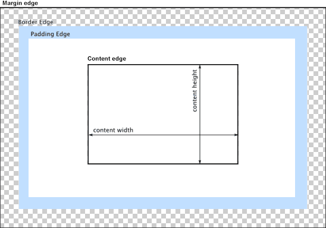
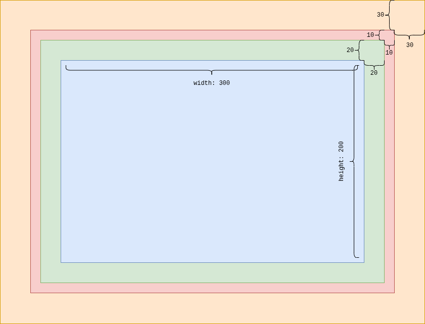

# Aula 06

**Sumário**

- [Aula 06](#aula-06)
  - [Box Model](#box-model)
    - [Como o tamanho total é calculado](#como-o-tamanho-total-é-calculado)
    - [*Margin collapsing*](#margin-collapsing)
    - [Exemplo](#exemplo)
  - [Exercícios](#exercícios)


## Box Model

**Materiais do MDN:**

- [Introduction to the CSS box model](https://developer.mozilla.org/en-US/docs/Web/CSS/Guides/Box_model/Introduction)
- [The box model](https://developer.mozilla.org/en-US/docs/Learn_web_development/Core/Styling_basics/Box_model)

Todo **elemento** HTML é tratado como uma caixa retangular pelo navegador. O Box Model define como essa caixa é calculada e como suas partes interagem entre si.

<figure style="text-align:center;">
    
</figure>

As quatro camadas principais (de dentro para fora):

1. *Content area* ou *content box* (conteúdo)
    - Área onde fica o texto, imagem, vídeo etc.
    - É limitado pelo `content edge`.
    - Controlada diretamente pelas propriedades `width`, `height` e suas variações.

2. *Padding area* ou *padding box* (preenchimento interno)
    - Espaço entre o conteúdo e a borda.
    - Limitado pelo `padding edge`.
    - Afeta o fundo do elemento (background).
    - Propriedades: `padding-top`, `padding-right`, `padding-bottom`, `padding-left`, ou *shorthand*: `padding: 10px 20px 15px 5px;`

3. *Border area* ou *border box* (borda)
    - Linha ao redor do padding + content.
    - Limitado pelo `border edge`.
    - Pode ter espessura, estilo e cor.
    - Propriedades: `border-width`, `border-style`, `border-color`, ou *shorthand*: `border: 4px solid #333;`

4. *Margin area* ou *margin box* (margem [externa])
    - Espaço fora da borda.
    - Limitado pelo `margin edge`.
    - Não tem cor/fundo (é transparente).
    - Causa colapso de margens verticais entre elementos `block` adjacentes.
    - Propriedades: `margin: 20px;` (todos os lados) ou `margin: 10px 30px;`

### Como o tamanho total é calculado

Existem dois modelos de cálculo controlados pela propriedade `box-sizing`:

| Valor | O que inclui em `width` e `height`? | Fórmula do tamanho total final,Comportamento típico |
|---|---|---|
| `content-box` | Apenas o content | Total = width + padding-esq/dir + border-esq/dir + margin-esq/dir,Padrão histórico (padrão do CSS) – causa surpresas frequentes |
| `border-box` | content + padding + border (margin fica fora) | "Total = width (fixo) – padding e border são ""subtraídos"" do espaço interno",Muito mais previsível e usado na prática |

Exemplo prático comparativo:

```css
.caixa {
  width: 300px;
  height: 200px;
  padding: 20px;
  border: 10px solid black;
  margin: 30px;
}
```

- **content-box** (padrão): Tamanho total na tela = 360px largura × 260px altura (300 + 20+20 + 10+10)
- **border-box**: Tamanho total na tela = 300px largura × 200px altura (exatamente o que você declarou)

<figure style="text-align: center;">
    
</figure>

Por isso, a grande maioria dos projetos modernos usa:

```css
* {
  box-sizing: border-box;
}
```

### *Margin collapsing*

Algumas vezes as margens `top` e `bottom` dos blocos são combinados (colapsados) em uma única margem cujo tamanho é o maior valor das margens individuais (existem casos que requerem abordagem diferente). 

O colpaso das margens vai acontecer nos seguintes casos:

- Irmãos adjacentes;
- Sem conteúdo separando um nó pai e seu descendente;
- Blocos vazios (sem `border`, `padding`, etc.).

**Exceções** (quando as margens nunca colapsam): 

- Se a propriedade [`float`](https://developer.mozilla.org/en-US/docs/Web/CSS/Reference/Properties/float) está definida; 
- Se a propriedade `position` estiver configurada para `absolute`;
- Se os elementos estão em um container com a propriedade `display` configurada para `flex` ou `grid`.

### Exemplo

**[Exemplo completo de box model](./exemplos/boxmodel.html)**

## Exercícios

### Fácil (exercícios 1 a 15)

Fixação isolada de `width`, `height`, `padding`, `border` e `margin`. Cálculos com valores em pixels.

#### Exercício 1 — Definir largura e altura da área de conteúdo

**Objetivo:** Aplicar `width` e `height` e reconhecer que, no padrão, esses valores descrevem só o conteúdo.

Crie um arquivo HTML com um único `div.caixa` dentro do `body`. Aplique um fundo visível (`#c5e4f3`) para enxergar a caixa.

**Código inicial:**

```css
.caixa {
  width: 240px;
  height: 120px;
  background: #c5e4f3;
}
```

**Tarefas:**

1. Abra o arquivo no navegador e, nas DevTools, confira `width` e `height` computados.
2. Aumente `width` para `320px` e `height` para `160px`. A área colorida deve crescer exatamente nesses incrementos.
3. Responda: com o CSS padrão, `width: 240px` controla o conteúdo, o padding-box ou o border-box?

**Dica:** Se não zerou as margens do `body`, a caixa não encosta na borda da janela — isso é margin do `body`, não da caixa.

#### Exercício 2 — Padding uniforme

**Objetivo:** Ver que o padding empurra o conteúdo para dentro e aumenta o tamanho pintado pelo `background`.

Use o mesmo `.caixa` do exercício 1 (`width: 240px; height: 120px; background: #c5e4f3`). Coloque um texto curto dentro do `div`.

**Código inicial:**

```css
.caixa {
  width: 240px;
  height: 120px;
  background: #c5e4f3;
  padding: 20px;
}
```

**Tarefas:**

1. Observe que o fundo azul cobre conteúdo + padding.
2. Calcule a largura da área pintada (padding-box): conteúdo + padding esquerdo + padding direito.
3. Calcule a altura da área pintada da mesma forma.
4. O texto deve ficar a `20px` de cada borda interna da área colorida.

#### Exercício 3 — Padding por lado

**Objetivo:** Controlar cada lado independentemente com as propriedades longas.

Partindo de `width: 200px; height: 100px; background: #fde68a`, aplique paddings diferentes.

**Código inicial:**

```css
.caixa {
  width: 200px;
  height: 100px;
  background: #fde68a;
  padding-top: 10px;
  padding-right: 40px;
  padding-bottom: 30px;
  padding-left: 8px;
}
```

**Tarefas:**

1. Calcule a largura do padding-box.
2. Calcule a altura do padding-box.
3. Confira no inspetor se `padding-left` é `8px` e `padding-right` é `40px`.

#### Exercício 4 — Atalho padding com 1, 2, 3 e 4 valores

**Objetivo:** Memorizar a ordem do atalho: cima, direita, baixo, esquerda (sentido horário a partir do topo).

Para cada regra abaixo, escreva os quatro valores equivalentes (`top`, `right`, `bottom`, `left`).

**Código inicial:**

```css
A) padding: 16px;
B) padding: 10px 24px;
C) padding: 8px 12px 20px;
D) padding: 4px 8px 12px 16px;
```

**Tarefas:**

1. Traduza A, B, C e D para `padding-top`, `padding-right`, `padding-bottom` e `padding-left`.
2. Aplique D em um `div` de `width: 180px` e calcule a largura do padding-box.

**Dica:** Dois valores significam vertical | horizontal. Três valores significam topo | horizontal | base.

#### Exercício 5 — Border soma no tamanho (content-box)

**Objetivo:** Perceber que a borda fica entre o padding e a margin e, no padrão, aumenta a largura/altura finais.

Comece com uma caixa de `200×80px`, padding `0` e fundo `#fecaca`.

**Código inicial:**

```css
.caixa {
  width: 200px;
  height: 80px;
  background: #fecaca;
  border: 5px solid #7f1d1d;
}
```

**Tarefas:**

1. Qual é a largura do border-box (conteúdo + padding + border)?
2. Qual é a altura do border-box?
3. Mude só a cor da borda. O tamanho deve permanecer igual.
4. Mude `border-width` para `10px` e recalcule largura e altura do border-box.

#### Exercício 6 — Atalho e lados da border

**Objetivo:** Aplicar espessuras diferentes em cada lado e ver o efeito no tamanho.

Use `width: 220px; height: 90px; padding: 0`.

**Código inicial:**

```css
.caixa {
  width: 220px;
  height: 90px;
  background: #e0e7ff;
  border-style: solid;
  border-color: #312e81;
  border-top-width: 2px;
  border-right-width: 12px;
  border-bottom-width: 2px;
  border-left-width: 12px;
}
```

**Tarefas:**

1. Calcule a largura do border-box.
2. Calcule a altura do border-box.
3. Reescreva as quatro espessuras usando apenas `border-width` (atalho de 4 valores).

#### Exercício 7 — Margin externa não pinta o fundo

**Objetivo:** Distinguir visualmente margin (espaço transparente fora da borda) de padding (espaço interno com fundo).

Crie dois elementos iguais, um abaixo do outro, cada um com fundo `#bbf7d0`.

**Código inicial:**

```css
.caixa {
  width: 200px;
  height: 60px;
  background: #bbf7d0;
  padding: 10px;
  border: 2px solid #166534;
  margin: 24px;
}
```

**Tarefas:**

1. O fundo verde deve cobrir conteúdo + padding, parar na borda e não avançar pela margin.
2. Calcule a largura total ocupada por UMA caixa (incluindo as margens horizontais: esquerda e direita).
3. Meça no inspetor a distância entre a borda da primeira caixa e a borda da segunda. Anote o valor. Você vai usar essa medida no exercício 20.

**Dica:** Não se preocupe ainda se a distância vertical não for `24+24`. Isso é *margin collapse* — aparece na faixa média.

#### Exercício 8 — Atalho margin

**Objetivo:** Ler e escrever o atalho de `margin` com 1 a 4 valores.

Escreva os quatro lados equivalentes e, quando pedido, o espaço horizontal ocupado além do border-box.

**Código inicial:**

```css
A) margin: 0;
B) margin: 12px 0;
C) margin: 8px 16px 24px;
D) margin: 5px 10px 15px 20px;
```

**Tarefas:**

1. Traduza A–D para `margin-top`, `right`, `bottom` e `left`.
2. Em D, quanto a margem acrescenta à largura total ocupada (`left + right`)?
3. Em B, as margens esquerda e direita são zero. A caixa encosta nas laterais do pai?

#### Exercício 9 — Cálculo completo da largura ocupada

**Objetivo:** Somar as sete parcelas horizontais do modelo de caixa.

Dado o CSS abaixo (`content-box`), calcule sem abrir o navegador. Depois confira.

**Código inicial:**

```css
.caixa {
  width: 300px;
  padding: 16px 24px;
  border: 4px solid black;
  margin: 10px 30px;
}
```

**Tarefas:**

1. Calcule a largura do conteúdo.
2. Calcule a largura do padding-box.
3. Calcule a largura do border-box.
4. Calcule a largura total ocupada (margin-box).

#### Exercício 10 — Cálculo completo da altura (elemento isolado)

**Objetivo:** Somar as sete parcelas verticais quando não há outro elemento para colapsar margem.

Considere um único filho dentro de um pai com padding e border, para as margens do filho não colapsarem com o pai.

**Código inicial:**

```css
.pai {
  padding: 1px;
  border: 1px solid #999;
}
.filho {
  height: 80px;
  padding: 10px 0 20px;
  border-top: 3px solid black;
  border-bottom: 5px solid black;
  margin: 12px 0 18px;
}
```

**Tarefas:**

1. Calcule a altura do border-box do filho.
2. Calcule a altura total ocupada pelo filho dentro do pai (incluindo as margens verticais do filho).
3. Explique por que o padding/border de `1px` no pai importa neste exercício.

**Dica:** O `1px` no pai existe só para impedir o colapso pai–filho. A faixa média explica o fenômeno.

#### Exercício 11 — Fundo, padding e conteúdo deslocado

**Objetivo:** Usar padding assimétrico para afastar o conteúdo sem mudar `width`.

Há um título de uma linha dentro de `.card`. A largura do conteúdo deve permanecer `280px`.

**Código inicial:**

```css
.card {
  width: 280px;
  height: 100px;
  background: #1e3a5f;
  color: white;
}
```

**Tarefas:**

1. Aplique `padding-left: 32px` e `padding-top: 24px`, sem padding nos outros lados.
2. A largura computada do conteúdo deve continuar `280px`.
3. Calcule a nova largura do padding-box.
4. O texto deve começar `32px` à direita da borda esquerda da área azul.

#### Exercício 12 — Border só em alguns lados

**Objetivo:** Compreender que lados sem borda não adicionam pixels àquele eixo.

Crie uma barra de destaque com borda apenas à esquerda.

**Código inicial:**

```css
.aviso {
  width: 360px;
  padding: 12px 16px;
  background: #fff7ed;
  border-left: 6px solid #ea580c;
}
```

**Tarefas:**

1. Calcule a largura do border-box.
2. Calcule a altura extra adicionada pela borda (não pelo padding).
3. Acrescente `border-bottom: 2px dashed #ea580c` e diga o que muda na altura do border-box.

#### Exercício 13 — Margin horizontal para afastar da borda do pai

**Objetivo:** Usar `margin-left` e `margin-right` positivas para criar folga externa.

O pai tem largura conhecida de `500px` (`width: 500px`) e nenhum padding/borda. O filho deve ter `width: 400px`.

**Código inicial:**

```css
.pai { width: 500px; background: #e5e7eb; }
.filho {
  width: 400px;
  height: 40px;
  background: #2563eb;
}
```

**Tarefas:**

1. Aplique `margin-left: 50px` no filho.
2. Quanto espaço sobra à direita entre o filho e o pai, se `margin-right` for `0`?
3. Ajuste `margin-left` e `margin-right` para `50px` cada. O filho de `400px` cabe exatamente?
4. Mude `margin-left` para `80px` e `margin-right` para `20px`. Ainda cabe? Qual é a largura total ocupada pelo filho?

#### Exercício 14 — Centralizar um bloco com margin horizontal auto

**Objetivo:** Usar `margin-left: auto` e `margin-right: auto` em um bloco com largura definida.

O pai ocupa a largura que você definir (por exemplo `600px`). O filho tem largura fixa e deve ficar no centro horizontal do pai. Não use `text-align`, flexbox nem `position`.

**Código inicial:**

```css
.pai { width: 600px; background: #f3f4f6; }
.filho {
  width: 240px;
  height: 50px;
  background: #7c3aed;
}
```

**Tarefas:**

1. Aplique `margin-left: auto; margin-right: auto` no filho (ou o atalho `margin: 0 auto`).
2. Confira visualmente o centramento.
3. Calcule quanto cada margem automática vale: `(largura do pai − largura do filho) / 2`.
4. Mude `width` do filho para `300px` e recálcule as margens automáticas.

**Dica:** `auto` na margem horizontal distribui o espaço sobrante. Isso só funciona se o elemento tiver `width` menor que o pai.

#### Exercício 15 — Preencher uma ficha de medidas

**Objetivo:** Ler um CSS e preencher conteúdo, padding-box, border-box e margin-box.

Sem alterar o CSS, complete a tabela de medidas do elemento abaixo.

**Código inicial:**

```css
.ficha {
  width: 180px;
  height: 70px;
  padding: 12px 8px 4px 20px;
  border-width: 1px 7px 3px 5px;
  border-style: solid;
  margin: 6px 15px 10px 9px;
}
```

**Tarefas:**

1. Largura do conteúdo e altura do conteúdo.
2. Largura e altura do padding-box.
3. Largura e altura do border-box.
4. Largura e altura do margin-box (elemento isolado, sem colapso).

---

### Médio (exercícios 16 a 25)

Combinações: `box-sizing`, porcentagens e o início do *margin collapse*.

#### Exercício 16 — content-box versus border-box

**Objetivo:** Ver que a mesma trinca `width + padding + border` produz tamanhos finais diferentes conforme `box-sizing`.

Crie duas caixas irmãs com o mesmo `width`, o mesmo `padding` e a mesma `border`. Só muda `box-sizing`.

**Código inicial:**

```css
.a, .b {
  width: 200px;
  padding: 20px;
  border: 10px solid #111;
}
.a { box-sizing: content-box; background: #93c5fd; }
.b { box-sizing: border-box;  background: #fca5a5; }
```

**Tarefas:**

1. Calcule a largura do border-box de `.a`.
2. Calcule a largura do border-box de `.b`.
3. Calcule a largura da área de conteúdo de `.b` (o que sobra depois de descontar padding e border).
4. Qual das duas cabe em um pai de exatamente `200px` de largura interna, sem estourar?

#### Exercício 17 — Converter um tamanho de content-box para border-box

**Objetivo:** Manter o mesmo border-box visual ao trocar o modelo de caixa.

A caixa atual é `content-box` e ocupa `260px` de border-box. Você quer passar para `border-box` sem mudar o tamanho visível nem o padding/borda.

**Código inicial:**

```css
.caixa {
  box-sizing: content-box;
  width: 200px;
  padding: 20px;
  border: 10px solid #333;
}
```

**Tarefas:**

1. Confirme a largura atual do border-box.
2. Altere para `box-sizing: border-box` e ajuste somente `width` para que o border-box continue com o mesmo valor.
3. A área de conteúdo deve permanecer `200px`.

#### Exercício 18 — width: 100% + padding no content-box estoura o pai

**Objetivo:** Entender o estouro clássico: `100%` refere-se à largura de conteúdo do pai; padding e border somam além disso.

O pai tem `width: 400px; padding: 0; border: 0`. O filho deve “tentar” ocupar a largura do pai.

**Código inicial:**

```css
.pai { width: 400px; background: #e5e7eb; }
.filho {
  width: 100%;
  padding: 20px;
  border: 5px solid #111;
  background: #fca5a5;
}
```

**Tarefas:**

1. Calcule a largura do border-box do filho com o CSS acima (`content-box`).
2. O filho estoura o pai? Por quantos pixels?
3. Corrija de duas formas independentes: (1) mudando só `box-sizing` do filho; (2) mantendo `content-box` e trocando `width: 100%` por um valor em `px` que faça o border-box valer `400px`.

#### Exercício 19 — Porcentagem em padding é relativa à largura do pai

**Objetivo:** Descobrir que `padding-top` e `padding-bottom` em `%` usam a **largura** do bloco contendo, não a altura.

O pai tem `width: 400px` e `height: 200px`. O filho não tem `width`/`height` explícitos neste exercício; foque no padding.

**Código inicial:**

```css
.pai { width: 400px; height: 200px; background: #e5e7eb; }
.filho {
  padding: 10%;
  background: #86efac;
}
```

**Tarefas:**

1. Quanto vale `10%` em pixels? Relativo a qual medida do pai?
2. Calcule o `padding-top` do filho em `px`.
3. Calcule o `padding-left` do filho em `px`.
4. Os dois valores são iguais ou diferentes? Por quê?
5. Mude o `height` do pai para `500px` sem mudar o `width`. O `padding-top` do filho muda?

#### Exercício 20 — Colapso entre irmãos (adjacent siblings)

**Objetivo:** Ver que duas margens verticais vizinhas não se somam: prevalece a de maior valor absoluto.

Dois blocos empilhados, sem padding nem borda entre eles.

**Código inicial:**

```css
.a {
  height: 40px;
  background: #93c5fd;
  margin-bottom: 30px;
}
.b {
  height: 40px;
  background: #fcd34d;
  margin-top: 20px;
}
```

**Tarefas:**

1. Qual seria a distância entre os border-boxes se as margens se somassem?
2. Qual é a distância real após o colapso?
3. Troque `margin-top` de `.b` para `30px`. A distância muda?
4. Troque `margin-top` de `.b` para `50px`. Qual é a nova distância?
5. As margens esquerda/direita de dois blocos lado a lado (se você as colocasse com `width` menor) colapsariam? Responda só com o conhecimento da regra — sem usar float/flex.

**Dica:** Entre irmãos, a margem vertical resultante é o máximo dos dois valores positivos.

#### Exercício 21 — Colapso com valores iguais e com zero

**Objetivo:** Consolidar o máximo e o caso em que uma das margens é `0`.

Três pares para calcular a distância entre border-boxes.

**Código inicial:**

```text
Par 1: margin-bottom: 24px  e  margin-top: 24px
Par 2: margin-bottom: 24px  e  margin-top: 0
Par 3: margin-bottom: 0     e  margin-top: 0
```

**Tarefas:**

1. Para cada par, declare a distância colapsada.
2. Implemente os três pares (três grupos de dois `div`s) e confira no inspetor.
3. Em uma frase, enuncie a regra para duas margens verticais positivas de irmãos.

#### Exercício 22 — Colapso pai–filho (margin collapsing through parent)

**Objetivo:** Ver a margem superior do primeiro filho “sair” do pai quando o pai não tem `padding-top` nem `border-top`.

O pai tem fundo cinza. O filho tem fundo azul e `margin-top: 40px`. Ninguém tem padding nem border.

**Código inicial:**

```css
.pai {
  background: #d1d5db;
  /* sem padding, sem border, sem height */
}
.filho {
  height: 50px;
  background: #3b82f6;
  margin-top: 40px;
}
```

**Tarefas:**

1. Antes de abrir o navegador: a faixa cinza do pai deve começar no mesmo Y que a faixa azul do filho, ou `40px` acima?
2. Confira. A margem do filho colapsou com a do pai e “escapou” para fora.
3. Meça: existe algum pedaço de fundo cinza acima do filho?

#### Exercício 23 — Como impedir o colapso pai–filho

**Objetivo:** Usar padding ou border no pai como “separador” que bloqueia o colapso.

Parta do CSS do exercício 22.

**Código inicial:**

```css
/* comece exatamente com o CSS do exercício 22 */
```

**Tarefas:**

1. Solução A: acrescente `padding-top: 1px` no pai. O fundo cinza deve aparecer acima do filho. Qual é agora a distância entre o topo do border-box do pai e o topo do border-box do filho?
2. Desfaça A. Solução B: acrescente `border-top: 1px solid transparent` no pai. O colapso também deve cessar.
3. Desfaça B. Solução C: use `padding-top: 40px` no pai e `margin-top: 0` no filho, de modo que o espaço interno de `40px` fique pintado com o fundo do pai.
4. Explique, em uma frase, por que padding ou border no pai impedem o colapso.

**Dica:** Há outros bloqueadores (`overflow` diferente de `visible`, por exemplo), mas eles saem do recorte deste material. Fique em padding e border.

#### Exercício 24 — Porcentagem em margin também usa a largura do pai

**Objetivo:** Aplicar a mesma referência de porcentagem às margens, inclusive às verticais.

Pai com `width: 500px; height: 300px`. Filho com `width: 200px; height: 40px`.

**Código inicial:**

```css
.pai { width: 500px; height: 300px; background: #e5e7eb; }
.filho {
  width: 200px;
  height: 40px;
  background: #f472b6;
  margin: 10%;
}
```

**Tarefas:**

1. Quanto vale `margin: 10%` em pixels neste contexto?
2. Calcule a largura total ocupada pelo filho (margin-box horizontal).
3. A margem superior de `10%` é `10%` de `300px` ou de `500px`?
4. Se o `width` do pai passar para `200px`, o que acontece com a `margin-top` do filho?

#### Exercício 25 — Montar um cartão que caiba exatamente no pai

**Objetivo:** Combinar `width`, `padding`, `border` e `margin` para o margin-box horizontal igualar a largura interna do pai.

Pai: `width: 480px; padding: 0; border: 0`. O cartão precisa de padding interno de `24px` em todos os lados, borda de `2px` e uma folga externa de `16px` à esquerda e à direita. Use `content-box`.

**Código inicial:**

```css
.pai { width: 480px; background: #e5e7eb; }
.cartao {
  box-sizing: content-box;
  padding: 24px;
  border: 2px solid #111;
  margin: 0 16px;
  background: white;
}
```

**Tarefas:**

1. Calcule o `width` (área de conteúdo) que faz o cartão caber exatamente: `16 + 2 + 24 + width + 24 + 2 + 16 = 480`.
2. Aplique esse `width`.
3. Refaça o mesmo cartão com `box-sizing: border-box`. Qual `width` você declara agora?
4. Nos dois casos o border-box deve medir o mesmo valor. Qual é esse valor?

---

### Difícil (exercícios 26 a 30)

Colapso encadeado, elemento vazio, porcentagens + `border-box` e previsão de altura de um empilhamento.

#### Exercício 26 — Cadeia de três irmãos com margens diferentes

**Objetivo:** Prever cada intervalo colapsado em uma pilha de três blocos.

Três blocos empilhados. Cada um tem `height: 30px`, `padding: 0`, `border: 1px solid #111`. As únicas variáveis são as margens verticais.

**Código inicial:**

```css
.a { margin-top: 10px; margin-bottom: 40px; }
.b { margin-top: 25px; margin-bottom: 25px; }
.c { margin-top: 60px; margin-bottom: 5px;  }
```

**Tarefas:**

1. Calcule a distância entre o border-box de `.a` e o de `.b`.
2. Calcule a distância entre o border-box de `.b` e o de `.c`.
3. Calcule a margem “externa” acima de `.a` e abaixo de `.c` (ainda sem um pai com padding).
4. Desenhe um esquema: `[10] [A] [?] [B] [?] [C] [5]` e preencha os pontos de interrogação.

#### Exercício 27 — Colapso encadeado avô–pai–filho

**Objetivo:** Entender que, sem padding/borda/height no meio, as margens de topo de vários níveis se fundem numa só.

Três níveis aninhados. Somente o neto tem conteúdo visível.

**Código inicial:**

```css
.avo {
  background: #fee2e2;
  margin-top: 30px;
}
.pai {
  background: #fef3c7;
  margin-top: 50px;
}
.neto {
  height: 40px;
  background: #bfdbfe;
  margin-top: 20px;
}
```

**Tarefas:**

1. As três margens de topo (`30`, `50` e `20`) colapsam. Qual valor vence?
2. Quantos pixels de fundo vermelho (`.avo`) aparecem acima do fundo amarelo (`.pai`)?
3. Quantos pixels de fundo amarelo aparecem acima do neto azul?
4. Agora coloque `padding-top: 1px` só em `.pai`. Recalcule: quais margens ainda colapsam entre si? Onde aparece o espaço de `50px`?

**Dica:** Se o pai não cria um “obstáculo” (padding, border ou altura que contenha a margem), a margem do filho atravessa e participa do colapso com o avô.

#### Exercício 28 — Elemento vazio cujas margens atravessam o próprio bloco

**Objetivo:** Ver o colapso através de um bloco sem conteúdo, sem padding, sem border e sem `height`.

Entre dois blocos visíveis existe um `div` vazio que só declara margens.

**Código inicial:**

```css
.acima, .abaixo {
  height: 40px;
  background: #a7f3d0;
}
.acima  { margin-bottom: 10px; }
.vazio  { margin-top: 30px; margin-bottom: 40px; }
.abaixo { margin-top: 20px; }
```

**Tarefas:**

1. Liste todas as margens verticais que participam do mesmo colapso.
2. Qual é a distância resultante entre o border-box de `.acima` e o de `.abaixo`?
3. Aplique `height: 1px` em `.vazio` (ainda sem padding/border). O colapso se parte em dois. Calcule as duas novas distâncias: acima↔vazio e vazio↔abaixo.
4. Em vez de `height`, aplique `padding-top: 1px` no vazio (`height` volta a `0`). O colapso também se parte? Por quê?

#### Exercício 29 — Conta completa com border-box e porcentagens

**Objetivo:** Resolver *used values* quando `width`, `padding` e `margin` misturam `%` e `px`, com `box-sizing: border-box`.

O bloco contendo (`.pai`) tem `width: 800px; padding: 0; border: 0`. Use exatamente o CSS abaixo.

**Código inicial:**

```css
.pai { width: 800px; }
.item {
  box-sizing: border-box;
  width: 50%;
  height: 100px;
  padding: 10%;
  border: 10px solid #111;
  margin: 20px 5%;
}
```

**Tarefas:**

1. Calcule `width` usado (`50%` de quê?). Esse valor é o border-box.
2. Calcule padding em `px` (`10%` de quê?). Lembre: os quatro lados usam a mesma base.
3. Calcule a largura da área de conteúdo do `.item`.
4. Calcule `margin-left` e `margin-right` em `px`.
5. Calcule a largura do margin-box do `.item`.
6. Calcule a altura do border-box e a altura da área de conteúdo (`height: 100px` é border-box).
7. A altura do `padding-top` cabe dentro de `100px` junto com o `padding-bottom` e as bordas? O que acontece com o conteúdo?

**Dica:** Com `border-box`, `width`/`height` incluem padding e border. Se padding + border superam o `height` declarado, a área de conteúdo pode chegar a zero e o elemento cresce para acomodar o mínimo necessário em alguns eixos — calcule primeiro no papel e depois confira o *used height* nas DevTools.

#### Exercício 30 — Altura de um pai com filhos, paddings e colapsos mistos

**Objetivo:** Prever a altura do border-box do pai em um cenário em que alguns colapsos acontecem e outros não.

Leia o CSS com atenção: o pai tem padding horizontal e border, mas o padding vertical é zero. Há dois filhos.

**Código inicial:**

```css
.pai {
  width: 400px;
  padding: 0 16px;      /* só horizontal */
  border: 4px solid #111;
  background: #e5e7eb;
}
.um {
  height: 50px;
  margin-top: 30px;
  margin-bottom: 20px;
  background: #60a5fa;
}
.dois {
  height: 40px;
  margin-top: 10px;
  margin-bottom: 25px;
  background: #f59e0b;
}
```

**Tarefas:**

1. A margem superior de `.um` colapsa com a do pai e escapa para fora, ou fica presa dentro? Justifique com o que há (ou não há) no topo do pai.
2. Entre `.um` e `.dois`, qual é a distância colapsada?
3. A margem inferior de `.dois` colapsa para fora do pai ou permanece dentro? Justifique com o que há na base do pai.
4. Calcule a altura da área de conteúdo do pai.
5. Calcule a altura do border-box do pai.
6. Calcule a altura do margin-box do pai, considerando a margem que escapou no topo (`30px`) e a que escapou na base (`25px`).
7. Acrescente `padding-top: 8px` e `padding-bottom: 8px` no pai. Recalcule a altura do border-box do pai e diga o que aconteceu com as margens que escapavam.