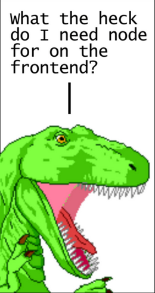

# Aula 08

**Sumário**

- [Aula 08](#aula-08)
  - [CSS Frameworks](#css-frameworks)
  - [Tailwind CSS](#tailwind-css)
  - [Exercícios](#exercícios)
    - [Fáceis](#fáceis)
      - [Grupo 1: Estilização de Texto e Cores](#grupo-1-estilização-de-texto-e-cores)
      - [Grupo 2: Box Model e Bordas](#grupo-2-box-model-e-bordas)
      - [Grupo 3: Listas e Backgrounds](#grupo-3-listas-e-backgrounds)
      - [Grupo 4: Imagens e Proporções](#grupo-4-imagens-e-proporções)
    - [Médias](#médias)
      - [Grupo 5: Flexbox e Layouts Responsivos](#grupo-5-flexbox-e-layouts-responsivos)
      - [Grupo 6: Grid System](#grupo-6-grid-system)
      - [Grupo 7: Formulários e Estados](#grupo-7-formulários-e-estados)
      - [Grupo 8: Cards Complexos](#grupo-8-cards-complexos)
    - [Difíceis](#difíceis)
      - [Grupo 9: Componentes Avançados e Animações](#grupo-9-componentes-avançados-e-animações)
      - [Grupo 10: Dark Mode e Customização](#grupo-10-dark-mode-e-customização)


## CSS Frameworks

São bibliotecas pré-projetadas para dar o pontapé inicial no estilo e layout de um projeto. Em vez de criar cada botão, grade e regra tipográfica do zero, com um framework CSS um desenvolvedor utiliza um sistema refinado de classes e componentes projetados para manter o projeto com uma boa aparência. Os frameworks também cuidam da responsividade, permitindo a um site que se adapte a diferentes dispositivos.

Eles podem ser categorizados entre Baseados em Componentes (*Component-based*) e Priorizados à utilidade (*Utility-first*). Os frameworks da primeira categoria fornecem elementos de UI pré-estilizados, prontos para uso. Seu principal expoente é o [Bootstrap](https://getbootstrap.com/). Os frameworks da segunda categoria fornecem classes utilitárias de baixo nível usadas para a construção de designs personalizados. Seu principal expoente é o [Tailwind CSS](https://tailwindcss.com/), atualmente o mais utilizado no mercado.

Outros frameworks bastante conhecidos, ou em ascenção:

- [Foundation](https://get.foundation/index.html)
- [Bulma](https://bulma.io/)
- [Semantic UI](https://semantic-ui.com/)
- [Materialize](https://materializecss.com/)
- [shadcn](https://ui.shadcn.com/)
- [Pico](https://picocss.com/)
- [Ant Design](https://ant.design/)
- [Open Props](https://open-props.style/)

## Tailwind CSS

O Tailwind CSS funciona analisando todos os seus arquivos HTML, componentes JavaScript e quaisquer outros modelos em busca de nomes de classe, gerando os estilos correspondentes e, em seguida, gravando-os em um arquivo CSS estático.

Tudo certo até então. Vamos até o [site oficial ver como instalá-lo](https://tailwindcss.com/docs/installation/using-vite). Então nos deparamos com as seguintes abas:

- **Using Vite**
- **Using PostCSS**
- **Tailwind CLI**
- **Framework Guides**
- **Play CDN**

<figure style="text-align:center;">
    
</figure>

Se paramos para ler vemos o seguinte:

- **Using Vite**: instalando o Tailwind CSS como um plugin de Vite é a maneira mais simples de integrá-lo com frameworks como Laravel, SvelteKit, React Router, Nuxt e SolidJS.
  - Ok, por enquanto não é o que a gente quer.
- **Using PostCSS**: instalando o Tailwind CSS como um plugin de PostCSS é a maneira mais fácil de integrá-lo com frameworks como Next.js e Angular.
  - Hummm...
- **Tailwind CLI**: A maneira mais simples e rápida de comelar a usar o Tailwind CSS do zero é com a ferramenta de linha de comando (CLI) do Tailwind.
  - Me parece que é este que queremos de início!
- **Framework Guides**: guias para framework específicos que cobrem nossa abordagem recomendada para instalar o Tailwind CSS em vários ambientes populares.
  - Não é o que a gente quer, por enquanto.
- **Play CDN**
  - Use o Play CDN para testar o Tailwind direto no navegador sem qualquer configuração. O Play CDN é projetado para propósitos de desenvolvimento apenas, e não é destinado para produção.
    - Pode ser interessante para brincar depois.

Aparentemente o **Tailwind CLI** é o mais adequado para vermos o Tailwind CSS de forma isolada. Então vamos ver como instalá-lo:

```
npm install tailwindcss @tailwindcss/cli
```

Mas o que é [`npm`](https://www.npmjs.com/)? No site do [`Node.js`](https://nodejs.org/learn/getting-started/an-introduction-to-the-npm-package-manager) podemos ver que o `npm` é o gerenciador de pacotes padrão do `Node.js`. E o que é o `Node.js`? Basicamente um ambiente de execução (*runtime environment*) de JavaScript; em outras palavras é a tecnologia que permite a **execução de código JavaScript fora do navegador**, o que faz com que ele seja a escolha certa para o **backend** em um paradigma *JavaScript everywhere*.

Então vem a dúvida:

<figure style="text-align:center;">
    
    <figcaption>Fonte: <a href="https://peterxjang.com/blog/modern-javascript-explained-for-dinosaurs.html">Modern JavaScript Explained for Dinosaurs</a></figcaption>
</figure>

De início é confuso (ser confuso é a especialidade do JavaScript), mas com o tempo passamos a entender que o `npm` acabou se tornando o gerenciador de pacotes "padrão" da web e, por isso, precisamos dele (e por consequência do `Node.js`) mesmo quando nosso foco é apenas *frontend*.

Para instalar o `npm` basta instalar o `Node.js`. A maneira mais segura é instalar o `Node.js` a partir de um `nvm` (*Node Version Manager*). Procure o `nvm` para seu sistema operacional e então instale o `Node.js` (e o `npm` de tabela).

Além do `npm` existem outros gerenciadores de pacote:

- [Yarn](https://classic.yarnpkg.com/)
- [pnpm](https://pnpm.io/)
- [bun](https://bun.com/)

Agora que temos o `npm` vamos seguir as instruções do site do Tailwind:

- No terminal, para instalar: `npm install tailwindcss @tailwindcss/cli`
- Importando o Tailwind para o arquivo CSS principal: `@import "tailwindcss";`
- Iniciando o processo de build do Tailwind CLI, que vai escanear os arquivos para criar o CSS: `npx @tailwindcss/cli -i ./AULAS/08/input.css -o ./AULAS/08/output.css --watch`
- Adicionando o arquivo CSS gerado no `<head>`.

Agora vamos brincar um pouco:

- [Tailwind playground](https://play.tailwindcss.com/)
- [Tailwind showcase](https://tailwindcss.com/showcase)
- [index.html](./index.html)

## Exercícios

### Fáceis

#### Grupo 1: Estilização de Texto e Cores

**Código Base:**

```html
<div class="container">
  <h1>Título do Artigo</h1>
  <p>Este é um parágrafo de exemplo para testar classes utilitárias.</p>
  <button>Clique Aqui</button>
</div>
```
1.  **Centralização:** Centralize horizontalmente o conteúdo da `div` principal.
2.  **Tipografia:** Mude a cor do `h1` para azul escuro e coloque-o em negrito.
3.  **Botão:** Adicione um fundo azul, texto branco e cantos arredondados ao botão.
4.  **Espaçamento:** Adicione uma margem inferior ao `h1` e um preenchimento (padding) interno à `div`.
5.  **Hover:** Faça o botão mudar de cor quando o mouse passar por cima.

#### Grupo 2: Box Model e Bordas

**Código Base:**

```html
<section>
  <div class="box">Conteúdo 1</div>
  <div class="box">Conteúdo 2</div>
</section>
```
6.  **Largura:** Defina uma largura fixa (ex: 200px) para as boxes.
7.  **Bordas:** Adicione uma borda de 2px sólida e cinza em ambas as boxes.
8.  **Sombra:** Aplique uma sombra leve (`shadow-md`) na primeira box.
9.  **Opacidade:** Deixe a segunda box com 50% de opacidade.
10. **Alinhamento:** Use Flexbox no elemento `section` para colocar as boxes lado a lado.

#### Grupo 3: Listas e Backgrounds

**Código Base:**

```html
<ul>
  <li>Item A</li>
  <li>Item B</li>
  <li>Item C</li>
</ul>
```
11. **Estilo de Lista:** Remova os pontos padrão da lista e adicione um fundo cinza claro.
12. **Divisores:** Use as classes `divide-y` para criar linhas entre os itens da lista.
13. **Padding:** Adicione preenchimento interno em cada `li`.
14. **Destaque:** Mude o fundo do primeiro item da lista para amarelo.
15. **Arredondamento:** Deixe as bordas do container da lista totalmente arredondadas.

#### Grupo 4: Imagens e Proporções

**Código Base:**

```html
<figure>
  
  <figcaption>Legenda da Imagem</figcaption>
</figure>
```
16. **Tamanho:** Redimensione a imagem para um tamanho fixo (ex: `w-32 h-32`).
17. **Círculo:** Transforme a imagem em um círculo perfeito.
18. **Ajuste:** Use `object-cover` para garantir que a imagem preencha o espaço sem distorcer.
19. **Legenda:** Centralize o texto da legenda e coloque-o em itálico.
20. **Filtro:** Adicione um filtro de escala de cinza (`grayscale`) à imagem.

### Médias

#### Grupo 5: Flexbox e Layouts Responsivos

**Código Base:**

```html
<nav class="navbar">
  <div class="logo">Logo</div>
  <div class="links">
    <a href="#">Home</a>
    <a href="#">Sobre</a>
    <a href="#">Contato</a>
  </div>
</nav>
```
1. **Distribuição:** Use Flexbox para colocar o Logo na esquerda e os Links na direita.
2. **Responsividade:** Esconda os links em telas pequenas e mostre-os apenas em telas `md` ou maiores.
3. **Espaçamento:** Use a utilidade `space-x-4` para separar os links entre si.
4. **Sticky:** Fixe a navbar no topo da página durante o scroll.
5. **Alinhamento Vertical:** Garanta que todos os itens dentro da navbar estejam centralizados verticalmente.

#### Grupo 6: Grid System

**Código Base:**

```html
<div class="grid-container">
  <div class="card">1</div>
  <div class="card">2</div>
  <div class="card">3</div>
  <div class="card">4</div>
</div>
```
6. **Colunas:** Crie um grid de 2 colunas para dispositivos móveis e 4 colunas para desktop.
7. **Gap:** Adicione um espaçamento de 2rem (8 unidades do Tailwind) entre os cards.
8. **Span:** Faça o primeiro card ocupar 2 colunas no desktop.
9. **Proporção:** Defina que todas as linhas do grid tenham a mesma altura mínima.
10. **Ordem:** Mude a ordem visual para que o card 4 apareça primeiro no desktop.

#### Grupo 7: Formulários e Estados

**Código Base:**

```html
<form>
  <label>Email</label>
  <input type="email" placeholder="Seu email">
  <p class="error">Email inválido</p>
</form>
```
11. **Foco:** Mude a cor da borda do input para roxo quando ele for focado (`focus`).
12. **Ring:** Adicione um efeito de "ring" (anel) externo no foco do input.
13. **Placeholder:** Mude a cor do texto do placeholder para um cinza bem claro.
14. **Condicional:** Esconda o parágrafo de erro por padrão e mostre-o apenas se necessário (simule via classe).
15. **Desabilitado:** Estilize o input para que ele fique com fundo cinza e cursor proibido quando estiver `disabled`.

#### Grupo 8: Cards Complexos

**Código Base:**

```html
<div class="profile-card">
  
  <h3>Nome do Usuário</h3>
  <p>Bio curta do usuário aqui.</p>
  <div class="tags"><span>UI/UX</span><span>Dev</span></div>
</div>
```
16. **Overflow:** Garanta que nada saia dos limites do card usando `overflow-hidden`.
17. **Group Hover:** Ao passar o mouse no card (pai), mude a cor do título (filho).
18. **Gradiente:** Adicione um fundo gradiente que vai do azul para o roxo no card.
19. **Pílulas:** Estilize as spans dentro da div "tags" para parecerem pílulas (bg colorido e full round).
20. **Aspect Ratio:** Force a imagem do perfil a manter uma proporção de 16/9.

### Difíceis

#### Grupo 9: Componentes Avançados e Animações

**Código Base:**

```html
<div class="modal-overlay">
  <div class="modal-content">
    <h2>Confirmação</h2>
    <p>Deseja excluir este arquivo?</p>
    <div class="actions">
      <button class="cancel">Não</button>
      <button class="confirm">Sim</button>
    </div>
  </div>
</div>
```
1. **Overlay:** Crie um fundo semitransparente com desfoque (`backdrop-blur`).
2. **Animação de Entrada:** Use `animate-bounce` ou uma transição de escala suave para o modal aparecer.
3. **Posicionamento:** Centralize o modal perfeitamente na tela usando `fixed` e técnicas de Flex ou Grid.
4. **Botões Customizados:** Use `@apply` (ou simule) para criar uma classe de botão base e variantes para "cancel" e "confirm".
5. **Z-Index:** Garanta que o modal esteja acima de qualquer outro elemento da página.

#### Grupo 10: Dark Mode e Customização

**Código Base:**

```html
<body class="bg-white text-black">
  <div class="card bg-gray-100">
    <h1 class="text-blue-600">Painel de Controle</h1>
    <p>Dados sensíveis aqui.</p>
  </div>
</body>
```
6. **Dark Mode:** Configure o código para que, no modo escuro, o fundo da página fique preto e o texto branco.
7. **Card Escuro:** No modo escuro, o fundo do card deve mudar para um cinza grafite (`bg-gray-800`).
8. **Cores Arbitrárias:** Use um valor de cor hexadecimal específico que não existe na paleta padrão do Tailwind (ex: `#123456`) usando a sintaxe de colchetes.
9. **Peer State:** Crie um checkbox invisível e, quando ele for marcado, mude o estilo do card de "Dados sensíveis" usando a classe `peer`.
10. **Container Queries:** (Se disponível/plugin) Altere o layout do card com base no tamanho do seu container pai, não da janela do navegador.