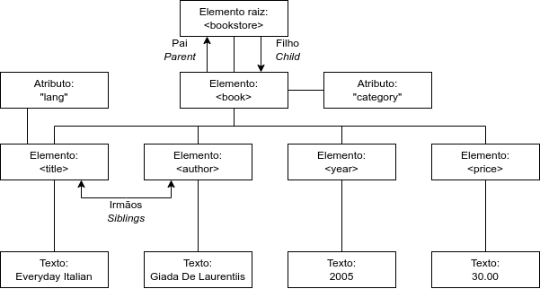

# Aula 10

Sumário

- [Aula 10](#aula-10)
  - [Introdução ao XML](#introdução-ao-xml)
    - [Diferenças principais entre XML e HTML](#diferenças-principais-entre-xml-e-html)
    - [Como o XML pode ser usado](#como-o-xml-pode-ser-usado)
  - [Árvore XML](#árvore-xml)
    - [Sintaxe auto-descritiva](#sintaxe-auto-descritiva)
  - [Regras de sintaxe](#regras-de-sintaxe)
  - [Elementos XML](#elementos-xml)
    - [Elementos vazios](#elementos-vazios)
    - [Regras de nomeação](#regras-de-nomeação)
    - [Elementos são extensíveis](#elementos-são-extensíveis)
  - [Atributos XML](#atributos-xml)
    - [O que é melhor: atributos ou mais elementos?](#o-que-é-melhor-atributos-ou-mais-elementos)
  - [Mais conteúdo da W3Schools](#mais-conteúdo-da-w3schools)
  - [Analisando (*Parsing*) e serializando o XML](#analisando-parsing-e-serializando-o-xml)
    - [`DOMParser`](#domparser)
      - [Sintaxe](#sintaxe)
      - [Exemplo](#exemplo)
    - [Convertendo recursos endereçáveis por URL em árvores DOM](#convertendo-recursos-endereçáveis-por-url-em-árvores-dom)
      - [`XMLHttpRequest`](#xmlhttprequest)
      - [`Fetch API`](#fetch-api)
    - [Serializando um documento XML](#serializando-um-documento-xml)


## Introdução ao XML

O **XML** (*Extensible Markup Language*) é uma `linguagem de marcação` e `formato de arquivo` para a serialização de dados, ou seja,  armazenar, transmitir e reconstruir dados arbitrários.

Sua formalização oficial é feita pelo [W3C](https://www.w3.org/), e o último documento foi publicado em 2008: [Extensible Markup Language (XML) 1.0 (Fifth Edition)](https://www.w3.org/TR/xml/).

É utilizado principalmente para a troca de dados pela Internet. Por exemplo, os seguintes formatos de documento usam a sintaxe do XML: [RSS](https://en.wikipedia.org/wiki/RSS), [Atom](https://en.wikipedia.org/wiki/Atom_(web_standard)), [Office Open XML](https://en.wikipedia.org/wiki/Office_Open_XML), [OpenDocument](https://en.wikipedia.org/wiki/OpenDocument), [SVG](https://en.wikipedia.org/wiki/SVG), e [XHTML](https://en.wikipedia.org/wiki/XHTML). Também é utilizado por alguns protocolos da Internet, e é tido como padrão para variadas indústrias.

<!--
Documentos XML são feitos de unidades de armazenamento chamados `entidades`, os quais contêm dados analisados (*parsed*) ou não analisados (*unparsed*). Os dados analisados são feitos de `caracteres`, alguns dos quais formam `dados de caractere`, e outros que foram `marcação`. A marcação codifica uma descrição da estrutura lógica e *layout* de armazenamento do documento. O XML fornece um mecanismo para impor restrições sobre o *layout* de armazenamento e estrutura lógica.
-->

<!--
## Documentos

Cada documento XML tem uma estrutura lógica e uma física:

- Fisicamente, o documento é composto por unidades chamadas `entidades`. Uma `entidade` pode se referir a outras `entidades` para incluí-las no documento. Um documento inicia em uma "raiz" ou `entidade documento`.
- Logicamente, o documento é composto por declarações, elementos, comentários, referências de caracteres e instruções de processamento, todos indicados no documento por meio de marcação explícita.

### Documentos Bem-Formados

Um objeto textual é um documento XML bem-formado se:

1. Tomado como um todo, corresponde ao documento rotulado como produção, ou seja, tem apenas um elemento raiz.
2. Obedece a todas as restrições de bem-formação presentes na documentação oficial.
3. Cada `entidade analisada` (*parsed entity*), a qual é referenciada direta ou indiretamente dentro do documento, é bem-formada.

### Terminologia

- **Caractere**: uma unidade atômica de texto, consistindo em qualquer caractere Unicode, exceto `FFFE` e `FFFF`.
- **Processador** e **aplicação**: o `processador` analisa a marcação e passa informação estruturada para uma `aplicação`.
-->

O material a seguir é uma adaptação de [W3 Schools](https://www.w3schools.com/xml/xml_whatis.asp).

### Diferenças principais entre XML e HTML

- O XML foi criado para transportar dados, com foco sobre o que o dado é.
- O HTML foi criado para exibir dados, com foco em como o dado aparece.
- As tags do XML **não são pré-definidas** como as do HTML.

Exemplo:

```xml
<nota>
    <para>João</para>
    <de>Maria</de>
    <assunto>Lembrete</assunto>
    <conteúdo>Não esqueça nosso aniversário de casamento!</conteúdo>
</nota>
```

### Como o XML pode ser usado

O XML pode ser usado para **separar dados de apresentação**. Isso é possível porque ele não armazena informações sobre como exibir os dados. Logo, um mesmo XML pode ser utilizado para diferentes apresentações. Por causa disso, pode ser usado **em complemento ao HTML**.

Uma vez que é um formato "universal", pode ser usado como uma "língua franca", ou seja, uma língua que todos utilizam em comum. A partir disso é possível ter dados de variados cenários:

- Ações em bolsas de valores;
- Transações financeiras;
- Dados médicos;
- Dados matemáticos;
- Mensurações científicas;
- Notícias;
- Informações sobre o tempo;
- etc.

Exemplo: XML de observação metereológica do NOAA (*National Oceanic and Atmospheric Administration*)

```xml
<?xml version="1.0" encoding="UTF-8"?>
<current_observation>

    <credit>NOAA's National Weather Service</credit>
    <credit_URL>http://weather.gov/</credit_URL>

    <image>
        <url>http://weather.gov/images/xml_logo.gif</url>
        <title>NOAA's National Weather Service</title>
        <link>http://weather.gov</link>
    </image>

    <location>New York/John F. Kennedy Intl Airport, NY</location>
    <station_id>KJFK</station_id>
    <latitude>40.66</latitude>
    <longitude>-73.78</longitude>
    <observation_time_rfc822>Mon, 11 Feb 2008 06:51:00 -0500 EST</observation_time_rfc822>

    <weather>A Few Clouds</weather>
    <temp_f>11</temp_f>
    <temp_c>-12</temp_c>
    <relative_humidity>36</relative_humidity>
    <wind_dir>West</wind_dir>
    <wind_degrees>280</wind_degrees>
    <wind_mph>18.4</wind_mph>
    <wind_gust_mph>29</wind_gust_mph>
    <pressure_mb>1023.6</pressure_mb>
    <pressure_in>30.23</pressure_in>
    <dewpoint_f>-11</dewpoint_f>
    <dewpoint_c>-24</dewpoint_c>
    <windchill_f>-7</windchill_f>
    <windchill_c>-22</windchill_c>
    <visibility_mi>10.00</visibility_mi>

    <icon_url_base>http://weather.gov/weather/images/fcicons/</icon_url_base>
    <icon_url_name>nfew.jpg</icon_url_name>
    <disclaimer_url>http://weather.gov/disclaimer.html</disclaimer_url>
    <copyright_url>http://weather.gov/disclaimer.html</copyright_url>

</current_observation>
```

## Árvore XML



A figura acima representa a estrutura em árvore do primeiro "objeto" do XML a seguir:

```xml
<?xml version="1.0" encoding="UTF-8"?>
<bookstore>
  <book category="cooking">
    <title lang="en">Everyday Italian</title>
    <author>Giada De Laurentiis</author>
    <year>2005</year>
    <price>30.00</price>
  </book>
  <book category="children">
    <title lang="en">Harry Potter</title>
    <author>J K. Rowling</author>
    <year>2005</year>
    <price>29.99</price>
  </book>
  <book category="web">
    <title lang="en">Learning XML</title>
    <author>Erik T. Ray</author>
    <year>2003</year>
    <price>39.95</price>
  </book>
</bookstore> 
```

Genericamente, a estrutura em árvore do XML terá a seguinte forma:

```xml
<root>
    <child>
        <subchild>....</subchild>
    </child>
</root>
```

### Sintaxe auto-descritiva

O XML usa uma sintaxe auto-descritiva. O documento inicia com um `prólogo` (ou `prolog`), com a definição da versão e codificação de caractere:

```xml
<?xml version="1.0" encoding="UTF-8"?>
```

Logo em seguida, no exemplo temos a tag raiz `<bookstore>` (livraria). Em seguida temos uma tag para livro: `<book>`, e os livros possuem elementos descritivos: `<title>`, `<author>`, `<year>`, `<price>`.

## Regras de sintaxe

- O XML deve ter **um único elemento raiz**.
  ```xml
  <nota>
    <para>João</para>
    <de>Maria</de>
    <cabeçalho>Lembrete</cabeçalho>
    <corpo>Não esqueça nosso aniversário de casamento!</corpo>
  </nota>
  ```
- O `prolog` é opcional, mas se estiver declarado, tem de ser **na primeira linha**.
- Todos os elementos devem ter uma **tag de fechamento**.
  - As tags são *case sensitive*, ou seja, diferenciam letras maiúsculas de minúsculas.
  ```xml
  <p> Parágrafo <!-- Tag precisa de fechamento -->
  <messagem>blá blá blá</Messagem> <!-- Vai dar erro -->
  ```
- Os elementos devem ser aninhados apropriadamente.
  ```xml
  <b><i>Texto em negrito e itálico</b></i> <!-- Funciona somente no HTML -->
  <b><i>Texto em negrito e itálico</i></b> <!-- Correto para o XML -->
  ```
- Valores de atributos devem estar sempre entre aspas
  ```xml
  <nota data="19/11/25">
    <para>João</para>
    <de>Maria</de>
  </nota>
  ```
- Caracteres especiais
  - Alguns caracteres não podem ser escritos diretamente. Para que sejam inseridos é preciso utilizar suas referências. As 5 referências de entidade definidas no XML são:
  
  | Referência | símbolo |
  |---|---|
  | `&lt` | `<`|
  | `&gt` | `>`|
  | `&amp` | `&`|
  | `&apos` | `'`|
  | `&quot` | `"`|
- Os comentários seguem o mesmo padrão de HTML: `<!-- comentário -->`.
- Espaços em branco são preservados em XML:
  ```xml
  Olá     mundo <!--XML-->
  ```

  ```html
  Olá mundo <!--HTML-->
  ```
- O XML armazena uma nova linha com o caractere `LF` (*Line Feed*).
  - Aplicações para Windows armazenam uma nova linha como `CR` (*Carriage Return*) + `LF`.
  - Unix e Mac OSX usam `LF`.
- XML **Bem-formado**
  - Consiste em um documento seguindo todas as regras de sintaxe apresentadas.

## Elementos XML

Um elemento XML consiste em tudo entre tags de abertura e fechamento (incluindo as tags). Um elemento pode conter:

- Texto.
- Atributos.
- Outros elementos.
- Um misto dos anteriores.

No exemplo do `bookstore` temos:

- Elementos `<title>`, `<author>`, `<year>` e `<price>` com conteúdo de texto.
- Elementos `<bookstore>` e `<book>` com conteúdo de elemento.
- Elemento `<book>` com um atributo.

### Elementos vazios

Um elemento XML vazio pode ser expresso de duas formas diferentes:

```xml
<elemento></elemento>
```

ou

```xml
<elemento />
```

### Regras de nomeação

- Nomes são *case-sensitive*, ou seja, o XML diferencia letras maiúsculas de minúsculas.
- Precisam começar com uma letra ou um `_`.
- Não podem começar com as letras `xml` (ou `XML`, `XMl`, etc.).
- Podem conter letras, dígitos, hífens, underlines e pontos.
- Não podem ter espaço em branco.

### Elementos são extensíveis

Isso significa que se algum elemento for modificado, a aplicação que lerá o XML ainda será capaz de reconhecer as tags que já existiam.

Exemplo (XML original):

```xml
<nota>
    <para>João</para>
    <de>Maria</de>
    <corpo>Não esqueça nosso aniversário de casamento!</corpo>
</nota>
```

Depois foi feita a seguinte alteração:

```xml
<nota>
    <data>2025-11-19</data>
    <para>João</para>
    <de>Maria</de>
    <assunto>Lembrete</assunto>
    <corpo>Não esqueça nosso aniversário de casamento!</corpo>
</nota>
```

A aplicação que está lendo o XML ainda será capaz de reconhecer as tags `<para>`, `<de>` e `<corpo>` e produzir a mesma saída.

## Atributos XML

Bastante parecidos com os do HTML. Todos os seus valores precisam estar entre aspas simples ou duplas.

### O que é melhor: atributos ou mais elementos?

Vejamos os exemplos a seguir:

```xml
<pessoa genero="feminino">
    <primeiroNome>Derpina</primeiroNome>
    <sobrenome>Silva</sobrenome>
</pessoa>
```

```xml
<pessoa>
    <genero>feminino</genero>
    <primeiroNome>Derpina</primeiroNome>
    <sobrenome>Silva</sobrenome>
</pessoa>
```

Os dois exemplos produzem a mesma informação. Qual é o correto? Qual usar?

A escolha depende de quem está construindo o documento. Porém, é importante lembrar que atributos não podem conter múltiplos valores, estruturas em árvore, e não são facilmente expandíveis. Uma boa prática pode ser deixar para os atributos apenas metadados. Exemplo:

```xml
<mensagens>
    <nota id="1">
        <data>
            <dia>19</dia>
            <mes>11</mes>
            <ano>2025</ano>
        </data>
        <para>João</para>
        <de>Maria</de>
        <assunto>Lembrete</assunto>
        <conteudo>Não esqueça do nosso aniversário de casamento!</conteudo>
    </nota>
    <nota id="2">
        <data>
            <dia>20</dia>
            <mes>11</mes>
            <ano>2025</ano>
        </data>
        <para>Maria</para>
        <de>João</de>
        <assunto>Re: Lembrete</assunto>
        <conteudo>Não vou esquecer</conteudo>
    </nota>
</mensagens>
```

## Mais conteúdo da W3Schools

Para não nos alongarmos demais, visite [esta página](https://www.w3schools.com/xml/xml_attributes.asp) do W3 Schools para continuar os estudos.

## Analisando (*Parsing*) e serializando o XML

Como converter um XML em uma árvore DOM, ou serializar uma árvore DOM em XML?

### `DOMParser`

O [`DOMParser`](https://developer.mozilla.org/en-US/docs/Web/API/DOMParser) é uma interface para a conversão de código XML ou HTML que **esteja em string** para um `XMLDocument` ou `Document`.

#### Sintaxe

- **Construtor**: `DOMParser()`.
- **Métodos**
  - `parseFromString(input, mimeType)`
    - `input`: a string a ser analisada, com marcação de HTML, XML, XHTML ou SVG.
    - `mimeType`: uma string que especifica qual analisador (*parser*) será usado sobre `input`. Valores possíveis:
      - `text/html`.
      - `text/xml`.
      - `application/xml`.
      - `application/xhtml+xml`.
      - `image/svg+xml`.

#### Exemplo

```js
const xmlStr = '<q id="a"><span id="b">hey!</span></q>';
const parser = new DOMParser();
const doc = parser.parseFromString(xmlStr, "application/xml");
// Imprimindo o nome do elemento raiz ou mensagem de erro
const errorNode = doc.querySelector("parsererror");
if (errorNode) {
  console.log("Erro durante a conversão");
} else {
  console.log(doc.documentElement.nodeName);
}
```

### Convertendo recursos endereçáveis por URL em árvores DOM

São duas formas possíveis: [`XMLHttpRequest`](https://developer.mozilla.org/en-US/docs/Web/API/XMLHttpRequest) e [`Fetch API`](https://developer.mozilla.org/en-US/docs/Web/API/Fetch_API).

#### [`XMLHttpRequest`](https://developer.mozilla.org/en-US/docs/Web/API/XMLHttpRequest)

O [`XMLHttpRequest`](https://developer.mozilla.org/en-US/docs/Web/API/XMLHttpRequest) é a versão mais arcaica da comunicação assíncrona, pois pode buscar dados de uma URL sem a necessidade de recarregar uma página inteira. É a base do `AJAX`.

Ao se utilizar o método [`open()`](https://developer.mozilla.org/en-US/docs/Web/API/XMLHttpRequest/open) seguido do [`send()`](https://developer.mozilla.org/en-US/docs/Web/API/XMLHttpRequest/send), o atributo [`responseXML`](https://developer.mozilla.org/en-US/docs/Web/API/XMLHttpRequest/responseXML) poderá conter o HTML ou XML pedido.

Exemplos: [exemplo 1](exemplo-1/ajax-index.html) e [exemplo 2](exemplo-2/ajax-index.html).

#### [`Fetch API`](https://developer.mozilla.org/en-US/docs/Web/API/Fetch_API)

A `FetchAPI` pode ser vista como evolução, versão moderna, ou substituta do `AJAX`.

Funciona sobre os objetos [`Request`](https://developer.mozilla.org/en-US/docs/Web/API/Request) e [`Response`](https://developer.mozilla.org/en-US/docs/Web/API/Response), análogos ao `HTTP Request` e `HTTP Response`. Para requisitar e buscar um recurso, é utilizado o método [`fetch()`](https://developer.mozilla.org/en-US/docs/Web/API/Window/fetch), o qual retorna uma [`Promise`](https://developer.mozilla.org/en-US/docs/Web/JavaScript/Reference/Global_Objects/Promise).

Uma [`Promise`](https://developer.mozilla.org/en-US/docs/Web/JavaScript/Reference/Global_Objects/Promise) é um objeto que representa a conclusão (ou falha) de uma operação assíncrona e o seu valor resultante. Pode estar em um de três possíveis estados:

- `pending`: estado inicial.
- `fulfilled`: quando a operação foi concluída com sucesso.
- `rejected`: quando a operação falha.

A partir disso é possível associar *handlers* para cada resultado da requisição, sem que seja necessário saber o resultado de antemão.

Exemplos: [exemplo 1](exemplo-1/fetch-index.html) e [exemplo 2](exemplo-2/fetch-index.html).

### Serializando um documento XML

Para serializar uma árvore DOM para um arquivo XML, é possível utilizar a interface [`XMLSerializer`](https://developer.mozilla.org/en-US/docs/Web/API/XMLSerializer).

```js
const serializer = new XMLSerializer();
const xmlStr = serializer.serializeToString(doc); // doc do DOMParser
```