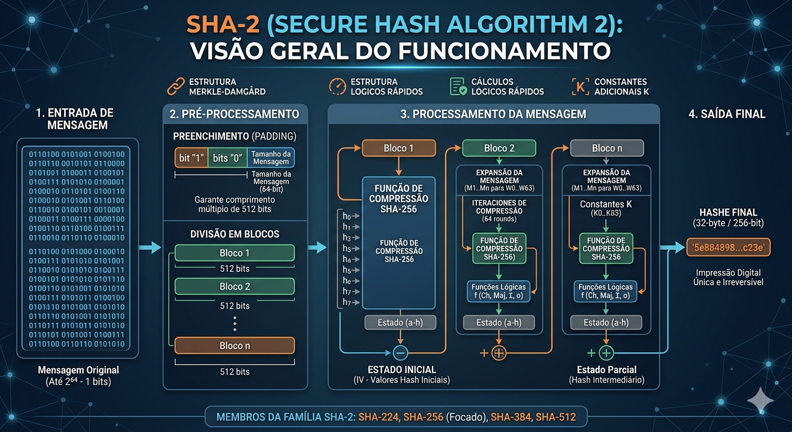
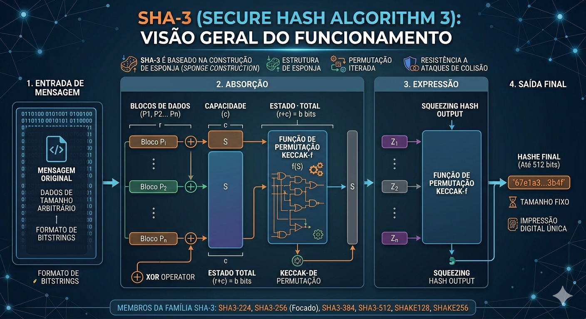
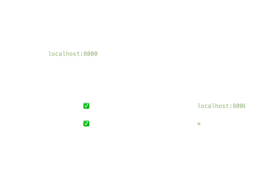
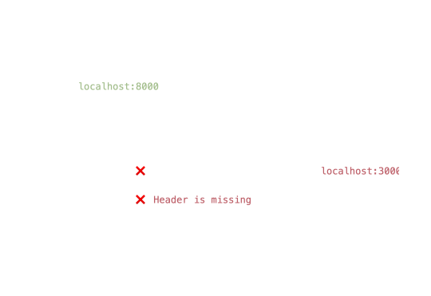
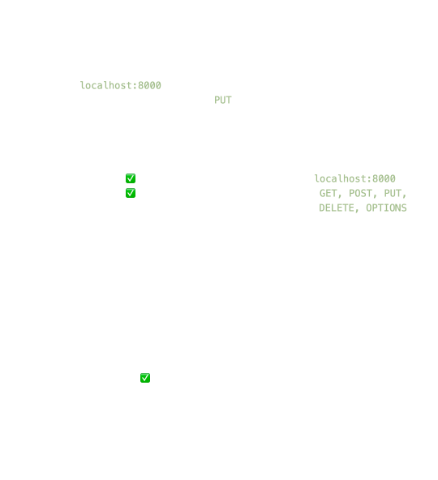
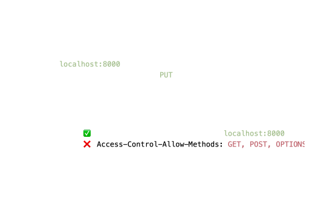

# Aula 12

Sumário

- [Aula 12](#aula-12)
  - [HTTPS](#https)
    - [TLS *Handshake*](#tls-handshake)
    - [SSL](#ssl)
    - [Algoritmos de Hash](#algoritmos-de-hash)
      - [MD5](#md5)
        - [Algoritmo](#algoritmo)
          - [Passo 1 - Adição de bits de preenchimento](#passo-1---adição-de-bits-de-preenchimento)
          - [Passo 2 - Anexar o comprimento](#passo-2---anexar-o-comprimento)
          - [Passo 3 - Inicializar o *buffer* MD](#passo-3---inicializar-o-buffer-md)
          - [Passos 4 e 5](#passos-4-e-5)
        - [Segurança](#segurança)
      - [SHA](#sha)
      - [`bcrypt` e `scrypt`](#bcrypt-e-scrypt)
  - [OWASP](#owasp)
  - [CORS](#cors)
    - [Funcionamento básico](#funcionamento-básico)
  - [Outros conceitos](#outros-conceitos)

## HTTPS

O *Hypertext Transfer Protocol Secure* é definido nos seguintes RFCs:

- [9110 - HTTP Semantics](https://www.rfc-editor.org/info/rfc9110/), que define a estrutura central, semântica e os esquemas "http" e "https".
- [8446 - TLS 1.3](https://www.rfc-editor.org/info/rfc8446/): protocolo de criptografia usado no HTTPS.

Resumidamente, é a versão segura do protocolo HTTP, utiliza a porta 443. Ele funciona como uma camada de segurança que utiliza criptografia (TLS) para impedir que hackers ou provedores de internet intrusivos, interceptem, falsifiquem ou escutem passivamente as comunicações.

O HTTPS estabelece segurança ao exigir que o servidor seja autenticado como agindo em nome de uma autoridade identificada. Essa autoridade é baseada na posse de uma **chave privada** correspondente a um **certificado digital** que o cliente (navegador) considera confiável. O cliente geralmente confia em uma lista de **autoridades certificadoras** (CAs) pré-configuradas para validar esses certificados. Se o certificado for inválido ou não corresponder ao domínio, o navegador emite um alerta de segurança ou termina a conexão.

Em outras palavras temos uma **criptografia assimétrica**:

1. **Chave privada**: controlada pelo dono do site, e fica armazenada em um servidor web para descriptografar as informações criptografadas com a chave pública.
2. **Chave pública**: disponível publicamente, via certificado SSL, para todos que queiram interagir com um servidor de uma maneira segura. As informações criptografadas com essa chave só podem ser descriptografadas pela chave privada.

Um certificado SSL pode ser comprado de algum provedor de serviço de hospedagem. Esse certificado pode ser compartilhado por vários usuários (*multi-domain SSL certificate*), ou pode ser individual (o que costuma ser mais caro). Dependendo do provedor de hospedagem, é possível ter um certificado compartilhado gratuito.

### TLS *Handshake*

<figure style="text-align:center;">
    
</figure>

1. **Negociação**
   1. O cliente envia uma mensagem (`ClientHello`) listando as versões do TLS (1.0, 1.2, 1.3, etc.) e a **suíte de criptografia** que suporta.
      - Uma suíte de criptografia (*cipher suite*) é um conjunto de algoritmos criptográficos usados para proteger a comunicação. Até o `TLS 1.2` vai ser listado o algoritmo para troca de chaves, para autenticação, criptografia da sessão (simétrico) e o *hashing* para integridade da mensagem. Ex.: `ECDHE-RSA-AES128-GCM-SHA256`.
        - `ECDHE` (*Elliptic Curve Diffie–Hellman Ephemeral*) para troca de chaves.
        - `RSA` para autenticação.
        - `AES128` como cifra de 128 bits da sessão, com o modo de operação `GCM` (*Galois/Counter Mode*) para cifra de bloco.
        - `SHA256` como o código de autenticação da mensagem baseado em *hash* (HMAC - *Hash-based Message Authentication Code*).
       - No `TLS 1.3` a suíte de cifras define apenas a criptografia simétrica/modo de operação e o algorimto de *hashing*. Ex.: `TLS_AES_128_GCM_SHA256`.
   2. O servidor responde (`ServerHello`) escolhendo a versão e os algoritmos que serão utilizados.
2. **Autenticação** 
   1. O servidor envia seu certificado digital (SSL) para o cliente.
   2. O cliente verifica a validade do certificado junto a uma autoridade de confiança.
3. **Troca de chaves**: Cliente e servidor negociam um segredo compartilhado sem que ele seja exposto na rede.
4. **Criptografia simétrica**
   1. A partir do segredo negociado, são geradas **chaves de sessão** únicas para criptografia simétrica.
   2. A criptografia simétrica é usada ara o tráfego de dados real por ser computacionalmente mais rápida que a assimétrica.
5. **Finalização**: Ambas as partes enviam mensagens confirmando que o handshake foi concluído com sucesso e que a partir de agora toda a comunicação será autenticada e criptografada.

Detalhes das etapas do *handshake* do TLS 1.3: [RFC 8446 - Seção 4](https://www.rfc-editor.org/rfc/rfc8446.html#page-24).

### SSL

Antigamente, o protocolo utilizado era o SSL (*Secure Sockets Layer* - [RFC 6101](https://datatracker.ietf.org/doc/html/rfc6101)). Ele foi desenvolvido inicialmente pela Netscape em 1995.

O seu funcionamento é basicamente o mesmo do TLS, ou seja, opera através de um *handshake*.

### Algoritmos de Hash

#### [MD5](https://www.rfc-editor.org/rfc/rfc1321.html)

O *Message-Digest Algorithm* é uma **função hash** que recebe como entrada uma mensagem de comprimento arbitrário e produz como saída uma "impressão digital" ou "resumo de mensagem" de 128 bits. Foi criado com o intuito de ser utilizado em aplicações de assinatura digital onde uma grade arquivo precisa ser comprimido de forma segura antes de ser criptografado. Isso faz com que ele possa ser usado como um *checksum* para verificar a **integridade dos dados**.

##### Algoritmo

A mensagem pode ser composta por uma quantidade arbitrária de $b$ bits não negativos, ou seja, $b \geq 0$, e não pode ser múltiplo de 8. A mensagem então é percebida como um conjunto de bits: $m_{0}m{1} ... m_{b-1}$. A partir disso são aplicados 5 passos.

###### Passo 1 - Adição de bits de preenchimento

A mensagem $m$ é estendida de forma que **seu comprimento** seja congruente a 448 modulo 512. Em outras palavras são adicionados bits até que $b\text{ mod }512 = 448\text{ mod }512$. O preenchimento sempre vai ocorrer, mesmo se a mensagem já seja congruente a 448, modulo 512. O primeiro bit adicionado é $1$ e os demais são $0$.

A operação $mod$ com valores binários  `x % d` é equivalente a `x & (d-1)`. Suponha o seguinte valor: `1010100001`, e `512 = 1000000000`. Portanto, $1010100001\text{ mod }1000000000 \equiv 1010100001\text{ \& }0111111111 = 0010100001$. Supondo que o valor seja a mensagem, seu comprimento é 10, portanto `1010`, logo:

1. `1010` \% `1000000000` = `1010` = $10$.
2. Mensagem:`1010100001`**1**. Comprimento $11$: `1011` \% `1000000000` = `1011` = $11$.
3. Mensagem: `10101000011`**0**. Comprimento $12$: `1100` \% `1000000000` = `1100` = $12$.
4. Mensagem: `101010000110`**0**. Comprimento $13$: `1101` \% `1000000000` = `1101` = $13$.
5. $\dots$

Ou seja, a mensagem vai sendo preenchida até estar faltando 64 bits para um comprimento que seja múltiplo de 512.

###### Passo 2 - Anexar o comprimento

O comprimento da mensagem em bits $b$ (antes do preenchimento do Passo 1), expresso em 64 bits, é anexado ao fim da mensagem. Se o comprimento for maior do que 64 bits, os 64 bits de baixa ordem (da direita para a esquerda) de $b$ são usados.

###### Passo 3 - Inicializar o *buffer* MD

Um *buffer* de 4 palavras (A,B,C,D) é usado para computar a *message digest* (resumo da mensagem). Cada uma das palavras (A, B, C, D) é um registrador de 32 bits. Os registradores são inicializados com os seguintes valores em hexadecimal:

- **A**: `01 23 45 67`
- **B**: `89 ab cd ef`
- **C**: `fe dc ba 98`
- **D**: `76 54 32 10`

###### Passos 4 e 5

**Desafio**: Implementar de acordo com o [RFC 1321](https://www.rfc-editor.org/rfc/rfc1321.html)

##### Segurança

Os hashes gerados pelo MD5 não são mais considerados criptograficamente seguros, porque:

1. Ataques de força bruta já são rápidos o suficiente. Ou seja, uma senha criptografada com MD5 já está passível de ser quebrada em pouco tempo (dependendo da máquina).
2. Já foi tão amplamente usado que existem bases de dados enormes de senhas e seus respectivos hashes. Portanto, há enormes chances de senhas simples e curtas já estarem disponíveis para consulta.
3. **Colisões**: isso acontece quando entradas diferentes geram o mesmo hash. Já foi reportado que em um Pentium 4 2,6 GHz conseguiram gerar colisões em 10 segundos.

**Alternativas**:

- SHA (*Secure Hash Algorithm*).
- Outros algoritmos de hash mais recentes (suportados pelo TLS 1.3).

#### [SHA](https://www.rfc-editor.org/rfc/rfc3174)

O *Secure Hash Algorithm 1* (SHA-1) é uma versão modificada do MD5 e transforma um valor de entrada em uma saída de 160 bits. Foi projetado pela Agência Nacional de Segurança (NSA) dos Estados Unidados. Apesar de ainda ser amplamente utilizado já foi quebrado criptograficamente e no seu lugar devem ser usados o SHA-2 ou SHA-3.

O **SHA-2** compartilha da mesma filosofia de design do SHA-1 e consiste de seis funções hash que produzem hashes de tamanhos diferentes: SHA-224, SHA-256, SHA-384, SHA-512, SHA-512/224 e SHA-512/256. Eles são descritos no [RFC 6234](https://www.rfc-editor.org/rfc/rfc6234). É o padrão atual da indústria, utilizado em certificados SSL/TLS, assinaturas digitais e criptomoedas (como o Bitcoin).

<figure style="text-align:center;">
  
</figure>

O **SHA-3** (originalmente chamado de [Kecckak](https://keccak.team/)) é o mais recente e é [especificado](https://www.nist.gov/publications/sha-3-standard-permutation-based-hash-and-extendable-output-functions) pelo NIST (*National Institute of Standards and Technology*). Ele é fruto de uma [competição](https://csrc.nist.gov/projects/hash-functions/sha-3-project).

<figure style="text-align:center;">
  
</figure>

#### `bcrypt` e [`scrypt`](https://www.tarsnap.com/scrypt.html)

O **bcrypt** é um algoritmo de hashing de senhas criado em 1999 por Niels Provos e David Mazières. Ele foi projetado para ser deliberadamente lento e caro de computar. Ele usa um algoritmo de codificação adaptativo. Ele repete um processo de hash várias vezes (chamado de "fator de custo"), tornando o hash resultante resistente a ataques de força bruta, mesmo com hardware potente. Ele também incorpora automaticamente um "salt" (um valor aleatório) ao hash para evitar ataques de tabela de arco-íris (*Rainbow Tables*).

É extremamente popular para hash e armazenamento de senhas em bancos de dados de aplicações web e móveis. É a opção padrão em muitos frameworks modernos (como **Ruby on Rails**, **Django**, e **Laravel**) para gerenciamento de usuários.

O **scrypt** é um algoritmo de hash de senhas mais recente, criado por Colin Percival em 2009. Ele foi projetado não apenas para ser lento em termos de CPU, mas também para ser intensivo em termos de memória. Ele opera de forma semelhante ao bcrypt, mas introduz um requisito significativo de RAM. O algoritmo exige que uma grande quantidade de memória seja acessada e manipulada durante o processo de hash. Isso torna extremamente caro e ineficiente criar hardware personalizado para realizar ataques de força bruta em massa contra o scrypt.

É usado principalmente em sistemas onde a segurança máxima é a prioridade mais alta e onde o uso intensivo de recursos do servidor para hash é aceitável. Ele é amplamente utilizado em criptomoedas (como o Litecoin e o **Dogecoin**) como prova de trabalho e para gerar chaves de criptografia para carteiras de criptomoedas, bem como para hash de senhas em sistemas de arquivos criptografados e bancos de dados de alta segurança.

**Bcrypt** e **scrypt** são parentes próximos no mundo da criptografia. Ambos são funções de derivação de chave (KDFs) projetadas para tornar o hash de senhas um processo lento e caro, ao contrário de funções como SHA-256, que são otimizadas para velocidade.

## [OWASP](https://owasp.org/about/)

A *Open Worldwide Application Security Project* (OWASP) é uma fundação sem fins lucrativos que trabalha para melhorar a segurança de software, lançada em 1º de dezembro de 2001 e incorporada como uma organização sem fins lucrativos dos Estados Unidos em 21 de abril de 2004.

Eles se definem como uma comunidade aberta dedicada a capacitar organizações a conceber, desenvolver, adquirir, operar e manter aplicações confiáveis. Alguns de seus principais projetos são:

- [OWASP *Top Ten Web Application Security Risks*](https://owasp.org/www-project-top-ten/): é um documento padrão de conscientização para desenvolvedores e segurança de aplicações web. Ele representa um amplo consenso sobre os riscos de segurança mais crı́ticos para aplicações web. O top 10 de 2025 inclui os seguintes riscos:
  - A01:2025 - Broken Access Control
  - A02:2025 - Security Misconfiguration
  - A03:2025 - Software Supply Chain Failures
  - A04:2025 - Cryptographic Failures
  - A05:2025 - Injection
  - A06:2025 - Insecure Design
  - A07:2025 - Authentication Failures
  - A08:2025 - Software or Data Integrity Failures
  - A09:2025 - Security Logging and Alerting Failures
  - A10:2025 - Mishandling of Exceptional Conditions
- [OWASP *Application Security Verification Standard* (ASVS)](https://owasp.org/www-project-application-security-verification-standard/): fornece uma base para testar os controles técnicos de segurança de aplicações web e também oferece aos desenvolvedores uma lista de requisitos para o desenvolvimento seguro.
- [OWASP *Mobile Application Security*](https://owasp.org/www-project-mobile-app-security/): fornece um padrão de segurança e privacidade para aplicativos mobile (OWASP MASVS), uma coleção de pontos fracos especı́ficos de aplicativos mobile (OWASP MASWE) e um guia de teste completo (OWASP MASTG) que cobre os processos, técnicas e ferramentas usados durante o teste de segurança, como também um conjunto exaustivo de casos de teste que permite aos testadores fornecerem resultados consistentes e completos.
- [OWASP *Web Security Testing Guide* (WSTG)](https://owasp.org/www-project-web-security-testing-guide/): é um guia completo para o teste de segurança de aplicações web e web services, e fornece um framework das melhores práticas usadas por pen testers e organizações ao redor do mundo.

## [CORS](https://developer.mozilla.org/en-US/docs/Web/HTTP/Guides/CORS)

O *Cross-Origin Resource Sharing* é um mecanismo baseado em cabeçalhos HTTP que permite a um servidor indicar qualquer origem (domínio, esquema ou porta) diferente da sua própria a partir da qual um navegador deve permitir o carregamento de recursos. Ele serve para flexibilizar de forma segura a "política de mesma origem" (*same origin policy*), que por padrão bloqueia scripts de interagir com recursos de outros domínios.

### Funcionamento básico

Quando um navegador faz uma requisição `cross-origin` ele inclui um cabeçalho `Origin` na requisição. O servidor responde com um cabeçalho `Access-Control-Allow-Origin`. Se o valor no cabeçalho da resposta coincide com o do cabelho `Origin`, o navegador permite o acesso aos dados da resposta. Se não coincidir, o navegador bloqueia o acesso, resultando em um `CORS error`.

<figure style="text-align:center;background-color:black;">
    
    
    <figcaption>Fonte: <a href="https://rbika.com/blog/understanding-cors">R Bika(s)</a></figcaption>
</figure>

Requisições que utilizam métodos diferentes de GET, POST, HEAD, ou que incluem cabeçalhos não padronizados, devem ser verificadas previamente. Nesses casos, antes de ser enviada a requisição real, o navegador envia uma requisição prévia (*pre-flight request*) usando o método HTTP `OPTIONS`. O servidor precisa responder com os cabeçalhos `Access-Control-Allow-Origin` e `Access-Control-Allow-Methods`. Se esses cabeçalhos coincidem com o método e `Origin` da requisição, o navegador procede com a requisição real. Dessa forma é garantido que o servidor explicitamente permite essas requisições antes de processá-las, prevenindo modificações não intencionais nos dados do servidor.

<figure style="text-align:center;background-color:black;">
    
    
    <figcaption>Fonte: <a href="https://rbika.com/blog/understanding-cors">R Bika(s)</a></figcaption>
</figure>

## Outros conceitos

- XSS
  - [*Cross-site scripting* - MDN](https://developer.mozilla.org/en-US/docs/Web/Security/Attacks/XSS)
  - [*Cross-site scripting* - OWASP](https://owasp.org/www-community/attacks/xss/)
- [API Security Best Practices](https://roadmap.sh/api-security-best-practices)
- [Hardened server](https://www.sophos.com/en-us/cybersecurity-explained/what-is-server-hardening).
- [*Content Security Policy* (CSP)](https://developer.mozilla.org/en-US/docs/Web/HTTP/Guides/CSP)